# 🌐 Default Gateways

> *A **Default Gateway** is the network device that forwards data from your local network to other networks. It serves as the "exit door" that allows computers to communicate with devices beyond their own subnet, including servers on the Internet.*

---


---

# 📑 Table of Contents

- [🎯 Learning Objectives](#-learning-objectives)
- [🌍 What Is a Default Gateway?](#-what-is-a-default-gateway)
- [🤔 Why Do We Need a Default Gateway?](#-why-do-we-need-a-default-gateway)
- [🏠 Local Network vs Remote Network](#-local-network-vs-remote-network)
- [📡 How a Default Gateway Works](#-how-a-default-gateway-works)
- [🌐 Packet Journey to Another Network](#-packet-journey-to-another-network)
- [🏡 Default Gateways in Home Networks](#-default-gateways-in-home-networks)
- [🏢 Default Gateways in Enterprise Networks](#-default-gateways-in-enterprise-networks)
- [🔍 How to Find Your Default Gateway](#-how-to-find-your-default-gateway)
- [📌 Common Default Gateway Addresses](#-common-default-gateway-addresses)
- [❌ What Happens If the Default Gateway Is Missing?](#-what-happens-if-the-default-gateway-is-missing)
- [🛡️ Cybersecurity Perspective](#️-cybersecurity-perspective)
- [💻 Mini Lab — Finding Your Default Gateway](#-mini-lab--finding-your-default-gateway)
- [🔑 Key Takeaways](#-key-takeaways)
- [🧠 Quick Check](#-quick-check)
- [📖 Knowledge Check](#-knowledge-check)
- [🚀 Challenge Questions](#-challenge-questions)
- [📝 Chapter Summary](#-chapter-summary)
- [🧭 Chapter Navigation](#-chapter-navigation)
- [📖 Continue Your Learning](#-continue-your-learning)

---

# 🎯 Learning Objectives

By the end of this chapter, you will be able to:

- Explain what a **default gateway** is.
- Understand why every network needs a default gateway.
- Differentiate between **local** and **remote** network communication.
- Describe how data reaches devices outside the local network.
- Explain the role of routers as default gateways.
- Identify the default gateway on Windows, Linux, and macOS.
- Recognize common default gateway addresses used in home and enterprise networks.
- Understand why default gateways are important in networking and cybersecurity.

---

# 🌍 What Is a Default Gateway?

Imagine you're writing a letter to someone who lives in another city.

You can easily deliver the letter to your local post office, but you cannot personally travel through every city, sort the mail, and deliver it to the final destination. Instead, the post office forwards your letter through a network of distribution centers until it reaches the correct address.

A **default gateway** works in a very similar way.

When your computer wants to communicate with another device **on the same local network**, it can send the data directly.

However, when the destination is **outside the local network**—such as another office, another city, or a website on the Internet—your computer doesn't know the path to that destination.

Instead, it sends the packet to a **default gateway**, which is responsible for forwarding the packet toward its destination.

In most networks, the default gateway is a **router**.

The router connects your local network to other networks and decides where packets should be sent next.

Without a default gateway, devices can communicate with other devices on the same network, but they cannot reach remote networks or access the Internet.

---

## 📖 Definition

A **Default Gateway** is the network device—typically a **router**—that forwards packets from a local network to other networks whenever the destination is outside the local subnet.

In simple terms:

> **A default gateway is the "exit door" from your local network.**

---

## 🧠 Breaking Down the Name

The term **Default Gateway** contains two important words:

### **Default**

The word **default** means **the automatic or standard choice**.

If your computer doesn't know exactly where to send a packet outside its own network, it automatically chooses the default gateway.

---

### **Gateway**

A **gateway** is a connection point between different networks.

It acts like a bridge or doorway that allows traffic to leave one network and enter another.

Together, the term **Default Gateway** means:

> **The standard device that forwards traffic from your local network to other networks.**

---

## 🌍 A Simple Example

Suppose your computer has the following IP address:

```text
192.168.1.20
```

Its default gateway is:

```text
192.168.1.1
```

When you open your web browser and visit:

```text
https://www.openai.com
```

Your computer recognizes that the website is **not on the local network**.

Instead of trying to contact the website directly, it sends the packet to:

```text
192.168.1.1
```

The router (default gateway) then forwards the packet through your Internet Service Provider (ISP) and eventually to the destination server.

---

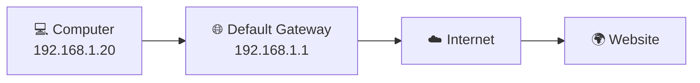

---

<!--
Image Description:
Create a beginner-friendly networking illustration showing a computer connected to a router labeled "Default Gateway." The router connects to the Internet, which then connects to a website server. Use arrows to show packets traveling from the computer to the router and then to the Internet. Label the router as "Default Gateway (Exit Door to Other Networks)." Use a clean educational style.

Suggested Filename:
Images/default_gateway_overview.png
-->

<p align="center">

</p>

---

> 💡 **Point to Remember**
>
> A **default gateway** is usually a **router** that forwards traffic from your local network to other networks. Whenever your computer needs to communicate with a destination outside its own subnet, it sends the packet to the default gateway first.

---

> 🤓 **Did You Know?**
>
> Every time you open a website, send an email, stream a video, or play an online game, your device uses its **default gateway** to send traffic beyond your local network. Without a correctly configured default gateway, your device could still communicate with nearby devices on the same network—but it wouldn't be able to reach the Internet.

# 🤔 Why Do We Need a Default Gateway?

At this point, you already know that every device on a network has an **IP address** and a **subnet mask**.

These two pieces of information allow a device to determine whether another device is:

- 📍 On the **same local network**
- 🌍 On a **different network**

But this raises an important question:

> **If every device has an IP address, why can't my computer simply send data directly to any device on the Internet?**

The answer lies in how networks are designed.

---

# 🏠 Devices Can Only Communicate Directly Within Their Local Network

Imagine two computers connected to the same home Wi-Fi network.

```
Computer A
192.168.1.10

Computer B
192.168.1.25
```

Both devices belong to the same network:

```text
192.168.1.0/24
```

Since they are on the same local network, they can communicate **directly** with each other.

There is no need for a router to forward their traffic.

For example:

- Sharing files
- Printing documents
- Playing multiplayer games on a LAN
- Accessing a local server

The data travels directly between the devices through the local network.

---

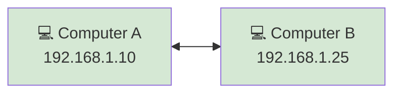

---

# 🌍 What Happens When the Destination Is Outside the Network?

Now imagine that Computer A wants to access Google's web servers.

Google's servers do **not** belong to the local network.

For example:

```text
Computer A

192.168.1.10
```

Google might have an IP address such as:

```text
142.250.xxx.xxx
```

These two addresses belong to completely different networks.

Your computer immediately realizes:

> **"This destination is not on my local network."**

At this point, it has a problem.

It knows **where** the destination is, but it does **not** know **how to get there**.

---

# 🚧 Your Computer Doesn't Know Every Route

The Internet contains billions of connected devices spread across millions of networks.

If every computer had to remember the path to every destination, it would require an enormous routing table that would constantly change.

That would be:

- Extremely inefficient
- Difficult to maintain
- Impossible for ordinary devices

Instead, computers use a much simpler approach.

---

# 🚪 The Default Gateway Solves the Problem

Rather than learning the route to every network in the world, your computer remembers only one important address:

> **The Default Gateway**

Whenever a destination is outside the local network, your computer sends the packet to the default gateway.

The gateway is responsible for deciding where the packet should go next.

Think of it like asking an experienced guide for directions.

Instead of memorizing every road in the country, you simply go to someone who already knows the way.

---

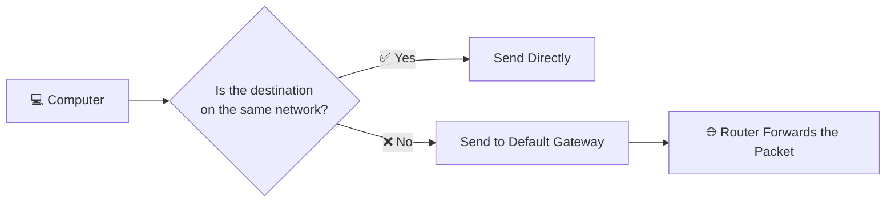

---

# 🏡 Real-World Analogy — Leaving Your Neighborhood

Imagine you live in a neighborhood with many houses connected by local streets.

If you want to visit your next-door neighbor, you simply walk to their house.

You don't need a highway.

However, if you want to travel to another city, the neighborhood streets are no longer enough.

You first drive to the **main highway**, which connects your neighborhood to the rest of the country.

In networking:

- 🏠 Your local network is the neighborhood.
- 🛣️ The highway is the Internet.
- 🚪 The entrance to the highway is the **Default Gateway**.

Without that entrance, you could move around your own neighborhood, but you could never travel beyond it.

---

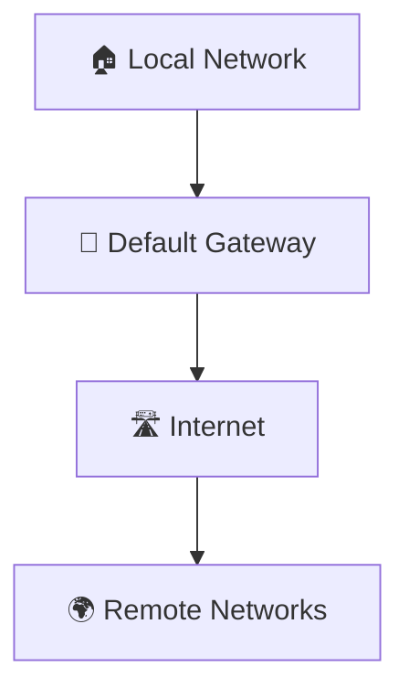

---

# 📊 Local Communication vs Remote Communication

| Situation | Does the Default Gateway Need to Be Used? |
|-----------|-------------------------------------------|
| Sending a file to another computer on the same LAN | ❌ No |
| Printing to a local network printer | ❌ No |
| Opening a website on the Internet | ✅ Yes |
| Sending an email | ✅ Yes |
| Accessing a cloud application | ✅ Yes |
| Connecting to a remote company server | ✅ Yes |

A simple rule to remember is:

- **Same network → Communicate directly**
- **Different network → Use the default gateway**

---

# 🌍 Why This Design Is Efficient

Using a default gateway provides several important advantages:

- 🌐 Devices only need to know about their own network.
- 🚀 Routers handle routing decisions.
- 📈 Networks become easier to expand.
- 🛡️ Security policies can be enforced at the gateway.
- ⚙️ Network management becomes simpler.

This design allows billions of devices around the world to communicate efficiently without each device storing information about every possible destination.

---

<!--
Image Description:
Create an educational infographic comparing local communication and remote communication. On the left, show two computers communicating directly within the same LAN. On the right, show a computer sending data to a router labeled "Default Gateway," which then forwards the traffic to the Internet and a remote web server. Include labels such as "Same Network = Direct Communication" and "Different Network = Use Default Gateway."

Suggested Filename:
Images/why_default_gateway_is_needed.png
-->

<p align="center">

</p>

---

> 💡 **Point to Remember**
>
> A computer can communicate directly only with devices on its own local network. When the destination is on a different network, it sends the packet to the **default gateway**, which forwards the traffic toward its final destination.

---

> 🤓 **Did You Know?**
>
> Your computer doesn't store routes to every network on the Internet. Instead, it relies on its **default gateway** as the first hop for all traffic destined for remote networks. This simple design makes modern networking scalable and efficient.

# 🏠 Local Network vs Remote Network

To understand how a default gateway works, you must first understand the difference between a **local network** and a **remote network**.

Whenever your computer wants to send data, it asks itself one important question:

> **"Is the destination on my network, or is it somewhere else?"**

The answer to this question determines whether the computer:

- 📤 Sends the packet **directly** to the destination.
- 🚪 Sends the packet to the **default gateway**.

This decision happens automatically in a fraction of a second for every packet your computer sends.

---

# 🌐 What Is a Local Network?

A **local network** consists of devices that belong to the **same IP network**.

Devices on the same local network can communicate **directly** with one another because they share the same network portion of their IP addresses.

For example, consider the following devices:

| Device | IP Address |
|---------|------------|
| 💻 Laptop | 192.168.1.10 |
| 🖥️ Desktop | 192.168.1.20 |
| 🖨️ Printer | 192.168.1.50 |

Subnet Mask:

```text
255.255.255.0 (/24)
```

Since all three devices belong to the network:

```text
192.168.1.0/24
```

they can communicate directly without involving a router.

For example:

- Printing documents
- Sharing files
- Accessing a NAS
- Playing LAN games

All of this traffic stays inside the local network.

---

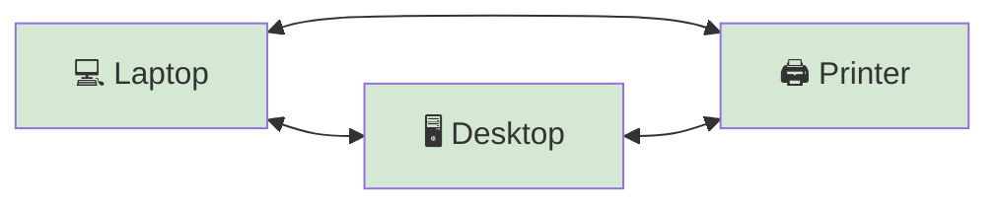

---

# 🌍 What Is a Remote Network?

A **remote network** is any network **outside your own local network**.

When the destination belongs to a different network, your computer **cannot** send the packet directly.

Instead, it must ask another device to forward the packet.

That device is the **default gateway**.

For example:

Your computer:

```text
192.168.1.25
```

Destination server:

```text
8.8.8.8
```

These addresses belong to different networks.

Therefore, the packet is first sent to the default gateway.

---

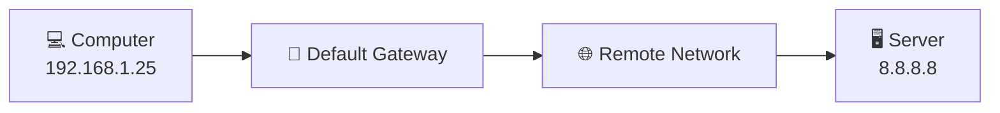

---

# 🔍 How Does the Computer Know?

Your computer compares:

- Its own **IP address**
- Its own **subnet mask**
- The destination IP address

If the destination belongs to the same network:

✅ Send directly.

If the destination belongs to another network:

✅ Send to the default gateway.

This decision happens automatically for every packet.

---

## 📖 Example 1 — Same Network

Your computer:

```text
192.168.1.15/24
```

Destination:

```text
192.168.1.80
```

Both belong to:

```text
192.168.1.0/24
```

Result:

```text
Direct Communication
```

No router is required.

---

## 📖 Example 2 — Different Network

Your computer:

```text
192.168.1.15/24
```

Destination:

```text
172.16.5.100
```

These addresses belong to different networks.

Result:

```text
Send Packet to Default Gateway
```

The router then forwards the packet toward the correct destination.

---

# 📊 Comparing Local and Remote Networks

| Feature | Local Network | Remote Network |
|---------|---------------|----------------|
| Same IP network | ✅ Yes | ❌ No |
| Direct communication | ✅ Yes | ❌ No |
| Router required | ❌ No | ✅ Yes |
| Uses default gateway | ❌ No | ✅ Yes |
| Example | Printer, NAS, another PC | Internet, cloud server, another office |

---

# 🌍 Everyday Example

Imagine you're in a large office building.

If you want to speak with a coworker in the next room, you simply walk there.

No one needs to guide you.

However, if you need to visit another office in another city, you first leave the building and travel using roads and highways.

Networking works exactly the same way.

- 🏢 Same office = Local Network
- 🚗 Another city = Remote Network
- 🚪 Building exit = Default Gateway

---

> 💡 **Point to Remember**
>
> Devices on the same network communicate directly. Devices on different networks must send their traffic to the **default gateway**, which forwards the packets toward the destination.

---

> 🤓 **Did You Know?**
>
> Every packet your computer sends begins with a simple decision: **Is the destination local or remote?** That single decision determines whether the packet is delivered directly or handed to the default gateway.

---

# 📡 How a Default Gateway Works

Now that you understand the difference between **local** and **remote** networks, let's see exactly what happens when your computer sends data to a device on another network.

Although the process happens in milliseconds, several networking devices work together to deliver your data to its destination.

---

# 📨 Step 1 — You Request a Resource

Suppose you open your web browser and type:

```text
www.openai.com
```

After the domain name is translated into an IP address by DNS, your computer prepares an IP packet destined for the web server.

For example:

```text
Destination IP:

104.xxx.xxx.xxx
```

Your computer now needs to determine how to reach that destination.

---

# 🔍 Step 2 — The Computer Checks the Destination

Your computer compares:

- Its own IP address
- Its subnet mask
- The destination IP address

Example:

Your computer:

```text
192.168.1.25/24
```

Destination:

```text
104.xxx.xxx.xxx
```

The destination is clearly outside the local network.

Therefore, direct communication is impossible.

---

# 🚪 Step 3 — Send the Packet to the Default Gateway

Instead of trying to reach the destination itself, the computer sends the packet to its configured default gateway.

Example:

```text
Default Gateway

192.168.1.1
```

The gateway becomes the **first hop** on the packet's journey.

---

# 🧭 Step 4 — The Router Chooses the Best Route

The router receives the packet and examines its destination IP address.

Unlike ordinary computers, routers maintain **routing tables** that contain information about how to reach many different networks.

Based on this information, the router decides where to send the packet next.

This process is called **routing**.

---

# 🌐 Step 5 — The Packet Travels Across Multiple Networks

The packet may pass through several routers before reaching its destination.

A typical path might look like this:

```text
Your Computer
      │
      ▼
Default Gateway
      │
      ▼
Internet Service Provider
      │
      ▼
Internet Backbone
      │
      ▼
Destination Network
      │
      ▼
Web Server
```

Each router forwards the packet one step closer to its destination.

---

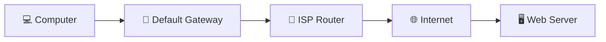

---

# 📥 Step 6 — The Reply Returns

After the destination server receives the request, it sends a response back.

The response follows the reverse path through the Internet until it reaches your router.

Finally, your default gateway forwards the packet to your computer.

To you, the entire process feels almost instantaneous.

---

# 📊 Step-by-Step Summary

| Step | What Happens |
|------|---------------|
| 1 | The user requests a resource (for example, a website). |
| 2 | The computer checks whether the destination is local or remote. |
| 3 | If the destination is remote, the packet is sent to the default gateway. |
| 4 | The router consults its routing table and chooses the best path. |
| 5 | The packet travels through multiple routers across the Internet. |
| 6 | The destination responds, and the reply is delivered back to the computer. |

---

<!--
Image Description:
Create a step-by-step infographic illustrating how a default gateway forwards packets. Show the sequence: Computer → Default Gateway (Router) → ISP → Internet → Web Server → Response returns. Number each step from 1 to 6 and use arrows to indicate packet flow. Use a modern educational networking style.

Suggested Filename:
Images/how_default_gateway_works.png
-->

<p align="center">

</p>

---

> 💡 **Point to Remember**
>
> A default gateway is the **first hop** for any packet destined for a remote network. It examines the destination address, chooses the best route using its routing table, and forwards the packet toward its final destination.

---

> 🤓 **Did You Know?**
>
> The route your data takes across the Internet can involve **dozens of routers** before reaching its destination. Despite this complexity, your computer only needs to know one route—the one to its **default gateway**.

# 🌐 Packet Journey to Another Network

Now that you understand **how a default gateway works**, let's follow a real packet as it travels from your computer to a website on the Internet.

This journey happens every time you:

- 🌐 Open a website
- 📧 Send an email
- 🎮 Join an online game
- ☁️ Access cloud storage
- 📺 Stream a video

Although the entire process usually takes only a few milliseconds, your data passes through several networking devices before reaching its destination.

---

# 🏠 Our Example Network

Suppose your home network looks like this:

```text
Computer
IP Address: 192.168.1.25

Subnet Mask: 255.255.255.0 (/24)

Default Gateway: 192.168.1.1
```

You open your web browser and visit:

```text
www.openai.com
```

Your computer must now send a request to a web server located somewhere on the Internet.

---

# 📍 Step 1 — The User Makes a Request

Everything begins when you perform an action.

For example:

- Opening a website
- Clicking a link
- Downloading a file

Your computer creates an IP packet containing the destination server's IP address.

For example:

```text
Source

192.168.1.25
```

```text
Destination

104.xxx.xxx.xxx
```

Now the operating system must decide how to deliver this packet.

---

# 🔍 Step 2 — Is the Destination Local?

The computer compares:

- Its own IP address
- Its subnet mask
- The destination IP address

It asks one simple question:

> **"Is this destination on my local network?"**

In this example:

```text
192.168.1.25/24
```

and

```text
104.xxx.xxx.xxx
```

clearly belong to different networks.

Therefore, the destination is **remote**.

---

# 🚪 Step 3 — Send the Packet to the Default Gateway

Since the destination is outside the local network, the computer forwards the packet to its configured default gateway.

```text
Default Gateway

192.168.1.1
```

Notice something important:

The computer is **not sending the packet directly to the website**.

Instead, it sends the packet to the router because the router knows how to reach other networks.

The router becomes the packet's **first hop**.

---

# 📡 Step 4 — The Router Takes Control

The router receives the packet and examines its destination IP address.

Using its routing table, the router determines the best path toward the destination network.

It then forwards the packet to the next router.

This process repeats again and again across the Internet.

Each router only needs to know:

> **"Where should I send this packet next?"**

Routers do not need to know the complete journey—they simply forward packets one hop at a time.

---

# 🌐 Step 5 — Crossing the Internet

Your packet now travels through multiple networks.

A typical path might be:

```text
Computer

↓

Home Router (Default Gateway)

↓

Internet Service Provider

↓

Regional Router

↓

Internet Backbone

↓

Destination Network

↓

Web Server
```

The exact path changes depending on:

- Network congestion
- Router availability
- Distance
- Internet routing decisions

Every router forwards the packet closer to its destination.

---

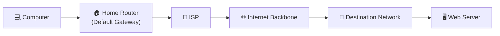

---

# 📥 Step 6 — The Server Responds

Once the web server receives the request, it processes it.

For example:

- Finds the requested webpage.
- Generates a response.
- Sends packets back toward your computer.

The reply travels through multiple routers until it reaches your home router.

Finally, your router delivers the packets to your computer.

Within milliseconds, the webpage appears in your browser.

---

# 🔄 The Journey Happens for Every Request

This process isn't unique to websites.

The same sequence occurs whenever you:

- 📧 Send an email.
- 🎮 Connect to an online game.
- 📺 Watch YouTube.
- ☁️ Upload files to cloud storage.
- 💬 Join a video meeting.

Every packet leaving your local network follows this basic journey.

---

# 📊 Complete Packet Journey

| Step | What Happens |
|------|---------------|
| 1 | The user requests a resource. |
| 2 | The computer determines whether the destination is local or remote. |
| 3 | The packet is forwarded to the default gateway. |
| 4 | The router consults its routing table. |
| 5 | Multiple routers forward the packet across the Internet. |
| 6 | The destination server receives the request and sends a reply. |
| 7 | The response returns through the network until it reaches your computer. |

---

<!--
Image Description:
Create a detailed networking infographic titled "Packet Journey to Another Network." Show the complete path: Computer → Home Router (Default Gateway) → ISP → Regional Router → Internet Backbone → Destination Network → Web Server → Response Back. Number each stage from 1 to 7 with arrows showing the packet's direction. Use a clean, modern educational style with networking icons.

Suggested Filename:
Images/packet_journey_to_another_network.png
-->

<p align="center">

</p>

---

> 💡 **Point to Remember**
>
> Your computer does not know how to reach every network on the Internet. It simply forwards packets destined for remote networks to its **default gateway**, which begins the routing process. Each router along the path forwards the packet one step closer to its destination until it reaches the target server.

---

> 🤓 **Did You Know?**
>
> Even a simple web page may require your computer to exchange **dozens or even hundreds of packets** with servers around the world. Every one of those packets begins its journey by leaving your local network through the **default gateway**.

# 🏡 Default Gateways in Home Networks

Most people use a **default gateway** every day without even realizing it.

Whether you're browsing the web, watching YouTube, playing online games, or attending a video meeting, your device is constantly sending traffic through a default gateway.

In a typical home network, the **Wi-Fi router** acts as the default gateway for every connected device.

This router connects your local home network to your **Internet Service Provider (ISP)**, allowing your devices to communicate with the rest of the Internet.

---

# 🌐 A Typical Home Network

Consider a common home network.

Several devices are connected to the same Wi-Fi router:

- 💻 Laptop
- 📱 Smartphone
- 📺 Smart TV
- 🎮 Gaming Console
- 🖨️ Wireless Printer

Each device receives:

- An IP address
- A subnet mask
- A default gateway

The default gateway is usually the IP address of the router itself.

For example:

| Device | IP Address | Default Gateway |
|---------|------------|-----------------|
| 💻 Laptop | 192.168.1.20 | 192.168.1.1 |
| 📱 Smartphone | 192.168.1.35 | 192.168.1.1 |
| 📺 Smart TV | 192.168.1.50 | 192.168.1.1 |
| 🎮 Gaming Console | 192.168.1.75 | 192.168.1.1 |

Notice that every device uses the **same default gateway** because they all belong to the same local network.

---

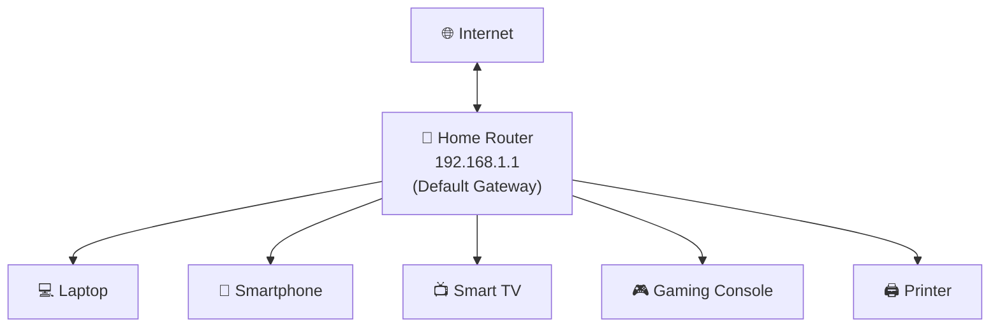

---

# 📡 Why Is the Router the Default Gateway?

A home router has **two different network connections**.

### Inside the Home

The router communicates with devices on your local network.

Examples include:

- Computers
- Smartphones
- Tablets
- Smart TVs
- Printers

These devices typically use **private IP addresses**.

For example:

```text
192.168.1.x
```

---

### Outside the Home

The router also communicates with your Internet Service Provider.

On this side, it uses a **public IP address** assigned by the ISP.

This allows the router to forward traffic between your private home network and the public Internet.

In other words, the router acts as the bridge between two completely different networks.

---

# 🌍 Example Scenario

Imagine you're using your laptop to visit:

```text
https://www.openai.com
```

Your laptop has:

```text
IP Address

192.168.1.20
```

Default Gateway:

```text
192.168.1.1
```

When you press **Enter**, your laptop determines that the website is not part of the local network.

Instead of trying to contact the website directly, it sends the request to:

```text
192.168.1.1
```

The router then forwards the packet through your ISP and onto the Internet until it reaches the destination server.

---

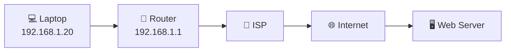

---

# 🔄 Every Device Shares the Same Gateway

One important thing to remember is that devices on the same home network normally use the **same default gateway**.

For example:

| Device | Default Gateway |
|---------|-----------------|
| Laptop | 192.168.1.1 |
| Phone | 192.168.1.1 |
| Tablet | 192.168.1.1 |
| Smart TV | 192.168.1.1 |
| Printer | 192.168.1.1 |

Although each device has its own unique IP address, they all rely on the same router whenever they need to communicate with another network.

---

# 📌 Common Home Router Addresses

Many home routers use one of the following private IP addresses as their default gateway.

| Common Gateway Address | Frequently Used By |
|------------------------|--------------------|
| `192.168.0.1` | Many home routers |
| `192.168.1.1` | Very common default |
| `10.0.0.1` | Some ISPs and enterprise equipment |
| `192.168.100.1` | Certain cable modems and routers |

These are **common defaults**, but they are **not mandatory**.

A network administrator can configure a router to use a different private IP address if needed.

---

# 🔧 Who Assigns the Default Gateway?

In most home networks, users never configure the default gateway manually.

Instead, the **DHCP server** built into the router automatically provides each device with:

- An IP address
- A subnet mask
- A default gateway
- DNS server addresses

This means that when a new device joins the network, it is automatically configured and ready to communicate both locally and on the Internet.

You'll learn more about this process in the **DHCP** chapter later in this module.

---

<!--
Image Description:
Create an educational illustration of a home network. Show a Wi-Fi router labeled "Default Gateway (192.168.1.1)" connected to a laptop, smartphone, smart TV, gaming console, and printer. The router should also connect to the Internet through an ISP. Use arrows to indicate that all Internet traffic passes through the router.

Suggested Filename:
Images/default_gateway_home_network.png
-->

<p align="center">

</p>

---

> 💡 **Point to Remember**
>
> In most home networks, the **Wi-Fi router** acts as the default gateway. Every device on the local network sends traffic destined for remote networks to the router, which forwards it to the Internet through the ISP.

---

> 🤓 **Did You Know?**
>
> When a new phone or laptop connects to your home Wi-Fi, it usually receives its **IP address**, **subnet mask**, **default gateway**, and **DNS server** automatically through **DHCP**. That's why most home networks work without any manual network configuration.

# 🏢 Default Gateways in Enterprise Networks

Home networks are usually simple.

Most homes have:

- One router
- One local network
- One default gateway

Every device uses the same gateway to access the Internet.

Enterprise networks, however, are much more complex.

Large organizations may have:

- Hundreds or thousands of computers
- Multiple office buildings
- Separate departments
- Multiple routers
- Multiple subnets
- Multiple default gateways

Instead of one large network, enterprises divide their infrastructure into many smaller networks for better performance, security, and management.

---

# 🏢 Why Large Organizations Use Multiple Networks

Imagine a company with the following departments:

- 💼 Human Resources (HR)
- 💰 Finance
- 💻 Information Technology (IT)
- 📞 Customer Support
- 🌐 Guest Wi-Fi

If every device were placed on one huge network, several problems would occur:

- Excessive broadcast traffic
- Reduced network performance
- Poor security
- Difficult troubleshooting
- Limited scalability

To solve these problems, network administrators divide the organization into **multiple subnets**.

Each subnet has its own network address and its own default gateway.

---

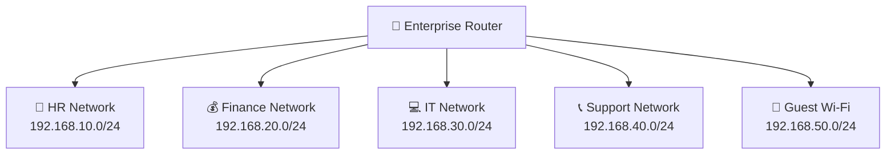

---

# 🌐 Each Subnet Has Its Own Default Gateway

Unlike a home network, where every device typically uses the same gateway, enterprise networks often assign a different gateway to each subnet.

For example:

| Department | Network | Default Gateway |
|------------|---------|-----------------|
| Human Resources | 192.168.10.0/24 | 192.168.10.1 |
| Finance | 192.168.20.0/24 | 192.168.20.1 |
| IT | 192.168.30.0/24 | 192.168.30.1 |
| Customer Support | 192.168.40.0/24 | 192.168.40.1 |
| Guest Wi-Fi | 192.168.50.0/24 | 192.168.50.1 |

Notice the pattern.

The gateway belongs to the same subnet as the devices it serves.

For example:

```text
Finance PC

192.168.20.45
```

Default Gateway:

```text
192.168.20.1
```

This allows devices in that subnet to communicate with other networks.

---

# 🔄 Communication Between Departments

Suppose an employee in the HR department wants to access a server located in the IT department.

Example:

```text
HR Computer

192.168.10.25
```

Destination Server:

```text
192.168.30.100
```

Since these devices are on different networks, the HR computer cannot communicate directly with the server.

Instead, it sends the packet to its default gateway:

```text
192.168.10.1
```

The enterprise router then forwards the packet to the IT network.

---

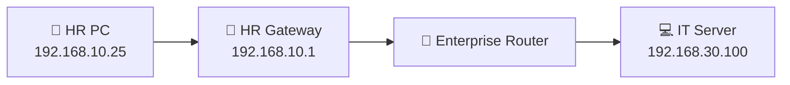

---

# 🔒 Security Through Network Segmentation

One of the biggest advantages of enterprise networking is **network segmentation**.

Instead of allowing every device to communicate freely, administrators can control traffic between networks.

For example:

- ✅ HR employees can access the HR server.
- ✅ Finance employees can access accounting systems.
- ❌ Guest Wi-Fi users cannot access internal company servers.
- ❌ Employees cannot directly access sensitive management networks.

These security policies are enforced by routers, firewalls, and access control rules.

Default gateways play an important role by forwarding traffic between networks where these security checks are applied.

---

# ☁️ Enterprise Networks May Use Multiple Routers

Large organizations often have more than one router.

For example:

```text
Office Floor 1
↓

Distribution Router
↓

Core Router
↓

Firewall
↓

Internet
```

Even though several routers may be involved, each computer still knows only one default gateway—its local router.

That router forwards packets to other routers until they reach the correct destination.

---

# 🌍 Real-World Example

Consider a company with offices in three different cities:

- Lahore
- Karachi
- Islamabad

An employee in Lahore wants to access a file server in Karachi.

The employee's computer sends the request to its local default gateway.

From there, enterprise routers forward the packet across the company's wide area network (WAN) until it reaches the server in Karachi.

To the employee, this process is completely transparent.

---

# 📊 Home Network vs Enterprise Network

| Feature | Home Network | Enterprise Network |
|---------|--------------|-------------------|
| Number of routers | Usually one | Often multiple |
| Number of subnets | Usually one | Many |
| Default gateways | One | Multiple (one per subnet) |
| Network size | Small | Large |
| Security policies | Basic | Advanced |
| Traffic management | Simple | Complex |

---

<!--
Image Description:
Create a modern enterprise networking diagram. Show an enterprise router connected to five departmental networks: HR, Finance, IT, Customer Support, and Guest Wi-Fi. Each subnet should display its own default gateway (for example, 192.168.10.1, 192.168.20.1, etc.). Show the enterprise router connecting to a firewall and then to the Internet. Use a clean educational style.

Suggested Filename:
Images/default_gateway_enterprise_network.png
-->

<p align="center">

</p>

---

> 💡 **Point to Remember**
>
> In enterprise networks, each subnet typically has its own **default gateway**. Devices send traffic for remote networks to their local gateway, which forwards the packets through the organization's routing infrastructure while applying security and routing policies.

---

> 🤓 **Did You Know?**
>
> Modern enterprise networks often contain **hundreds of subnets** and **thousands of devices**. Even in these large environments, every computer still needs to know only one default gateway—the router responsible for forwarding traffic beyond its local network.

# 🔍 How to Find Your Default Gateway

Now that you understand what a default gateway is and why it is important, let's learn how to find it on your own computer.

Every operating system stores the network configuration of your device, including:

- IP Address
- Subnet Mask
- Default Gateway
- DNS Servers

Knowing how to view this information is an essential troubleshooting skill for network administrators, system administrators, and cybersecurity professionals.

---

# 🪟 Finding the Default Gateway on Windows

On Windows, the easiest way to view your default gateway is by using the **Command Prompt**.

## Step 1 — Open Command Prompt

Press:

```text
Windows + R
```

Type:

```text
cmd
```

Then press **Enter**.

---

## Step 2 — Run the Command

Type the following command:

```powershell
ipconfig
```

Example output:

```text
Ethernet adapter Ethernet

IPv4 Address . . . . . . . . . : 192.168.1.25
Subnet Mask  . . . . . . . . . : 255.255.255.0
Default Gateway . . . . . . .  : 192.168.1.1
```

The highlighted value is your default gateway.

In this example:

```text
192.168.1.1
```

is the router that forwards traffic outside your local network.

---

# 🐧 Finding the Default Gateway on Linux

Linux systems provide several networking commands.

One of the most common is:

```bash
ip route
```

Example output:

```text
default via 192.168.1.1 dev eth0

192.168.1.0/24 dev eth0 proto kernel scope link
```

The important part is:

```text
default via 192.168.1.1
```

This means:

```text
Default Gateway = 192.168.1.1
```

---

# 🍎 Finding the Default Gateway on macOS

On macOS, open the **Terminal** application.

Run:

```bash
netstat -nr
```

Example output:

```text
Routing tables

Internet:

Destination        Gateway

default            192.168.1.1
```

The value beside **default** is your default gateway.

---

# ⚙️ Using Graphical Settings

You don't always need the command line.

Most operating systems also display the default gateway in their network settings.

For example:

### Windows

```
Settings

↓

Network & Internet

↓

Properties

↓

Default Gateway
```

### Linux

```
Settings

↓

Network

↓

Connection Details

↓

Gateway
```

### macOS

```
System Settings

↓

Network

↓

Wi-Fi or Ethernet

↓

Details

↓

Router
```

The router address shown here is your default gateway.

---

# 📊 Example Network Configuration

Suppose your computer displays the following information:

| Setting | Value |
|---------|-------|
| IP Address | 192.168.1.25 |
| Subnet Mask | 255.255.255.0 |
| Default Gateway | 192.168.1.1 |
| DNS Server | 8.8.8.8 |

From this information, you can conclude:

- Your computer belongs to the **192.168.1.0/24** network.
- The router's address is **192.168.1.1**.
- Any traffic destined for another network will first be sent to **192.168.1.1**.

---

# 🧪 Testing Your Default Gateway

After finding your default gateway, you can test whether it is reachable.

On Windows, Linux, or macOS, run:

```bash
ping 192.168.1.1
```

Replace **192.168.1.1** with your own gateway address if it is different.

Example output:

```text
Reply from 192.168.1.1

bytes=32

time<1ms

TTL=64
```

If you receive replies, your computer can communicate with the default gateway successfully.

If the request times out, there may be a network problem such as:

- The router is powered off.
- The network cable is disconnected.
- Wi-Fi is disconnected.
- The gateway address is configured incorrectly.

---

# 🚨 Why This Skill Is Important

Checking the default gateway is often one of the first troubleshooting steps when Internet access is not working.

For example, if:

- You can access local devices but not the Internet.
- Websites fail to load.
- Online games cannot connect.
- Cloud applications stop working.

One of the first things a network administrator checks is whether the computer has the correct default gateway configured.

A missing or incorrect gateway prevents traffic from reaching remote networks.

---

<!--
Image Description:
Create an educational infographic showing how to find the default gateway on Windows, Linux, and macOS. Include three panels:
1. Windows using the "ipconfig" command.
2. Linux using the "ip route" command.
3. macOS using the "netstat -nr" command.
Highlight the default gateway value (192.168.1.1) in each example.

Suggested Filename:
Images/find_default_gateway.png
-->

<p align="center">

</p>

---

> 💡 **Point to Remember**
>
> Every operating system provides a way to view the configured **default gateway**. Learning how to find and verify this information is an essential troubleshooting skill for networking and cybersecurity professionals.

---

> 🤓 **Did You Know?**
>
> Before troubleshooting Internet connectivity, network administrators often verify three settings first: the **IP address**, **subnet mask**, and **default gateway**. If any of these are incorrect, communication with other networks may fail.

# 📌 Common Default Gateway Addresses

When you install a home router or connect to a new network, you'll often notice that the **default gateway** uses a familiar IP address.

For example:

```text
192.168.1.1
```

or

```text
192.168.0.1
```

These addresses appear so frequently that many people assume they are official standards.

However, that's not actually the case.

There is **no rule** that says a default gateway must use a specific IP address.

Instead, the gateway can use **any valid host address within the local subnet**.

Network administrators simply choose addresses that are easy to remember and manage.

---

# 🌍 Why Do Certain Addresses Appear So Often?

Most home routers are preconfigured by manufacturers before they leave the factory.

To make installation simple, manufacturers choose common private IP addresses as the router's default gateway.

As a result, millions of routers around the world use addresses such as:

- `192.168.0.1`
- `192.168.1.1`
- `10.0.0.1`

When you connect a new computer to the network, the router's DHCP server automatically tells the computer which address to use as its default gateway.

---

# 📊 Common Default Gateway Addresses

The following addresses are commonly used in home and small business networks.

| Default Gateway | Common Usage |
|-----------------|--------------|
| `192.168.0.1` | Many consumer Wi-Fi routers |
| `192.168.1.1` | One of the most common router addresses |
| `10.0.0.1` | Some ISPs, businesses, and enterprise networks |
| `192.168.100.1` | Some cable modems and modem/router combinations |
| `172.16.0.1` | Occasionally used in enterprise environments |

These are **common conventions**, not mandatory values.

---

# 🏠 Home Network Example

Suppose your router is configured like this:

```text
Router (Default Gateway)

192.168.1.1
```

Your devices may receive addresses such as:

| Device | IP Address |
|---------|------------|
| 💻 Laptop | 192.168.1.20 |
| 📱 Phone | 192.168.1.35 |
| 📺 Smart TV | 192.168.1.60 |
| 🎮 Game Console | 192.168.1.75 |

Every device will use:

```text
Default Gateway

192.168.1.1
```

to communicate with remote networks.

---

# 🏢 Enterprise Example

Enterprise networks often use completely different addressing schemes.

For example:

| Department | Network | Default Gateway |
|------------|---------|-----------------|
| HR | 192.168.10.0/24 | 192.168.10.1 |
| Finance | 192.168.20.0/24 | 192.168.20.1 |
| IT | 192.168.30.0/24 | 192.168.30.1 |
| Guest Wi-Fi | 192.168.50.0/24 | 192.168.50.1 |

Notice the pattern.

The gateway usually uses one of the first usable IP addresses in the subnet, making it easy for administrators to remember.

However, this is only a convention.

---

# ⚙️ Does the Gateway Have to End in ".1"?

No.

A default gateway **does not have to end in `.1`**.

For example, all of the following could be valid default gateways for the same subnet:

```text
192.168.1.1
```

```text
192.168.1.10
```

```text
192.168.1.100
```

```text
192.168.1.254
```

As long as the address:

- Belongs to the same subnet
- Is a valid host address
- Is assigned to the router

it can function as the default gateway.

Many organizations choose `.1` simply because it is easy to remember, while others prefer `.254` or another address that matches their internal addressing standards.

---

# 🚫 Addresses That Cannot Be Used

Not every address in a subnet can be assigned to a default gateway.

For example, in the network:

```text
192.168.1.0/24
```

The following addresses have special purposes:

| Address | Purpose |
|----------|---------|
| `192.168.1.0` | Network Address |
| `192.168.1.255` | Broadcast Address |

Because these addresses are reserved, they **cannot** be assigned to the router as the default gateway.

Only usable **host addresses** can serve as a gateway.

---

# 🧠 Best Practices

Network administrators typically follow these recommendations:

- ✅ Use a simple, easy-to-remember gateway address.
- ✅ Keep the gateway within the local subnet.
- ✅ Use a consistent addressing scheme across the organization.
- ✅ Document gateway addresses for troubleshooting and maintenance.
- ✅ Reserve the gateway address so it is never assigned to another device.

Following these practices makes networks easier to manage and reduces configuration errors.

---

<!--
Image Description:
Create an infographic titled "Common Default Gateway Addresses." Show a router in the center labeled "Default Gateway" with example IP addresses (192.168.1.1, 192.168.0.1, 10.0.0.1, 192.168.100.1). Include a note that these are common conventions, not mandatory standards, and illustrate that the gateway can use any valid host address within the subnet.

Suggested Filename:
Images/common_default_gateway_addresses.png
-->

<p align="center">

</p>

---

> 💡 **Point to Remember**
>
> There is **no standard IP address** for a default gateway. While addresses like **192.168.1.1** and **192.168.0.1** are very common, a default gateway can use **any valid host address within its subnet**, provided it is assigned to the router.

---

> 🤓 **Did You Know?**
>
> Many enterprise networks deliberately choose gateway addresses such as **.254** instead of **.1** to follow internal addressing standards. The choice of gateway address is a matter of network design, not a technical requirement.

# ❌ What Happens If the Default Gateway Is Missing?

By now, you know that a **default gateway** is responsible for forwarding traffic to other networks.

But what happens if your computer **doesn't have a default gateway configured** or if the configured gateway is incorrect?

The answer is simple:

> **Your computer can still communicate with devices on the local network, but it cannot reach remote networks or the Internet.**

This is one of the most common network configuration problems and an important concept for troubleshooting.

---

# 🏠 Local Communication Still Works

Suppose your computer has the following configuration:

| Setting | Value |
|---------|-------|
| IP Address | 192.168.1.20 |
| Subnet Mask | 255.255.255.0 |
| Default Gateway | ❌ Not Configured |

Now imagine another computer on the same network:

```text
192.168.1.50
```

Since both devices belong to the same subnet:

```text
192.168.1.0/24
```

they can still communicate directly.

For example, you can still:

- 📂 Share files
- 🖨️ Print to a network printer
- 🎮 Play LAN games
- 📁 Access a NAS
- 💻 Connect to another local computer

No default gateway is required because the traffic never leaves the local network.

---

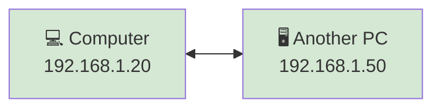

---

# 🌐 Internet Access Stops Working

Now suppose you try to visit:

```text
https://www.openai.com
```

Your computer determines that the destination is outside the local network.

Normally, it would send the packet to the default gateway.

However, because no default gateway is configured, the computer has no idea where to send the packet.

As a result:

- ❌ Websites won't load.
- ❌ Online games cannot connect.
- ❌ Cloud services become unreachable.
- ❌ Emails cannot be sent or received.
- ❌ Remote servers cannot be accessed.

The packet never leaves your local network.

---

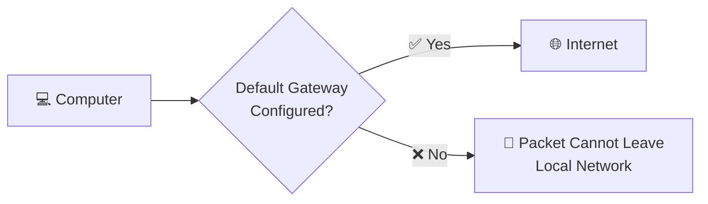

---

# ⚠️ Incorrect Default Gateway

A default gateway can also cause problems if it is configured incorrectly.

For example:

| Setting | Value |
|---------|-------|
| Computer IP | 192.168.1.20 |
| Subnet Mask | 255.255.255.0 |
| Configured Gateway | 192.168.2.1 ❌ |

The gateway address belongs to a different subnet.

Because the computer cannot even reach that gateway, it cannot forward packets to remote networks.

This results in Internet connectivity problems even though the network cable or Wi-Fi connection appears to be working.

---

# 🔍 Common Symptoms

A missing or incorrect default gateway often causes the following symptoms:

- 🌐 No Internet access
- 📧 Email cannot connect
- ☁️ Cloud applications fail
- 💻 Remote Desktop connections fail
- 🌍 Websites cannot be reached
- ✅ Local network devices remain accessible

This combination of symptoms is a strong indication that the gateway configuration should be checked.

---

# 🛠️ How to Troubleshoot

When Internet connectivity is unavailable, network administrators often follow these basic steps:

1. Verify that the computer has a valid IP address.
2. Check the subnet mask.
3. Confirm the default gateway is configured correctly.
4. Ping the default gateway.
5. Test access to an external IP address.
6. Test DNS resolution if the gateway is reachable.

These simple checks can quickly identify many common network problems.

---

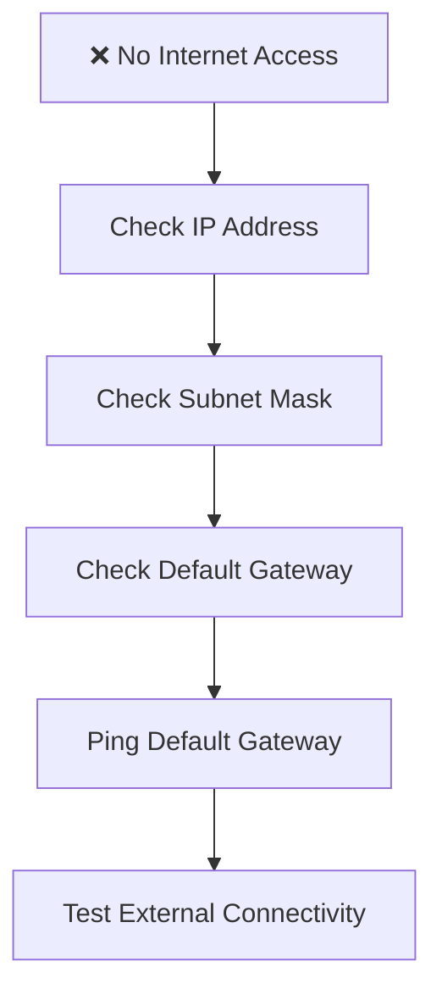

---

# 📊 Comparing the Two Situations

| Situation | Local Network | Internet |
|-----------|---------------|-----------|
| Correct Default Gateway | ✅ Works | ✅ Works |
| Missing Default Gateway | ✅ Works | ❌ Fails |
| Incorrect Default Gateway | ✅ Usually Works | ❌ Fails |

This table highlights an important concept:

A default gateway is **only required for communication with remote networks**.

---

# 🌍 Real-World Example

Imagine you live in a neighborhood where all the streets connect to one main highway.

One day, the entrance to the highway is closed.

You can still:

- Visit your neighbors.
- Walk around your neighborhood.
- Drive on local streets.

However, you cannot:

- Travel to another city.
- Reach the airport.
- Visit another town.

The **default gateway** is like that highway entrance.

Without it, communication is limited to your local area.

---

<!--
Image Description:
Create an educational troubleshooting infographic titled "What Happens If the Default Gateway Is Missing?" Split the image into two halves. On the left, show a computer communicating successfully with another computer on the same LAN. On the right, show the same computer attempting to reach the Internet but failing because the default gateway is missing. Include a warning icon over the missing gateway and arrows indicating where communication succeeds and where it stops.

Suggested Filename:
Images/missing_default_gateway.png
-->

<p align="center">

</p>

---

> 💡 **Point to Remember**
>
> A computer without a valid **default gateway** can still communicate with devices on its own local network. However, it cannot send packets to remote networks, making Internet access and communication with external systems impossible.

---

> 🤓 **Did You Know?**
>
> One of the first things a network administrator checks when troubleshooting Internet connectivity is the **default gateway**. An incorrect or missing gateway is one of the most common causes of network access problems.

# 🛡️ Cybersecurity Perspective

From a networking perspective, a default gateway simply forwards packets between networks.

From a cybersecurity perspective, however, the default gateway is much more than just a router—it is one of the **most important security control points** in an entire network.

Since nearly all traffic entering or leaving a network passes through the default gateway, it becomes the ideal location to inspect, filter, monitor, and protect network communications.

Whether you're using a home Wi-Fi router or an enterprise network, the default gateway often serves as the **first line of defense** against external threats.

---

# 🚪 The Gateway Is the Network's Front Door

Think of your network as a secure office building.

Employees can move freely inside the building, but anyone entering or leaving must pass through the main entrance.

Security guards stationed at the entrance can:

- Verify identities
- Check credentials
- Prevent unauthorized access
- Monitor suspicious activity

A default gateway plays a similar role in networking.

Every packet destined for another network must pass through the gateway, making it the perfect place to enforce security policies.

---

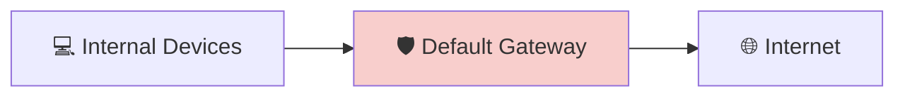

---

# 🔥 Firewalls Are Commonly Located at the Gateway

Many routers include a built-in **firewall**.

A firewall examines network traffic and decides whether it should be allowed or blocked based on predefined security rules.

For example, a firewall can:

- ✅ Allow web browsing.
- ✅ Allow email traffic.
- ❌ Block malicious connections.
- ❌ Block unauthorized ports.
- ❌ Prevent certain applications from accessing the Internet.

Because every packet passes through the gateway, the firewall can inspect all incoming and outgoing traffic.

---

# 🚫 Blocking Unauthorized Access

Attackers on the Internet constantly scan networks looking for vulnerable devices.

Without proper protection, these attackers could attempt to:

- Access shared folders
- Exploit vulnerable services
- Install malware
- Steal sensitive information

The default gateway helps reduce these risks by working with firewalls and security policies to block unwanted traffic before it reaches internal devices.

---

# 📊 Monitoring Network Traffic

Modern gateways do more than forward packets.

Many business routers and security appliances continuously monitor network activity.

Administrators can use gateway logs to identify:

- Unusual login attempts
- Malware communications
- Large file transfers
- Suspicious outbound connections
- Denial-of-Service (DoS) attacks

This visibility helps security teams detect and respond to threats more quickly.

---

# 🌐 Network Segmentation

Large organizations often divide their infrastructure into multiple subnets.

For example:

- 💰 Finance
- 💼 Human Resources
- 💻 IT
- 🌍 Guest Wi-Fi

Traffic moving between these networks passes through routers or Layer 3 switches acting as default gateways.

This allows administrators to enforce rules such as:

- Finance systems can access accounting servers.
- HR systems can access employee databases.
- Guest Wi-Fi users cannot reach internal company resources.
- Only IT administrators can manage network equipment.

This practice, known as **network segmentation**, limits the spread of attacks and improves overall security.

---

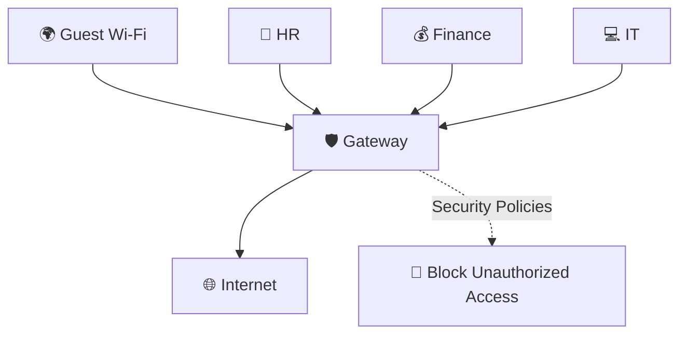

---

# 🔐 Virtual Private Networks (VPNs)

Many organizations allow employees to work remotely.

To protect sensitive data, remote users often connect through a **Virtual Private Network (VPN)**.

In many environments, the VPN terminates at the organization's gateway or firewall.

The gateway:

- Authenticates remote users.
- Encrypts network traffic.
- Grants access only to authorized resources.
- Protects company data while employees work remotely.

Without a secure gateway, remote access would expose the organization to significant security risks.

---

# 🛡️ Why Attackers Target Gateways

Because the default gateway sits between the internal network and the Internet, it is a valuable target for attackers.

If an attacker compromises the gateway, they may be able to:

- Monitor network traffic.
- Redirect users to malicious websites.
- Bypass security controls.
- Launch attacks against internal systems.

For this reason, routers and gateways must be:

- Regularly updated.
- Protected with strong administrator passwords.
- Configured securely.
- Monitored for suspicious activity.

---

# 📊 Security Responsibilities of a Default Gateway

| Security Function | Why It Matters |
|-------------------|----------------|
| Packet Forwarding | Routes traffic between networks |
| Firewall Protection | Blocks unauthorized traffic |
| Traffic Monitoring | Detects suspicious activity |
| Network Segmentation | Limits movement between networks |
| VPN Support | Provides secure remote access |
| Access Control | Enforces security policies |

---

<!--
Image Description:
Create an educational cybersecurity diagram showing a default gateway positioned between an internal corporate network and the Internet. The gateway should include icons representing a firewall, VPN, traffic monitoring, and access control. Show malicious traffic being blocked while legitimate traffic is allowed through. Use a clean enterprise-style design.

Suggested Filename:
Images/default_gateway_cybersecurity.png
-->

<p align="center">

</p>

---

> 💡 **Point to Remember**
>
> In cybersecurity, the **default gateway** is much more than a router. It serves as a strategic security checkpoint where traffic can be filtered, monitored, encrypted, and controlled before entering or leaving a network.

---

> 🤓 **Did You Know?**
>
> Many modern organizations no longer rely on a simple home router as their gateway. Instead, they deploy **next-generation firewalls (NGFWs)** that combine routing, firewall protection, intrusion prevention, VPN services, application awareness, and detailed traffic monitoring into a single device.

# 💻 Mini Lab — Finding Your Default Gateway

Now it's time to put what you've learned into practice.

In this mini lab, you'll discover the **default gateway** configured on your own computer and verify that it is reachable.

By completing this exercise, you'll gain hands-on experience with one of the most important networking concepts covered in this chapter.

---

# 🎯 Lab Objectives

After completing this lab, you will be able to:

- Find your computer's default gateway.
- Understand which device acts as your gateway.
- Verify connectivity to the gateway.
- Observe how your operating system stores network configuration.

---

# 🧰 Lab Requirements

You'll need:

- A computer running **Windows**, **Linux**, or **macOS**
- A connection to a local network (Ethernet or Wi-Fi)
- Access to the Terminal or Command Prompt

---

# 🪟 Windows Instructions

## Step 1 — Open Command Prompt

Press:

```text
Windows + R
```

Type:

```text
cmd
```

Press **Enter**.

---

## Step 2 — Display Network Information

Run:

```powershell
ipconfig
```

Look for:

```text
Default Gateway
```

Example:

```text
IPv4 Address . . . . . . . . : 192.168.1.20

Subnet Mask  . . . . . . . . : 255.255.255.0

Default Gateway . . . . . .  : 192.168.1.1
```

Write down your gateway address.

```
My Default Gateway:

__________________________
```

---

# 🐧 Linux Instructions

Open a terminal.

Run:

```bash
ip route
```

Example:

```text
default via 192.168.1.1 dev eth0
```

The address after:

```text
default via
```

is your default gateway.

Write it below.

```
My Default Gateway:

__________________________
```

---

# 🍎 macOS Instructions

Open **Terminal**.

Run:

```bash
netstat -nr
```

Example:

```text
Destination        Gateway

default            192.168.1.1
```

The value beside **default** is your gateway.

Record it below.

```
My Default Gateway:

__________________________
```

---

# 📡 Test Connectivity

Now verify that your computer can communicate with the gateway.

Run:

```bash
ping <your_gateway_ip>
```

For example:

```bash
ping 192.168.1.1
```

If everything is working correctly, you should receive replies similar to:

```text
Reply from 192.168.1.1

bytes=32

time<1ms

TTL=64
```

This confirms that your computer can successfully communicate with the router.

---

# 🔍 Observe Your Network

Answer the following questions.

### 1. What is your computer's IP address?

```
________________________________
```

---

### 2. What is your subnet mask?

```
________________________________
```

---

### 3. What is your default gateway?

```
________________________________
```

---

### 4. Are you connected using Wi-Fi or Ethernet?

```
________________________________
```

---

### 5. Could you successfully ping your default gateway?

```
☐ Yes

☐ No
```

---

# 🧠 Think About It

Consider these questions before reading the answers.

### Why do all devices on your home network use the same default gateway?

<details>

<summary>💡 Answer</summary>

Because every device belongs to the same subnet and uses the same router to communicate with remote networks.

</details>

---

### What would happen if the default gateway were removed?

<details>

<summary>💡 Answer</summary>

Devices could still communicate with other devices on the same local network, but they would lose access to remote networks such as the Internet.

</details>

---

### Why is the router usually the default gateway?

<details>

<summary>💡 Answer</summary>

Because the router connects the local network to other networks and knows how to forward packets toward their destinations.

</details>

---

# 🏆 Challenge

Without looking back at the chapter, answer the following:

- Why doesn't your computer send Internet traffic directly to websites?
- What information does the computer use to determine whether a destination is local or remote?
- Why can two computers on the same subnet communicate without using a default gateway?

If you can answer these questions confidently, you've understood one of the most important concepts in IP networking.

---

> ✅ **Lab Complete!**
>
> Congratulations! You have successfully identified your computer's default gateway, verified that it is reachable, and observed how your operating system stores essential network configuration. These are practical skills used daily by network engineers, system administrators, and cybersecurity professionals.

# 🔑 Key Takeaways

Let's review the most important concepts from this chapter.

- ✅ A **default gateway** is the network device that forwards packets from a local network to other networks.
- ✅ In most networks, the default gateway is a **router**.
- ✅ Devices communicate **directly** only with other devices on the same local network.
- ✅ Traffic destined for a **remote network** is always sent to the default gateway first.
- ✅ The computer uses its **IP address** and **subnet mask** to determine whether a destination is local or remote.
- ✅ The default gateway acts as the **first hop** in a packet's journey across the Internet.
- ✅ Home networks typically have **one default gateway**, while enterprise networks often have **multiple gateways**, one for each subnet.
- ✅ Common gateway addresses include **192.168.1.1**, **192.168.0.1**, and **10.0.0.1**, but any valid host address within the subnet can be used.
- ✅ Without a valid default gateway, devices can still communicate on the **local network** but cannot access remote networks or the Internet.
- ✅ From a cybersecurity perspective, the default gateway is a critical security checkpoint where traffic can be monitored, filtered, and controlled.

---

> 💡 **Remember:**
>
> **Same Network → Communicate Directly**  
> **Different Network → Send to the Default Gateway**

---

# 🧠 Quick Check

Test your understanding before moving on.

### **1. What is the primary purpose of a default gateway?**

- ☐ A. Assign IP addresses to devices
- ☐ B. Translate domain names into IP addresses
- ☐ C. Forward traffic to other networks
- ☐ D. Store web pages

<details>
<summary>✅ Answer</summary>

**C. Forward traffic to other networks**

</details>

---

### **2. Which device usually acts as the default gateway in a home network?**

- ☐ A. Switch
- ☐ B. Hub
- ☐ C. Router
- ☐ D. Access Point

<details>
<summary>✅ Answer</summary>

**C. Router**

</details>

---

### **3. When does a computer use the default gateway?**

- ☐ A. When communicating with devices on the same subnet
- ☐ B. When communicating with devices on another network
- ☐ C. Every time it sends a packet
- ☐ D. Only when using Wi-Fi

<details>
<summary>✅ Answer</summary>

**B. When communicating with devices on another network**

</details>

---

### **4. Can two devices on the same subnet communicate without a default gateway?**

- ☐ A. Yes
- ☐ B. No

<details>
<summary>✅ Answer</summary>

**A. Yes**

Devices on the same subnet communicate directly without involving the default gateway.

</details>

---

### **5. What happens if the default gateway is missing or configured incorrectly?**

- ☐ A. Local communication stops immediately.
- ☐ B. The computer shuts down.
- ☐ C. Devices can still communicate locally but cannot reach remote networks.
- ☐ D. DNS automatically fixes the problem.

<details>
<summary>✅ Answer</summary>

**C. Devices can still communicate locally but cannot reach remote networks.**

</details>

---

### **6. Which information does a computer use to determine whether a destination is local or remote?**

- ☐ A. MAC Address only
- ☐ B. IP Address and Subnet Mask
- ☐ C. DNS Server
- ☐ D. Default Gateway only

<details>
<summary>✅ Answer</summary>

**B. IP Address and Subnet Mask**

</details>

---

### **7. Which of the following is a commonly used default gateway address in home networks?**

- ☐ A. 255.255.255.255
- ☐ B. 127.0.0.1
- ☐ C. 192.168.1.1
- ☐ D. 0.0.0.0

<details>
<summary>✅ Answer</summary>

**C. 192.168.1.1**

</details>

---

### **8. Why is the default gateway important in cybersecurity?**

- ☐ A. It increases monitor brightness.
- ☐ B. It stores user passwords.
- ☐ C. It serves as a control point where traffic can be monitored, filtered, and secured.
- ☐ D. It replaces antivirus software.

<details>
<summary>✅ Answer</summary>

**C. It serves as a control point where traffic can be monitored, filtered, and secured.**

</details>

---
# 🎯 Challenge Questions

You've learned what a default gateway is, how it works, and why it's essential for communication between networks.

Now it's time to apply that knowledge.

These scenario-based questions are designed to make you think like a network engineer or cybersecurity professional.

Take your time and try to answer each question before revealing the solution.

---

## Challenge 1 — Local or Remote?

A computer has the following configuration:

| Setting | Value |
|---------|-------|
| IP Address | **192.168.1.25** |
| Subnet Mask | **255.255.255.0 (/24)** |
| Default Gateway | **192.168.1.1** |

The computer wants to communicate with:

```text
192.168.1.80
```

### ❓Question

Will the computer:

- Communicate directly?
- Send the packet to the default gateway?

<details>
<summary>✅ Answer</summary>

The destination belongs to the **same subnet (192.168.1.0/24)**.

Therefore, the computer communicates **directly** with the destination.

The default gateway is **not used**.

</details>

---

## Challenge 2 — Leaving the Local Network

Using the same computer configuration, the destination is now:

```text
8.8.8.8
```

### ❓Question

What happens first?

<details>
<summary>✅ Answer</summary>

Since **8.8.8.8** is outside the local network, the computer forwards the packet to its **default gateway (192.168.1.1)**.

The router then determines the best route toward the destination.

</details>

---

## Challenge 3 — Missing Gateway

A computer has:

| Setting | Value |
|---------|-------|
| IP Address | **192.168.1.50** |
| Subnet Mask | **255.255.255.0** |
| Default Gateway | **Not Configured** |

### ❓Question

Which of the following will still work?

- Accessing another computer on the same LAN
- Browsing the Internet
- Sending an email
- Connecting to a cloud application

<details>
<summary>✅ Answer</summary>

Only **accessing another computer on the same LAN** will work.

Without a default gateway, the computer has no route to remote networks.

</details>

---

## Challenge 4 — Enterprise Network

An employee's computer has:

```text
IP Address

192.168.20.45
```

Default Gateway:

```text
192.168.20.1
```

The employee wants to access a server:

```text
192.168.30.100
```

### ❓Question

Why can't the employee communicate directly with the server?

<details>
<summary>✅ Answer</summary>

The server is located on a **different subnet**.

The computer sends the packet to its **default gateway**, which forwards it to the correct network through the organization's routing infrastructure.

</details>

---

## Challenge 5 — Troubleshooting

A user reports:

- ✅ They can print to the office printer.
- ✅ They can access shared folders on another local computer.
- ❌ Websites do not load.
- ❌ Cloud applications cannot connect.

### ❓Question

What network setting should you check first?

<details>
<summary>✅ Answer</summary>

The first setting to verify is the **default gateway**.

Since local communication works but remote communication fails, an incorrect or missing default gateway is a likely cause.

</details>

---

## 🏁 Final Challenge

Without looking back at this chapter, explain the following in your own words:

1. What is a **default gateway**?
2. Why is it needed?
3. When does a computer use it?
4. What happens if it is missing?
5. Why is it important in cybersecurity?

If you can confidently answer these five questions, you've mastered one of the most fundamental concepts in computer networking.

---

> 🏆 **Challenge Complete!**
>
> If you successfully worked through these scenarios, you now understand not only **what a default gateway is**, but also **how it behaves in real-world networks**, **how to troubleshoot gateway-related problems**, and **why it plays a critical role in modern cybersecurity**.

# 📝 Chapter Summary

Congratulations! 🎉 You have completed the **Default Gateways** chapter.

In this chapter, you learned that a **default gateway** is the device responsible for forwarding packets from one network to another. It acts as the bridge between your local network and remote networks such as the Internet.

You explored how a computer decides whether a destination is **local** or **remote**, and why packets destined for other networks must first be sent to the default gateway. You also followed the complete journey of a packet as it traveled from a local device, through a router, across the Internet, and finally to its destination.

You discovered how default gateways are used in both **home** and **enterprise** environments, learned how to identify your gateway using operating system tools, and examined common gateway addresses used in real-world networks. Finally, you saw why the default gateway is a critical component of network security and what happens when it is missing or configured incorrectly.

By completing this chapter, you should now be able to:

- ✅ Define what a default gateway is and explain its purpose.
- ✅ Distinguish between local and remote network communication.
- ✅ Explain how packets are forwarded to other networks.
- ✅ Describe the role of routers as default gateways.
- ✅ Find the default gateway on Windows, Linux, and macOS.
- ✅ Troubleshoot common default gateway configuration problems.
- ✅ Understand the importance of the default gateway in enterprise networking and cybersecurity.

---

# 🚀 Next Chapter

Excellent work! You now understand **how devices communicate outside their own network** using a default gateway.

The next step is learning one of the most important skills in networking:

## 👉 [10-Subnetting.md](10-Subnetting.md)

In the next chapter, you'll learn:

- 📍 What subnetting is and why it is used.
- 📍 How large networks are divided into smaller subnetworks.
- 📍 Network IDs, Host IDs, and subnet boundaries.
- 📍 CIDR notation and subnet masks in greater detail.
- 📍 How to calculate subnets and host ranges.
- 📍 Real-world subnetting examples used in enterprise networks.
- 📍 Why subnetting improves performance, scalability, and security.

Subnetting is considered one of the most valuable networking skills for certifications like **CompTIA Network+**, **CCNA**, and many cybersecurity roles. The concepts you learned in this chapter—IP addresses, subnet masks, CIDR, loopback addresses, APIPA, and default gateways—provide the foundation you'll build on next.

➡️ **Continue your networking journey by opening [`10-Subnetting.md`](10-Subnetting.md).**

# 📖 Continue Your Learning

Congratulations! 🎉 You have completed the **Default Gateways** chapter.

You now understand:

- ✅ What a default gateway is.
- ✅ Why every network needs a default gateway.
- ✅ The difference between local and remote network communication.
- ✅ How a computer decides whether to send packets directly or through the default gateway.
- ✅ How routers forward packets between networks.
- ✅ How to find your default gateway on Windows, Linux, and macOS.
- ✅ What happens when the default gateway is missing or configured incorrectly.
- ✅ Why the default gateway plays an important role in enterprise networking and cybersecurity.

In the next chapter, you'll learn **Subnetting**, one of the most important and practical skills in computer networking.

You'll discover how to divide a large network into smaller subnetworks, calculate network and broadcast addresses, determine usable host ranges, and design efficient IP addressing schemes. Subnetting is an essential skill for network engineers, cloud administrators, system administrators, and cybersecurity professionals because it improves network performance, enhances security through segmentation, and makes better use of available IP addresses.

> **🚀 Next Lesson:** [**Subnetting**](10-Subnetting.md)

