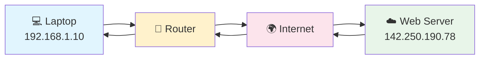
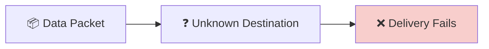
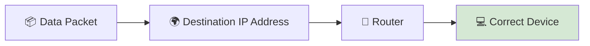
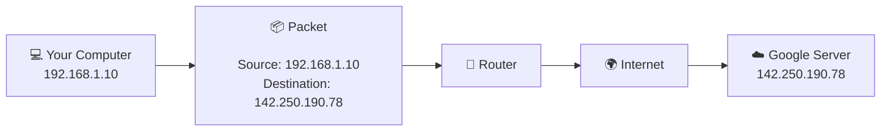
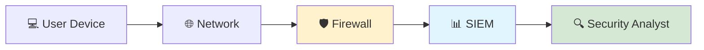
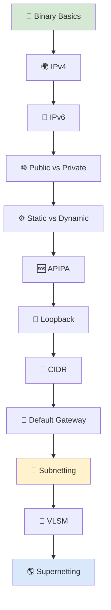

# 🌍 IP Addressing

> *Learn how devices are uniquely identified on a network, how data finds its destination across the Internet, and why IP addressing is one of the most fundamental concepts in networking and cybersecurity.*

---

---

<!--
Image Description:
Create a professional educational banner illustrating the concept of IP Addressing. Show multiple devices including laptops, smartphones, servers, cloud infrastructure, routers, and the Internet. Display unique IP addresses above each device with packets traveling between them to emphasize logical addressing and communication across networks. Use a clean modern networking style.

Suggested Search Keywords:
IP addressing infographic
computer networking IP illustration
internet packet routing
network devices with IP addresses
logical addressing diagram

Suggested Filename:
Images/ip_addressing_banner.png
-->

---

# 🌐 What Is IP Addressing?

Imagine trying to send a letter to a friend without writing their home address on the envelope.

The postal service would have no idea where to deliver it.

Computer networks face the same challenge.

Whenever your computer sends data across a network—whether you're opening a website, sending an email, joining a video call, or streaming a movie—that data must know **exactly where it is going**.

This is made possible through **IP Addressing**.

An **IP (Internet Protocol) Address** is a **unique logical identifier** assigned to every device connected to a network. It allows routers and other networking devices to determine where data should be delivered and how it should travel from one network to another.

Without IP addressing, computers would still be able to send electrical signals, light pulses, or radio waves—but they would have **no way of knowing which device should receive the data**.

In simple terms:

> **IP Addressing gives every device on a network its own unique identity, allowing billions of devices around the world to communicate accurately and efficiently.**

---

---

<!--
Image Description:
Illustrate a laptop communicating with a web server across the Internet. Show the laptop with a private IP address, a router forwarding packets, and the destination web server with a public IP address. Use arrows to represent the journey of network packets.

Suggested Search Keywords:
how IP addressing works
computer to server communication
internet packet flow diagram
IP address communication illustration

Suggested Filename:
Images/how_ip_addressing_works.png
-->

---

> 💡 **Did You Know?**
>
> Every time you visit a website, your computer first determines the destination IP address of the server before sending any data. Every packet exchanged across the Internet contains both a **Source IP Address** and a **Destination IP Address**, allowing routers to deliver information to the correct device.

---

# 🤔 Imagine a World Without IP Addresses

Imagine a city where **none of the houses have addresses**.

A delivery driver receives thousands of packages every day but has no street names, house numbers, or postal codes to guide them.

Even if the roads are perfectly built and every vehicle is working correctly, **the packages would never reach the correct destination**.

Computer networks face the exact same challenge.

Network cables, fiber optic links, and wireless signals provide the **path** for data to travel, but they do not identify **where the data should go**.

Without a unique address, a computer would have no way of determining:

- 📍 Which device should receive the data.
- 🌍 Which network the destination belongs to.
- 🚦 Which route the packet should follow.
- 📦 Where responses should be sent.

This is why **IP addressing is one of the most fundamental technologies in computer networking**.

Every packet that travels across a network carries addressing information so that networking devices can make forwarding decisions and deliver data to the correct destination.

---

**Without IP Addressing**

The network may successfully transmit electrical signals, light pulses, or radio waves, but those signals have **no destination**.

---

**With IP Addressing**

Every packet contains a destination address, allowing routers to examine the packet and forward it toward the correct device, even if that device is located on the other side of the world.

---

<!--
Image Description:
Create a side-by-side educational illustration comparing networking with and without IP addressing. On the left, show packets becoming lost because devices have no addresses. On the right, show packets successfully reaching their destination using IP addresses and routers.

Suggested Search Keywords:
IP addressing comparison infographic
network packets with and without IP addresses
logical addressing illustration
packet routing diagram

Suggested Filename:
Images/why_ip_addressing_is_needed.png
-->

---

> 💡 **Point to Remember**
>
> **Network media (copper, fiber optics, and wireless) provide the path for communication, while IP addressing provides the destination.**
>
> Both are essential. Without transmission media, data cannot travel. Without IP addressing, data has nowhere to go.

---

> 🤓 **Fun Fact**
>
> At any given moment, **billions of IP packets** are traveling across the Internet. Routers around the world examine the destination IP address of each packet and make forwarding decisions in milliseconds, allowing websites, cloud services, video calls, and online games to work seamlessly.

---
# ⚙️ How IP Addressing Works

Whenever two devices communicate across a network, they exchange information in the form of **packets**.

Each packet contains not only the actual data being transmitted but also important addressing information that tells the network where the packet came from and where it needs to go.

Think of a network packet like a postal envelope:

- 📄 The **letter inside** is the actual data.
- 🏠 The **sender's address** tells the recipient who sent it.
- 📬 The **recipient's address** tells the postal service where to deliver it.

Network packets work in exactly the same way.

Every packet contains two essential IP addresses:

- **Source IP Address** — The address of the device sending the data.
- **Destination IP Address** — The address of the device that should receive the data.

Routers examine the **Destination IP Address** and determine the best path for the packet to reach its intended destination.

---

---

The communication process can be summarized in five simple steps:

1. **A device creates a packet** containing the information it wants to send.
2. **The packet is assigned a Source IP Address and a Destination IP Address.**
3. **The packet is forwarded to a router.**
4. **Routers examine the destination IP address** and forward the packet toward the correct network.
5. **The destination device receives the packet** and sends a response using the same process in reverse.

---

<!--
Image Description:
Create an educational infographic illustrating the journey of a network packet from a user's computer to a web server. Show the Source IP Address, Destination IP Address, routers, Internet cloud, and the return path of the response packet. Use arrows to clearly indicate packet flow.

Suggested Search Keywords:
IP packet journey infographic
how packets travel on the Internet
source and destination IP address diagram
packet routing illustration

Suggested Filename:
Images/ip_packet_journey.png
-->

---

## 📦 What's Inside an IP Packet?

While you'll study packet structure in greater detail later, every IP packet contains several important pieces of information that allow devices and routers to communicate effectively.

Some of the most important fields include:

| Field | Purpose |
|--------|---------|
| **Source IP Address** | Identifies the sender of the packet. |
| **Destination IP Address** | Identifies the intended recipient. |
| **Payload (Data)** | The actual information being transmitted. |
| **Protocol Information** | Indicates which higher-level protocol (such as TCP or UDP) is carrying the data. |

As you continue through this roadmap, you'll explore packet structures in much greater detail when studying **Network Protocols** and **Packet Analysis**.

---

> 💡 **Point to Remember**
>
> **Routers do not care what the packet contains—they primarily use the Destination IP Address to determine where the packet should be forwarded.** This simple principle allows billions of devices around the world to communicate reliably across the Internet.

---

> 🤓 **Did You Know?**
>
> Every time you open a webpage, your device may exchange **dozens or even hundreds of IP packets** with multiple servers to load text, images, videos, advertisements, fonts, and other website resources.

---
# 🛡️ Why IP Addressing Matters in Cybersecurity

Every cyberattack, security investigation, and network defense operation begins with one fundamental piece of information:

> **An IP Address.**

Whether you're monitoring network traffic, investigating a security incident, configuring a firewall, or responding to an attack, IP addresses help identify **where network communication originates and where it is going**.

Because every packet contains both a **Source IP Address** and a **Destination IP Address**, security professionals can analyze communication patterns, detect suspicious activity, and trace malicious traffic across networks.

In other words, **IP addresses act like digital addresses that help defenders understand who is communicating, what systems are involved, and where potential threats may exist.**

---

---

Cybersecurity professionals work with IP addresses every single day.

Here are just a few examples:

| Cybersecurity Area | How IP Addressing Is Used |
|--------------------|---------------------------|
| 🔥 Firewalls | Allow or block traffic based on source or destination IP addresses. |
| 🚨 Intrusion Detection & Prevention (IDS/IPS) | Detect suspicious communication between hosts. |
| 📊 SIEM Platforms | Analyze logs and correlate events using IP addresses. |
| 🕵️ Digital Forensics | Trace malicious activity back to affected systems. |
| 🌍 Threat Intelligence | Identify known malicious IP addresses and block them. |
| 🔍 Vulnerability Scanning | Discover devices and services running on a network. |
| 🧪 Penetration Testing | Enumerate live hosts before testing for vulnerabilities. |
| 📡 Network Monitoring | Observe traffic flows between devices and networks. |

---

<!--
Image Description:
Create an educational cybersecurity illustration showing a SOC analyst monitoring network traffic. Include firewalls, routers, servers, SIEM dashboards, and packets labeled with source and destination IP addresses. Highlight suspicious traffic being detected and analyzed.

Suggested Search Keywords:
cybersecurity network monitoring
SOC analyst network traffic
firewall packet analysis
SIEM IP address monitoring
network security infographic

Suggested Filename:
Images/ip_addressing_cybersecurity.png
-->

---

## 🌍 Real-World Example

Imagine that a company's web server suddenly begins receiving thousands of login requests every second.

A security analyst investigates the firewall logs and notices that most of the requests originate from the same external IP address.

By analyzing the source IP address, the security team can:

- 🚫 Block the malicious IP using a firewall.
- 🔍 Investigate whether other systems have communicated with it.
- 📊 Search SIEM logs for related activity.
- 🌐 Compare the IP against threat intelligence databases.
- 🛡️ Reduce the impact of the attack before additional damage occurs.

Without IP addressing, identifying and responding to malicious network activity would be significantly more difficult.

---

> 💡 **Did You Know?**
>
> Security Operations Centers (SOCs) investigate **millions of network events every day**, and IP addresses are one of the primary indicators used to identify suspicious communication and investigate cyber incidents.

---

> ⭐ **Point to Remember**
>
> Understanding IP addressing is not just important for network engineers—it is an essential skill for cybersecurity professionals, cloud engineers, penetration testers, incident responders, and digital forensic investigators.

---

# 🗺️ Your Learning Journey

Learning IP addressing can seem overwhelming at first.

Terms like **IPv4**, **IPv6**, **CIDR**, **Subnetting**, and **VLSM** are often introduced together, making it difficult for beginners to understand how they relate to one another.

In this module, we'll take a different approach.

Instead of memorizing concepts, you'll build your knowledge **step by step**, with each lesson preparing you for the next. By the time you reach subnetting and network design, you'll already have the foundation needed to understand them with confidence.

Our learning journey follows a logical progression:

1. **Understand how computers represent numbers using binary.**
2. **Learn how IPv4 identifies devices on a network.**
3. **Explore IPv6 and discover why it was developed.**
4. **Understand different types of IP addresses and how they are assigned.**
5. **Learn how devices communicate beyond their local network.**
6. **Master modern IP addressing techniques such as CIDR and subnetting.**
7. **Finish with advanced concepts like VLSM and Supernetting.**

By following this sequence, you'll not only learn **how IP addressing works**, but also **why each concept exists and how it is used in real-world networks.**

---

------

> 💡 **Learning Tip**
>
> Don't skip ahead to **Subnetting** or **VLSM** if you're new to networking. These topics become much easier when you first understand **binary numbers**, **IPv4 addressing**, and **CIDR notation**. Each lesson in this module has been arranged to build naturally upon the previous one.

---

# 📚 Lessons in This Module

This module is divided into **12 carefully structured lessons**. Each lesson builds upon the previous one, gradually developing your understanding of IP addressing—from basic binary numbers to advanced network design concepts like subnetting and supernetting.

Whether you're preparing for certifications such as **CompTIA Network+**, **CCNA**, or **Security+**, these lessons provide the foundational knowledge required to understand how devices communicate across modern networks.

| # | Lesson | Description |
|---|--------|-------------|
| 01 | [Binary Basics](01-Binary%20Basics.md) | Learn how computers represent numbers using binary and why it matters in networking. |
| 02 | [IPv4](02-IPv4.md) | Explore the structure and operation of IPv4 addresses. |
| 03 | [IPv6](03-IPv6.md) | Discover the next generation of Internet addressing. |
| 04 | [Public vs Private IP](04-Public%20vs%20Private%20IP.md) | Understand Internet-facing and internal addresses. |
| 05 | [Static vs Dynamic IP](05-Static%20vs%20Dynamic%20IP.md) | Learn how devices obtain IP addresses. |
| 06 | [APIPA](06-APIPA.md) | Understand Automatic Private IP Addressing and troubleshooting. |
| 07 | [Loopback Address](07-Loopback%20Address.md) | Learn about localhost and network testing. |
| 08 | [CIDR](08-CIDR.md) | Master modern IP prefix notation. |
| 09 | [Default Gateway](09-Default%20Gateway.md) | Learn how packets leave your local network. |
| 10 | [Subnetting](10-Subnetting.md) | Divide networks efficiently using subnet masks. |
| 11 | [VLSM](11-VLSM.md) | Allocate IP addresses more efficiently with Variable Length Subnet Masking. |
| 12 | [Supernetting](12-Supernetting.md) | Learn route summarization and network aggregation. |

---

---
# 📚 Lessons in This Module

This module is divided into **12 carefully structured lessons**, each building upon the knowledge gained in the previous one.

Rather than presenting isolated networking concepts, the lessons are arranged as a **progressive learning journey**. You'll begin with the binary number system used by computers, then explore IPv4 and IPv6 addressing, before advancing to subnetting, VLSM, and supernetting.

Whether you're preparing for **CompTIA Network+**, **CCNA**, **Security+**, or building a strong networking foundation for cybersecurity, these lessons will provide the knowledge and practical understanding required to master IP addressing.

---

# 🔢 Lesson 01 — [Binary Basics](01-Binary%20Basics.md)

Every computer stores and processes information using **binary numbers**.

Before learning IPv4 addresses, subnet masks, and CIDR notation, you'll first discover how computers represent numbers using bits and bytes. This lesson builds the mathematical foundation required for understanding every IP addressing concept that follows.

### 📖 Topics Covered

- Binary Numbers
- Decimal Numbers
- Bits & Bytes
- Binary ↔ Decimal Conversion
- Why Networking Uses Binary

---

# 🌍 Lesson 02 — [IPv4](02-IPv4.md)

IPv4 is the addressing system that has powered the Internet for decades.

In this lesson, you'll learn how IPv4 addresses are structured, how they uniquely identify devices, and why the limited IPv4 address space eventually led to the development of IPv6.

### 📖 Topics Covered

- IPv4 Structure
- 32-bit Addressing
- Dotted Decimal Notation
- Network & Host Portions
- IPv4 Limitations

---

# 🚀 Lesson 03 — [IPv6](03-IPv6.md)

IPv6 is the next generation of Internet addressing, designed to overcome the limitations of IPv4.

You'll explore 128-bit addressing, hexadecimal notation, address compression techniques, and discover how IPv6 ensures the Internet can continue growing for decades to come.

### 📖 Topics Covered

- Why IPv6 Exists
- 128-bit Addressing
- Hexadecimal Numbers
- Address Compression
- IPv4 vs IPv6

---

# 🌐 Lesson 04 — [Public vs Private IP](04-Public%20vs%20Private%20IP.md)

Not every IP address can be accessed directly from the Internet.

This lesson explains the difference between public and private IP addresses, why private networks exist, and how technologies such as NAT allow private devices to communicate with the public Internet.

### 📖 Topics Covered

- Public IP Addresses
- Private IP Addresses
- RFC 1918 Address Ranges
- NAT Overview
- Home Network Examples

---

# ⚙️ Lesson 05 — [Static vs Dynamic IP](05-Static%20vs%20Dynamic%20IP.md)

Learn how devices receive IP addresses, either through manual configuration or automatically from a DHCP server, and understand when each approach is appropriate.

### 📖 Topics Covered

- Static Addressing
- Dynamic Addressing
- DHCP Basics
- Advantages & Disadvantages
- Real-World Use Cases

---

# 🆘 Lesson 06 — [APIPA](06-APIPA.md)

Discover why Windows assigns addresses in the **169.254.x.x** range and how APIPA helps identify DHCP and network connectivity problems.

### 📖 Topics Covered

- APIPA
- 169.254.x.x
- DHCP Failure
- Troubleshooting

---

# 🔄 Lesson 07 — [Loopback Address](07-Loopback%20Address.md)

Learn how a computer communicates with itself using the loopback interface and why network engineers frequently use **127.0.0.1** and **::1** for testing.

### 📖 Topics Covered

- Localhost
- Loopback Interface
- 127.0.0.1
- IPv6 Loopback
- Network Testing

---
# 📏 Lesson 08 — [CIDR](08-CIDR.md)

Classless Inter-Domain Routing (CIDR) replaced the traditional class-based addressing system, allowing networks to allocate IP addresses more efficiently and reduce address waste.

In this lesson, you'll learn how CIDR notation works, how to interpret prefix lengths, and why it has become the standard method for designing modern IP networks.

### 📖 Topics Covered

- Classful vs Classless Addressing
- CIDR Notation
- Prefix Length
- Network Prefixes
- Efficient Address Allocation

---

# 🚪 Lesson 09 — [Default Gateway](09-Default%20Gateway.md)

Devices can communicate directly only with other devices on the same network. To reach remote networks or the Internet, they rely on a **Default Gateway**.

This lesson explains how routers forward packets between networks and why the default gateway is one of the most important settings in every network configuration.

### 📖 Topics Covered

- What is a Default Gateway?
- Router's Role
- Local vs Remote Communication
- Packet Forwarding
- Real-World Examples

---

# 🧩 Lesson 10 — [Subnetting](10-Subnetting.md)

Subnetting is one of the most valuable skills for every network engineer and cybersecurity professional. It allows large networks to be divided into smaller, organized subnetworks that improve performance, security, and efficient IP address utilization.

By the end of this lesson, you'll be able to calculate subnet masks, identify network and broadcast addresses, and determine the number of usable hosts within a subnet.

### 📖 Topics Covered

- Why Subnetting?
- Subnet Masks
- Network Address
- Broadcast Address
- Usable Host Calculation
- Subnetting Examples

---

# 🏢 Lesson 11 — [VLSM (Variable Length Subnet Masking)](11-VLSM.md)

Real-world enterprise networks rarely require every subnet to contain the same number of hosts. Variable Length Subnet Masking (VLSM) solves this problem by allowing subnets of different sizes within the same network.

This lesson teaches efficient address allocation, helping reduce wasted IP addresses while improving scalability and network design.

### 📖 Topics Covered

- Variable Length Subnet Masking
- Address Optimization
- Efficient Network Design
- Multiple Subnet Sizes
- Enterprise Network Examples

---

# 🌎 Lesson 12 — [Supernetting](12-Supernetting.md)

The final lesson introduces **Supernetting**, also known as **Route Aggregation**, which combines multiple smaller networks into a larger address block.

You'll discover how Internet Service Providers (ISPs) and enterprise networks simplify routing tables, improve routing efficiency, and reduce network complexity using supernetting.

This lesson also concludes the IP Addressing module and prepares you for the next stage of your networking journey.

### 📖 Topics Covered

- Supernetting
- Route Aggregation
- Route Summarization
- ISP Routing
- Enterprise Networks
- Preparing for Network Protocols

---
---

# 🎯 Module Learning Outcomes

By the time you complete this module, you won't just recognize an IP address—you'll understand **how modern networks identify devices, exchange information, and deliver data across the Internet**.

You'll be able to:

- ✅ Explain the purpose of IP addressing.
- ✅ Understand how IPv4 and IPv6 work.
- ✅ Distinguish between public and private addressing.
- ✅ Configure static and dynamic IP addresses.
- ✅ Troubleshoot APIPA and loopback addresses.
- ✅ Read CIDR notation.
- ✅ Explain the role of a default gateway.
- ✅ Design simple subnetting schemes.
- ✅ Understand VLSM and supernetting.
- ✅ Apply IP addressing concepts from a cybersecurity perspective.

These skills form the foundation for routing, network services, firewalls, cloud networking, and nearly every cybersecurity discipline you'll study later in this roadmap.

---

# 💡 Key Takeaways

Before moving on to the lessons, remember these important ideas:

- 🌍 Every device connected to a network requires a unique logical address.
- 📦 Every packet contains both a Source IP Address and a Destination IP Address.
- 📡 Routers rely on IP addresses to forward packets across networks.
- 🔐 IP addressing plays a critical role in both networking and cybersecurity.
- 🚀 Mastering IP addressing will make routing, subnetting, and network security much easier to understand.

---

> 💭 **Quote to Remember**
>
> *"Network media provides the path. IP addressing provides the destination."*

---

<!--
Image Description:
Create an inspiring educational illustration representing the transition into learning IP addressing. Show a student studying a network diagram with routers, computers, cloud infrastructure, and interconnected devices labeled with IP addresses. The illustration should represent the beginning of the IP Addressing learning journey.

Suggested Search Keywords:
network engineer studying IP addressing
computer networking education
IP addressing concept illustration
network learning journey

Suggested Filename:
Images/start_learning_ip_addressing.png
-->

---

# 🚀 Ready to Begin?

You've now explored **what IP addressing is, why it exists, how it works, and why it is essential in networking and cybersecurity**.

The next step is to build the foundation that every networking professional needs: **Binary Numbers**.

Understanding binary will make IPv4, IPv6, subnetting, and every lesson that follows much easier to understand.

Take your time, complete each lesson in order, and don't hesitate to revisit earlier topics whenever needed. Each lesson has been carefully arranged to build upon the previous one.

## ➜ Start your journey here:

# **[🔢 01 – Binary Basics](01-Binary%20Basics.md)** →

---

## 📖 Continue Your Learning Journey

| Previous Module | Current Module | Next Module |
|-----------------|----------------|-------------|
| **[📡 Network Media](../03-Network%20Media/README.md)** | **🌍 IP Addressing** | **[📦 Network Protocols](../05-Network%20Protocols/README.md)** |

---

### 🌟 One Step Closer to Becoming a Networking & Cybersecurity Professional

**Every expert once learned their first IP address. This is where your journey begins.**

---