# 🌐 Address Resolution Protocol (ARP)

> *The **Address Resolution Protocol (ARP)** is a fundamental IPv4 protocol that enables devices on a local network to discover the **MAC (Media Access Control) address** associated with an **IPv4 address**. It acts as the bridge between the **Network Layer (IP addressing)** and the **Data Link Layer (MAC addressing)**, making communication over Ethernet networks possible.*

---

<div align="center">


</div>

---


<p align="center">
<i>Figure 1: Before two devices can communicate over an Ethernet network, the sender must discover the destination device's MAC address using ARP.</i>
</p>

> **🖼️ Image Reminder**
>
> **Image Description:** Create or download an illustration showing **two computers connected through a switch**. Computer A knows the **IPv4 address** of Computer B but does **not** know its **MAC address**. Show an **ARP Request** being broadcast to the network and an **ARP Reply** returning from Computer B with its MAC address.
>
> **Suggested Filename:** `arp-overview.png`

---

# 📖 Introduction

Imagine you want to send a package to your friend.

You know **their street address**, but you don't know **which house belongs to them**. Before you can deliver the package, you must identify the correct house.

Computer networks face a very similar challenge.

Every device connected to a network has an **IP address**, which identifies it logically, and a **MAC address**, which identifies its network interface physically.

When one computer wants to communicate with another device on the same local network, it usually knows the destination's **IP address**. However, Ethernet communication cannot deliver data using IP addresses alone—it requires the destination's **MAC address**.

This creates an important question:

> **How does a computer discover the MAC address that belongs to a known IPv4 address?**

The answer is the **Address Resolution Protocol (ARP).**

ARP automatically translates an IPv4 address into its corresponding MAC address before Ethernet frames are transmitted across the local network.

Although this entire process takes only a few milliseconds and happens silently in the background, it is one of the most essential operations performed on every IPv4 Ethernet network.

Without ARP, devices on the same Local Area Network (LAN) would know each other's IP addresses but would have no way to determine where Ethernet frames should actually be delivered.

Throughout this chapter, you'll learn how ARP works internally, how devices exchange ARP Requests and Replies, how ARP caches improve network performance, the security risks associated with ARP, and how network administrators protect against attacks such as **ARP Spoofing** and **ARP Poisoning**.

By the end of this lesson, you'll have a solid understanding of one of the most fundamental protocols in modern IPv4 networking.

# 🤔 Why Do We Need ARP?

Before we can understand how ARP works, we first need to understand **the problem it was designed to solve**.

When computers communicate over a network, they don't simply send data directly to an IP address. Instead, data passes through different layers of the networking stack, and each layer has its own addressing system.

At the **Network Layer (Layer 3)**, devices are identified using **IP addresses**.

At the **Data Link Layer (Layer 2)**, devices communicate using **MAC addresses**.

This means that even if your computer knows the destination's IP address, it still cannot send an Ethernet frame until it discovers the destination's MAC address.

This is exactly where **Address Resolution Protocol (ARP)** comes into play.

---


<p align="center">
<i>Figure 2: ARP bridges the gap between logical IP addressing and physical MAC addressing, allowing Ethernet communication to take place.</i>
</p>

**Image Description:** Create or download a diagram showing the communication flow from an application that knows the destination IP address to ARP resolving the corresponding MAC address before the Ethernet frame is transmitted.

---

# 🌐 Two Different Addresses

One of the most common misconceptions among beginners is believing that an **IP address** is enough for devices to communicate.

In reality, both an **IP address** and a **MAC address** are required, and each serves a completely different purpose.

Think of them as two different ways of identifying a destination.

| IP Address | MAC Address |
|------------|-------------|
| Logical address | Physical hardware address |
| Assigned by software or DHCP | Assigned by the manufacturer |
| Can change | Usually remains unchanged |
| Used for communication between networks | Used for communication within a local network |
| Operates at the Network Layer | Operates at the Data Link Layer |

You can think of it like sending a letter through the postal service.

- The **IP address** is similar to the street address that tells the postal system where the destination is located.
- The **MAC address** is like the specific house on that street where the package must ultimately be delivered.

Without knowing both pieces of information, successful delivery cannot occur.

---

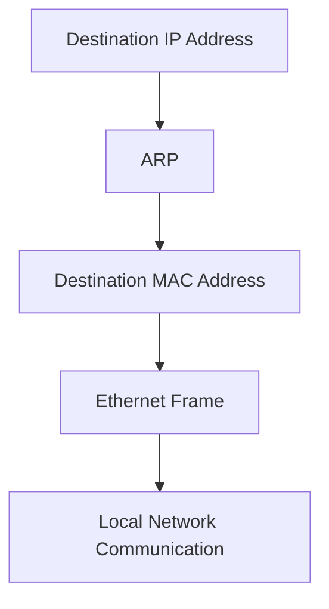


<p align="center">
<i>Figure 3: ARP converts a known IPv4 address into the corresponding MAC address required for Ethernet communication.</i>
</p>

**Image Description:** Create or download an illustration comparing an IPv4 address and a MAC address, showing ARP acting as the bridge that converts the logical address into the physical hardware address.

---

# 💡 A Real-World Analogy

Imagine you order food through a delivery application.

The application knows your **home address**, but once the delivery driver reaches your street, they still need to identify **which specific house** belongs to you.

Similarly, computers first determine **where** data should go using an IP address.

Before the data can actually be delivered across an Ethernet network, the sending device must identify **which network interface** belongs to that IP address.

ARP performs this task automatically.

Every time you browse a website, access a file server, connect to another computer, or communicate with a printer on your local network, ARP silently performs this address resolution process in the background.

Without ARP, Ethernet networks would be unable to deliver frames correctly, making local communication impossible despite devices having valid IP addresses.

# 🚧 The Communication Problem

Now that we understand why ARP exists, let's examine the communication problem that occurs on every Ethernet network.

Imagine two computers connected to the same switch.

Computer **A** wants to send data to Computer **B**.

The sending computer already knows the destination's **IPv4 address**, either because the user entered it manually, a DNS server resolved it, or an application requested communication.

However, Ethernet does **not** deliver data using IP addresses.

Instead, Ethernet frames are delivered using **MAC addresses**.

This means Computer A has enough information to know **who** it wants to communicate with, but not enough information to actually deliver the frame.

Before any data can leave the network interface card (NIC), Computer A must answer one important question:

> **"Which MAC address belongs to this IPv4 address?"**

That question is answered by ARP.

---


<p align="center">
<i>Figure 4: Computer A knows the destination IPv4 address but cannot transmit an Ethernet frame until ARP discovers the corresponding MAC address.</i>
</p>

**Image Description:** Create or download a diagram showing Computer A connected to a switch with Computer B. Show that Computer A knows the IPv4 address (192.168.1.20) but displays a question mark for the MAC address until ARP resolves it.

---

# 📦 Why Ethernet Requires MAC Addresses

To understand why ARP is necessary, it's important to remember that different networking technologies use different addressing methods.

The **Internet Protocol (IP)** is responsible for identifying devices across networks, while **Ethernet** is responsible for delivering frames across the local network.

Because Ethernet operates at the **Data Link Layer (Layer 2)**, it doesn't understand IP addresses.

Instead, every Ethernet frame contains two physical addresses:

- **Source MAC Address** – The sender's hardware address.
- **Destination MAC Address** – The receiver's hardware address.

Without a valid destination MAC address, the Ethernet frame cannot be constructed or transmitted.

---

```text
Ethernet Frame

+------------------------------------------------------+
| Destination MAC | Source MAC | Data | Error Check |
+------------------------------------------------------+
```


<p align="center">
<i>Figure 5: Every Ethernet frame contains both a source and destination MAC address before it can be transmitted across the local network.</i>
</p>

**Image Description:** Create or download a labeled Ethernet frame illustrating the Destination MAC Address, Source MAC Address, Data (Payload), and Frame Check Sequence (FCS).

---

# 🧩 Bridging Two Layers

ARP acts as the bridge between two important layers of the TCP/IP networking model.

At one layer, applications and IP routing work with **IPv4 addresses**.

At another layer, Ethernet hardware communicates using **MAC addresses**.

ARP connects these two worlds by translating a known IPv4 address into the correct MAC address before communication begins.

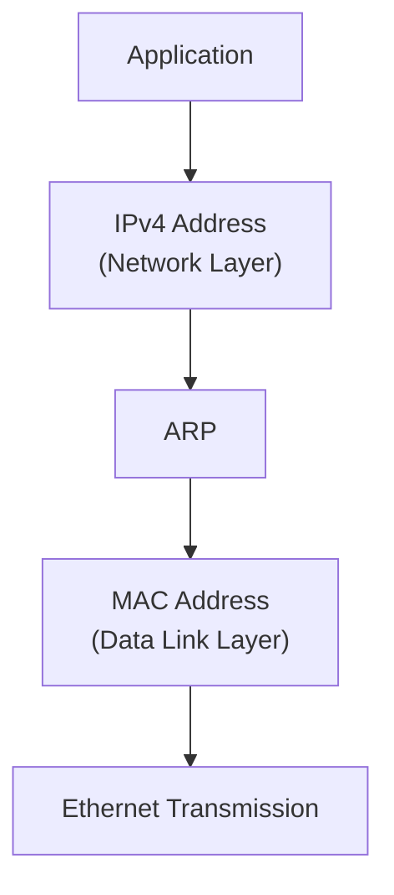


<p align="center">
<i>Figure 6: ARP bridges the Network Layer and the Data Link Layer by translating IPv4 addresses into MAC addresses.</i>
</p>

**Image Description:** Create or download a layered networking diagram showing the Application Layer, Network Layer (IPv4), ARP positioned between the Network and Data Link layers, and Ethernet communication using MAC addresses.

---

# 🎯 Key Point

ARP does **not** determine **where** data should travel across the Internet—that is the responsibility of the **Internet Protocol (IP)** and routers.

Instead, ARP determines **which physical device on the local network** should receive the Ethernet frame by resolving an IPv4 address into its corresponding MAC address.

In simple terms:

- **IP decides the destination.**
- **ARP discovers the hardware address.**
- **Ethernet delivers the frame.**

These three technologies work together every time devices communicate on an IPv4 Ethernet network.

# 🔄 How ARP Works

Now that we've identified the communication problem, it's time to see **how ARP solves it**.

The Address Resolution Protocol follows a simple but highly efficient process to discover the MAC address associated with an IPv4 address.

Whenever a device needs to communicate with another device on the same Local Area Network (LAN), it first checks whether it already knows the destination's MAC address.

If the MAC address is already stored in memory, communication can begin immediately.

If not, the device starts the ARP resolution process.

This entire process usually takes only a few milliseconds and is completely transparent to the user.

---

## 📝 The ARP Resolution Process

The ARP process consists of four main steps:

1. **Check the ARP Cache**
   - The sender first looks in its local ARP cache to see if it already knows the destination MAC address.

2. **Broadcast an ARP Request**
   - If no matching entry exists, the sender broadcasts an ARP Request to every device on the local network.

3. **Receive an ARP Reply**
   - The device whose IP address matches the request sends back an ARP Reply containing its MAC address.

4. **Update the ARP Cache**
   - The sender stores the new IP-to-MAC mapping in its ARP cache and begins normal communication.

---

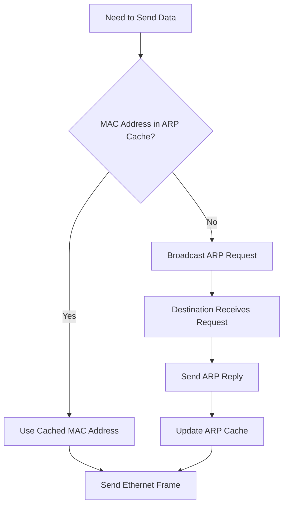


<p align="center">
<i>Figure 7: The complete ARP resolution process, from checking the ARP cache to successfully transmitting an Ethernet frame.</i>
</p>

**Image Description:** Create or download a flow diagram illustrating the ARP resolution process. Begin with "Need to Send Data," check the ARP cache, branch to either using the cached MAC address or broadcasting an ARP Request, receiving an ARP Reply, updating the ARP cache, and finally sending the Ethernet frame.

---

# 🖥️ A Practical Example

Let's see this process in action.

Assume the following network:

| Device | IPv4 Address | MAC Address |
|---------|--------------|-------------|
| Computer A | 192.168.1.10 | 00:AA:11:22:33:44 |
| Computer B | 192.168.1.20 | 00:BB:55:66:77:88 |

Computer A wants to send data to Computer B.

It already knows the destination IP address (**192.168.1.20**), but it does not know the corresponding MAC address.

Here's what happens:

1. Computer A checks its ARP cache.
2. No matching entry is found.
3. Computer A broadcasts an ARP Request asking, **"Who has 192.168.1.20?"**
4. Every device on the LAN receives the request.
5. Only Computer B recognizes its own IP address.
6. Computer B replies with its MAC address (**00:BB:55:66:77:88**).
7. Computer A stores this mapping in its ARP cache.
8. Computer A constructs an Ethernet frame using Computer B's MAC address and sends the data.

The next time Computer A communicates with Computer B, it can use the cached MAC address without repeating the ARP Request, as long as the cache entry has not expired.

---

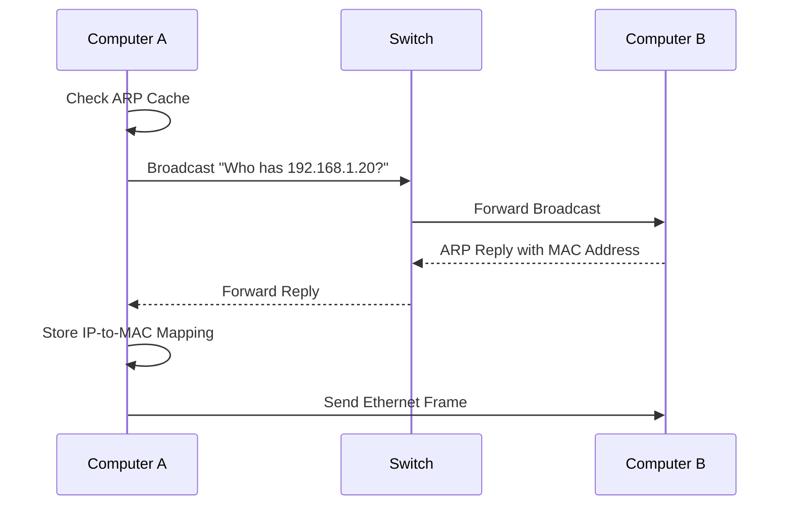


<p align="center">
<i>Figure 8: A practical example of ARP resolution between two computers connected to the same local network.</i>
</p>

**Image Description:** Create or download a network diagram showing Computer A, a switch, and Computer B. Illustrate the sequence of checking the ARP cache, broadcasting an ARP Request, receiving an ARP Reply, updating the ARP cache, and finally transmitting the Ethernet frame using the resolved MAC address.

---

# 💡 Why This Process Is Efficient

Although ARP uses broadcasts to discover unknown MAC addresses, this broadcast occurs **only when necessary**.

Once the mapping is learned, it is temporarily stored in the ARP cache, allowing future communication to proceed without additional broadcasts.

This reduces unnecessary network traffic and improves overall communication efficiency.

As a result, ARP provides a fast, automatic, and lightweight mechanism for resolving IPv4 addresses into MAC addresses, making seamless Ethernet communication possible.

# 📢 ARP Request

The first message sent during the ARP resolution process is called an **ARP Request**.

An ARP Request is a **broadcast message** sent by a device when it knows the destination's IPv4 address but does not know its corresponding MAC address.

Instead of sending the request to one specific device, the sender transmits it to **every device on the local network**.

Every computer connected to the same broadcast domain receives the request and examines its contents.

Only the device whose IPv4 address matches the requested address responds.

All other devices simply ignore the request.

This broadcasting mechanism ensures that the sender can locate the correct device even when it has no knowledge of its hardware address.

---

# 📡 Why Is an ARP Request Broadcast?

When a computer does not know the destination MAC address, it has no way of sending a unicast frame directly to the target device.

The only option is to ask everyone on the local network.

To achieve this, Ethernet uses a special **broadcast MAC address**:

```text
FF:FF:FF:FF:FF:FF
```

This is known as the **Ethernet Broadcast Address**.

Every network interface card (NIC) on the local network accepts frames sent to this address.

As a result, every device receives the ARP Request and checks whether the requested IPv4 address belongs to it.

---

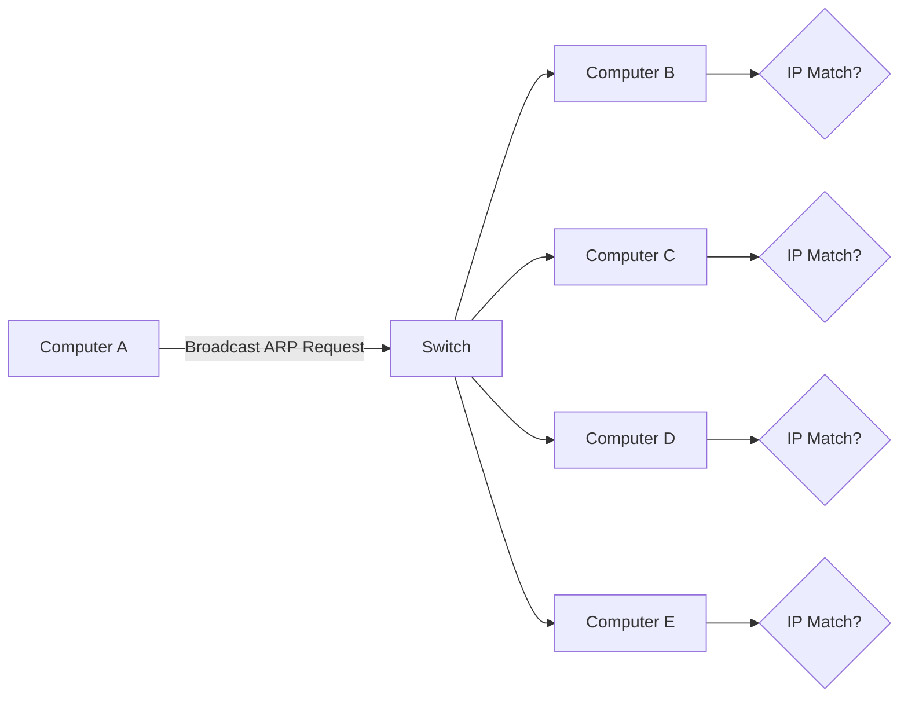


<p align="center">
<i>Figure 9: An ARP Request is broadcast to every device on the local network using the destination MAC address FF:FF:FF:FF:FF:FF.</i>
</p>

**Image Description:** Create or download a LAN diagram with one computer broadcasting an ARP Request through a switch to multiple computers. Label the Ethernet destination address as **FF:FF:FF:FF:FF:FF** and show that every connected device receives the broadcast.

---

# 📨 What Does an ARP Request Say?

An ARP Request is essentially a question sent across the network.

It asks:

> **"Who has this IPv4 address? Please tell me your MAC address."**

For example, suppose Computer A wants to communicate with **192.168.1.20**.

The ARP Request would be interpreted as:

```text
Who has 192.168.1.20?

Tell 192.168.1.10
```

This means:

- The sender is **192.168.1.10**.
- The sender wants to communicate with **192.168.1.20**.
- The sender needs the MAC address associated with that IPv4 address.

Every device receives the request, but only the device using **192.168.1.20** responds.

---

# 📦 Information Inside an ARP Request

An ARP Request contains several important fields that help identify both the sender and the intended recipient.

| Field | Description |
|--------|-------------|
| Sender MAC Address | MAC address of the requesting device |
| Sender IPv4 Address | IPv4 address of the requesting device |
| Target MAC Address | Unknown (filled with zeros) |
| Target IPv4 Address | IPv4 address being searched for |
| Operation Code | Indicates that this is an **ARP Request** |

Notice that the **Target MAC Address** is unknown because discovering it is the entire purpose of the ARP Request.

It is commonly represented as:

```text
00:00:00:00:00:00
```

until the correct MAC address is learned.

---

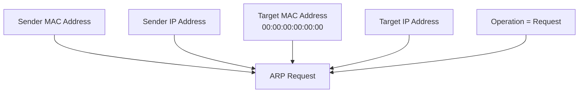


<p align="center">
<i>Figure 10: The main fields contained within an ARP Request packet before the destination MAC address is known.</i>
</p>

**Image Description:** Create or download a labeled ARP Request packet showing the Sender MAC Address, Sender IPv4 Address, Target MAC Address (00:00:00:00:00:00), Target IPv4 Address, and Operation field set to Request.

---

# 💡 Important Characteristics of an ARP Request

An ARP Request has several defining characteristics:

- 📡 It is always transmitted as an **Ethernet broadcast**.
- 🌐 It remains within the local network and is **never forwarded by routers**.
- 🖥️ Every device on the LAN receives the request.
- ✅ Only the device whose IPv4 address matches the requested address sends a reply.
- ⚡ The request is used only when the sender does not already know the destination MAC address.

Because ARP Requests are broadcasts, they generate a small amount of additional network traffic. However, this overhead is minimized by the use of the ARP cache, which stores learned IP-to-MAC mappings for future communication.

In the next section, we'll see how the destination device responds by sending an **ARP Reply**, completing the address resolution process.

# 📩 ARP Reply

After the ARP Request has been broadcast across the local network, every device examines the request to determine whether the **Target IPv4 Address** matches its own.

Most devices immediately discard the request because the requested IP address does not belong to them.

Only **one device** recognizes that the requested IPv4 address is its own.

That device then responds by sending an **ARP Reply**.

Unlike an ARP Request, an **ARP Reply is not broadcast**.

Instead, it is sent **directly back to the requesting device** as a **unicast** Ethernet frame because the responding device already knows the sender's MAC address from the ARP Request.

This completes the address resolution process and allows normal communication to begin.

---

# 📨 Why Is an ARP Reply Unicast?

Remember that the ARP Request contained the following information:

- Sender IP Address
- Sender MAC Address

Because the responding computer already knows the sender's MAC address, there is no need to broadcast the reply to every device on the network.

Instead, it sends the response directly to the requesting computer.

This makes the communication much more efficient and prevents unnecessary network traffic.

---


<p align="center">
<i>Figure 11: Unlike an ARP Request, an ARP Reply is sent as a unicast message directly to the requesting device.</i>
</p>

**Image Description:** Create or download a diagram showing Computer A broadcasting an ARP Request through a switch. Computer B replies directly to Computer A with a unicast ARP Reply containing its MAC address.

---

# 💬 What Does an ARP Reply Say?

The ARP Reply answers the sender's question.

If Computer A asked:

```text
Who has 192.168.1.20?

Tell 192.168.1.10
```

Computer B responds with:

```text
192.168.1.20 is at

00:BB:55:66:77:88
```

This tells the requesting computer exactly which MAC address belongs to the requested IPv4 address.

Once this information is received, the sender can immediately begin transmitting Ethernet frames to the destination device.

---

# 📦 Information Inside an ARP Reply

An ARP Reply contains the same basic fields as an ARP Request, but now the previously unknown MAC address has been filled in.

| Field | Description |
|--------|-------------|
| Sender MAC Address | MAC address of the responding device |
| Sender IPv4 Address | IPv4 address of the responding device |
| Target MAC Address | MAC address of the original requester |
| Target IPv4 Address | IPv4 address of the original requester |
| Operation Code | Indicates that this is an **ARP Reply** |

Unlike the ARP Request, every address field now contains valid information.

The sender has successfully identified itself, allowing communication to proceed.

---

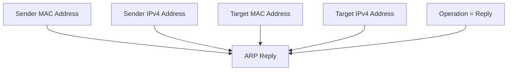


<p align="center">
<i>Figure 12: An ARP Reply contains the complete IP-to-MAC mapping needed by the requesting device.</i>
</p>

**Image Description:** Create or download a labeled ARP Reply packet showing the Sender MAC Address, Sender IPv4 Address, Target MAC Address, Target IPv4 Address, and the Operation field set to Reply.

---

# 💾 Updating the ARP Cache

Once the ARP Reply reaches the requesting computer, it performs an important task before sending any data.

It stores the newly learned **IPv4-to-MAC mapping** inside its **ARP Cache**.

This means that future communication with the same device can begin immediately without broadcasting another ARP Request.

For example, after receiving the reply, the ARP Cache may contain an entry like this:

```text
Internet Address      Physical Address         Type

192.168.1.20          00-BB-55-66-77-88        Dynamic
```

The next time Computer A needs to communicate with **192.168.1.20**, it simply looks up the MAC address in its ARP Cache and skips the entire ARP Request/Reply process.

This significantly reduces network traffic and improves communication efficiency.

---


<p align="center">
<i>Figure 13: After receiving an ARP Reply, the sender stores the IP-to-MAC mapping in its ARP Cache for future communication.</i>
</p>

**Image Description:** Create or download a flow diagram showing an ARP Reply being received, the ARP Cache being updated with the new mapping, and future packets using the cached entry instead of sending another ARP Request.

---

# 🎯 Key Points

The ARP Reply completes the address resolution process by providing the requested MAC address.

Unlike the broadcast ARP Request, the reply is transmitted as a **unicast** message because the responder already knows the sender's MAC address.

After receiving the reply, the requesting device updates its ARP Cache and begins normal Ethernet communication.

From this point onward, both devices can exchange Ethernet frames directly until the ARP Cache entry expires or is removed.

# 🖥️ Step-by-Step Communication Example

Now that you understand both the **ARP Request** and the **ARP Reply**, let's put everything together and follow the complete communication process from beginning to end.

We'll use a simple network consisting of two computers connected to the same switch.

| Device | IPv4 Address | MAC Address |
|---------|--------------|-------------|
| 💻 Computer A | 192.168.1.10 | 00:AA:11:22:33:44 |
| 💻 Computer B | 192.168.1.20 | 00:BB:55:66:77:88 |

Computer A wants to send data to Computer B.

Although it already knows **Computer B's IPv4 address**, it does not know its **MAC address**.

Let's see exactly what happens.

---

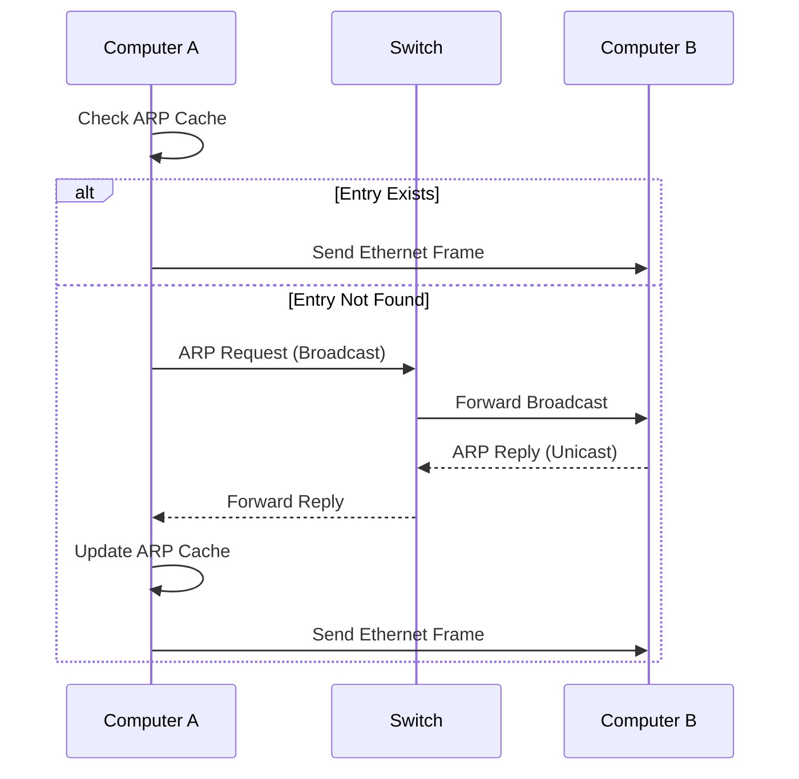


<p align="center">
<i>Figure 14: The complete ARP communication process from checking the ARP Cache to sending the Ethernet frame.</i>
</p>

**Image Description:** Create or download a complete network communication diagram showing Computer A checking its ARP Cache, broadcasting an ARP Request through a switch, Computer B replying with its MAC address, the ARP Cache being updated, and finally the Ethernet frame being transmitted.

---

# 🪜 Step 1 — Computer A Needs to Send Data

Suppose a user on **Computer A** opens a shared folder hosted on **Computer B**.

The operating system already knows that the destination IP address is:

```text
192.168.1.20
```

However, Ethernet communication requires a **destination MAC address**, not just an IP address.

Before any data can be transmitted, Computer A checks whether it already knows Computer B's MAC address.

---

# 🪜 Step 2 — Checking the ARP Cache

The operating system searches its local **ARP Cache**.

If an entry already exists, communication begins immediately.

If no entry is found, the operating system starts the ARP resolution process.

For our example, assume the cache is empty.

```text
ARP Cache

-----------------------------------------

No entry for 192.168.1.20

-----------------------------------------
```

Since no matching entry exists, Computer A must discover the MAC address using ARP.

---

# 🪜 Step 3 — Broadcasting the ARP Request

Computer A creates an ARP Request asking:

```text
Who has 192.168.1.20?

Tell 192.168.1.10
```

The Ethernet destination address is:

```text
FF:FF:FF:FF:FF:FF
```

Because this is the broadcast address, every device connected to the local network receives the request.

Most devices ignore it immediately because the requested IP address does not belong to them.

---

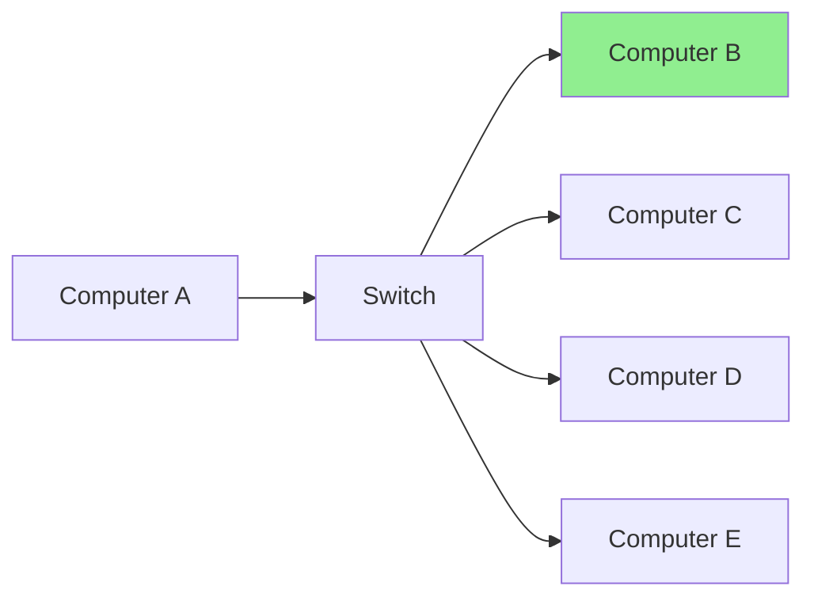


<p align="center">
<i>Figure 15: The ARP Request is broadcast to every device connected to the local network.</i>
</p>

**Image Description:** Create or download a LAN diagram showing one computer broadcasting an ARP Request through a switch to several computers. Highlight the destination computer that owns the requested IPv4 address.

---

# 🪜 Step 4 — Computer B Sends an ARP Reply

Computer B examines the ARP Request.

It notices that the requested IPv4 address matches its own.

Computer B then creates an ARP Reply containing its MAC address.

```text
192.168.1.20 is at

00:BB:55:66:77:88
```

Unlike the request, this reply is sent **directly back** to Computer A using a unicast Ethernet frame.

No other computers process the reply.

---

# 🪜 Step 5 — Updating the ARP Cache

Computer A receives the ARP Reply and immediately stores the new mapping inside its ARP Cache.

```text
Internet Address      Physical Address         Type

192.168.1.20          00-BB-55-66-77-88        Dynamic
```

Future communication with Computer B can now begin without broadcasting another ARP Request.

This improves network efficiency by reducing unnecessary broadcast traffic.

---

# 🪜 Step 6 — Sending the Data

Now that Computer A knows Computer B's MAC address, it constructs the Ethernet frame.

The frame now contains:

| Field | Value |
|--------|-------|
| Source MAC | 00:AA:11:22:33:44 |
| Destination MAC | 00:BB:55:66:77:88 |
| Source IP | 192.168.1.10 |
| Destination IP | 192.168.1.20 |

The frame is transmitted through the switch and delivered directly to Computer B.

From the user's perspective, everything happens almost instantly.

Most users never realize that ARP performed several operations behind the scenes before the first byte of data was ever transmitted.

---

# 🎯 Key Takeaway

Although the ARP communication process appears lengthy when studied step by step, it is extremely fast in real networks.

The entire sequence—from checking the ARP Cache to receiving the ARP Reply and sending the first Ethernet frame—typically completes in just a few milliseconds.

This automatic address resolution process enables billions of devices around the world to communicate seamlessly across IPv4 Ethernet networks every single day.

# 💾 ARP Cache

Imagine if your computer had to broadcast an ARP Request every single time it wanted to send data to another device.

Even if you were communicating with the same computer hundreds of times every minute, the ARP Request and ARP Reply process would have to repeat over and over again.

This would generate unnecessary network traffic, consume bandwidth, and reduce overall network performance.

To solve this problem, operating systems maintain a temporary database known as the **ARP Cache**.

The ARP Cache stores recently learned **IPv4-to-MAC address mappings**, allowing devices to reuse this information instead of repeatedly broadcasting ARP Requests.

Think of it as your computer's **address book**.

Instead of asking the network every time, your computer simply looks up the answer in its local cache.

---

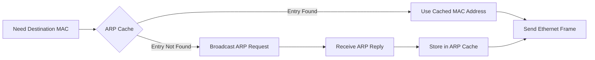


<p align="center">
<i>Figure 16: The ARP Cache allows devices to reuse previously learned IP-to-MAC mappings, reducing unnecessary ARP broadcasts.</i>
</p>

**Image Description:** Create or download a flow diagram showing a device first checking its ARP Cache. If a matching entry exists, communication continues immediately. Otherwise, an ARP Request is broadcast, an ARP Reply is received, and the new mapping is stored in the ARP Cache.

---

# 📖 What Does the ARP Cache Store?

Each ARP Cache entry contains information about a device that has recently communicated on the local network.

A typical entry includes:

- IPv4 Address
- MAC Address
- Entry Type
- Lifetime (Timeout)

Example:

```text
Internet Address      Physical Address         Type

192.168.1.1           40-8D-5C-11-22-33        Dynamic

192.168.1.20          00-BB-55-66-77-88        Dynamic

192.168.1.50          00-15-5D-4A-6F-91        Static
```

Each row represents a known mapping between an IPv4 address and its corresponding MAC address.

Whenever your computer needs to communicate with one of these devices again, it simply reads the information from the cache instead of sending another ARP Request.

---

# ⚡ Dynamic vs Static ARP Entries

Not all ARP Cache entries are created in the same way.

They generally fall into two categories.

| Dynamic Entry | Static Entry |
|---------------|--------------|
| Learned automatically through ARP | Configured manually by an administrator |
| Temporary | Permanent until removed |
| Expires after a timeout | Does not expire automatically |
| Most common | Used in special environments |

### Dynamic Entries

Most entries in the ARP Cache are **dynamic**.

They are automatically created whenever an ARP Reply is received.

After a certain period of inactivity, these entries expire and are removed from the cache.

If communication is needed again, ARP simply performs another address resolution.

---

### Static Entries

Static entries are manually configured by network administrators.

Because they never expire automatically, they are often used in situations where:

- Critical servers always use the same MAC address.
- Network security policies require fixed mappings.
- Administrators want to reduce the risk of ARP spoofing attacks.

Although useful, static entries require manual maintenance whenever hardware changes.

---

# ⏳ Why Do ARP Entries Expire?

You might wonder:

> **Why doesn't the ARP Cache store addresses forever?**

The answer is simple.

Networks change.

For example:

- A computer may disconnect.
- A laptop may reconnect with a different network adapter.
- A virtual machine may receive a new MAC address.
- Network hardware may be replaced.

If old information remained forever, computers could continue sending Ethernet frames to incorrect hardware addresses.

To prevent this, operating systems automatically remove outdated entries after a certain amount of time.

The exact timeout depends on the operating system.

When an entry expires, the next communication simply triggers a new ARP Request to learn the current MAC address.

---

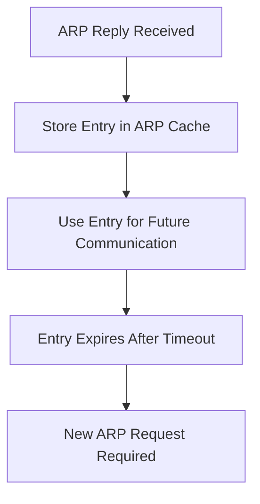


<p align="center">
<i>Figure 17: Dynamic ARP Cache entries remain available for a limited time before expiring and being rediscovered when needed.</i>
</p>

**Image Description:** Create or download a timeline illustrating the lifecycle of a dynamic ARP Cache entry, beginning with an ARP Reply, followed by storage in the cache, normal usage, expiration after a timeout, and a new ARP Request when communication resumes.

---

# 💻 Viewing the ARP Cache

Every major operating system provides commands for displaying the contents of the ARP Cache.

### Windows

```powershell
arp -a
```

### Linux

```bash
ip neigh
```

or

```bash
arp -n
```

### macOS

```bash
arp -a
```

These commands allow administrators and cybersecurity professionals to inspect existing IP-to-MAC mappings, troubleshoot communication issues, and detect suspicious entries that may indicate ARP spoofing attacks.

---

# 🎯 Key Takeaway

The ARP Cache is one of the reasons Ethernet communication is so efficient.

Instead of broadcasting an ARP Request every time a device sends data, previously learned IP-to-MAC mappings are temporarily stored and reused.

This reduces network traffic, improves performance, and allows communication to begin almost instantly.

However, because network environments change over time, cached entries eventually expire, ensuring that devices always maintain accurate and up-to-date address information.

# 📢 Gratuitous ARP

So far, we've learned that ARP is used when one device needs to discover the MAC address of another device.

However, there is another special type of ARP message called **Gratuitous ARP**.

Unlike a normal ARP Request, a Gratuitous ARP is **not sent because a device needs someone else's MAC address**.

Instead, a device sends a Gratuitous ARP to **announce its own IP-to-MAC address mapping** to every device on the local network.

In other words, the device already knows its own IP address and MAC address—it simply broadcasts this information so that other devices can update their ARP Caches.

Although it uses the ARP protocol, its purpose is completely different from normal address resolution.

---

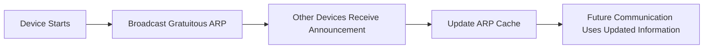


<p align="center">
<i>Figure 18: A Gratuitous ARP allows a device to announce its own IP-to-MAC mapping to every device on the local network.</i>
</p>

**Image Description:** Create or download a network diagram showing a newly connected computer broadcasting a Gratuitous ARP to all devices on the LAN. Other computers update their ARP Cache without sending any request.

---

# 🤔 Why Is It Called "Gratuitous"?

The word **gratuitous** means **given without being requested**.

Normally, an ARP Reply is sent only after another device broadcasts an ARP Request.

A Gratuitous ARP is different.

The device broadcasts the ARP message **without anyone asking for it**.

That is why it is called a **Gratuitous ARP**.

Think of it as introducing yourself to everyone when you enter a room instead of waiting for someone to ask your name.

---

# ⚙️ How Gratuitous ARP Works

When a device sends a Gratuitous ARP:

1. It broadcasts an ARP packet to the entire local network.
2. The sender IP address and the target IP address are usually the **same**.
3. Every device receives the packet.
4. Devices update their ARP Cache with the sender's latest IP-to-MAC mapping.
5. Communication with the announcing device becomes faster because its MAC address is already known.

Unlike a normal ARP Request, no ARP Reply is expected.

The purpose is simply to inform other devices about the sender's current address mapping.

---

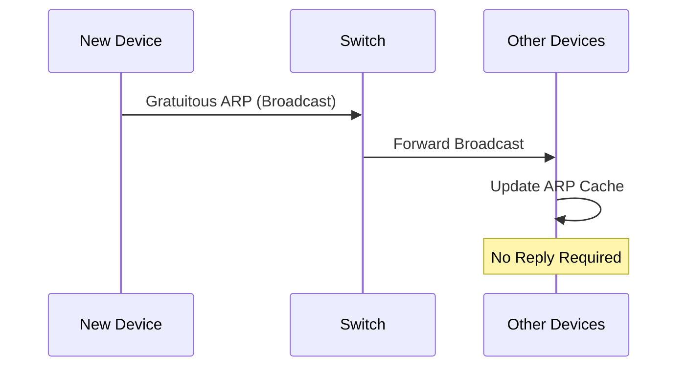


<p align="center">
<i>Figure 19: A Gratuitous ARP is broadcast across the LAN, allowing other devices to update their ARP Cache without sending a response.</i>
</p>

**Image Description:** Create or download a sequence diagram showing a device broadcasting a Gratuitous ARP through a switch while all other devices update their ARP Cache. No reply messages should be shown.

---

# 🌍 Common Uses of Gratuitous ARP

Although most users never notice it, Gratuitous ARP is used in many real-world networking situations.

## ✅ 1. Updating ARP Caches

When a device joins the network, it can immediately announce its IP-to-MAC mapping.

Other devices store this information in their ARP Cache, reducing the need for future ARP Requests.

---

## ✅ 2. Detecting Duplicate IP Addresses

One of the most important uses of Gratuitous ARP is **Duplicate Address Detection (DAD)**.

Before a device begins using an IPv4 address, it may broadcast a Gratuitous ARP.

If another device replies or reports that it is already using the same IP address, an address conflict is detected.

This helps prevent two devices from accidentally sharing the same IPv4 address.

---

## ✅ 3. High Availability and Failover

Enterprise networks often use multiple servers for redundancy.

If the primary server fails, a backup server immediately takes over using the same IPv4 address.

The backup server then sends a Gratuitous ARP announcing:

> "This IP address now belongs to my MAC address."

All computers on the network update their ARP Cache automatically and continue communicating without waiting for old ARP entries to expire.

This allows failover to occur within seconds.

---


<p align="center">
<i>Figure 20: During failover, the backup server broadcasts a Gratuitous ARP so clients immediately associate the shared IP address with the new MAC address.</i>
</p>

**Image Description:** Create or download an enterprise failover diagram showing a primary server failing, a backup server becoming active, broadcasting a Gratuitous ARP, and client computers updating their ARP Cache.

---

# ⚠️ Important Points

Gratuitous ARP has several characteristics that distinguish it from normal ARP communication.

- 📡 It is broadcast across the local network.
- ❓ It is **not** sent because another device requested information.
- 💾 It helps update ARP Cache entries on neighboring devices.
- 🔍 It can detect duplicate IPv4 addresses.
- 🏢 It is widely used in enterprise failover and high-availability solutions.
- 🚫 Routers do not forward Gratuitous ARP packets beyond the local broadcast domain.

---

# 🎯 Key Takeaway

Gratuitous ARP is a special form of ARP communication in which a device voluntarily announces its own IP-to-MAC mapping to the local network.

Rather than resolving an unknown address, it keeps neighboring devices informed of address changes, detects duplicate IP addresses, and supports high-availability environments where IP addresses may move from one device to another.

Although it operates quietly in the background, Gratuitous ARP plays an important role in maintaining accurate ARP Caches and ensuring reliable communication across modern IPv4 Ethernet networks.

# 🌐 Proxy ARP

So far, we've learned that ARP allows devices on the **same local network** to discover each other's MAC addresses.

However, what happens if a device wants to communicate with another device that is **not** on the same network?

Normally, the sending device forwards the packet to its **default gateway**, which then routes the packet to the destination network.

But in some special situations, a router can perform an additional function known as **Proxy ARP**.

With Proxy ARP, a router answers an ARP Request **on behalf of another device**.

Instead of the destination device replying with its own MAC address, the router replies using **its own MAC address**, effectively acting as a proxy (representative) for the remote device.

This allows communication to continue even though the destination is located on a different network.

---


<p align="center">
<i>Figure 21: In Proxy ARP, the router responds to an ARP Request on behalf of a remote device using its own MAC address.</i>
</p>

**Image Description:** Create or download a network diagram showing Computer A on one subnet, a router in the middle, and Computer B on another subnet. Computer A broadcasts an ARP Request for Computer B's IP address, and the router replies with its own MAC address before forwarding the traffic.

---

# 🤔 Why Is Proxy ARP Needed?

Under normal circumstances, computers use a **subnet mask** to determine whether the destination is on the same network.

- If the destination is on the **same subnet**, the device uses ARP to discover the destination's MAC address.
- If the destination is on a **different subnet**, the device sends the packet to its default gateway.

However, some legacy networks or misconfigured devices may not know how to reach remote networks correctly.

In these situations, Proxy ARP allows the router to answer the ARP Request, making the sender believe that the destination is directly reachable.

The router then forwards the packet to the actual destination using normal routing.

---

# ⚙️ How Proxy ARP Works

Let's examine the complete process.

Assume:

- **Computer A:** `192.168.1.10`
- **Router Interface:** `192.168.1.1`
- **Remote Computer:** `192.168.2.20`

Computer A attempts to communicate with **192.168.2.20**.

Instead of the remote computer responding, the router performs Proxy ARP.

The communication process is as follows:

1. Computer A broadcasts an ARP Request for **192.168.2.20**.
2. The router receives the request.
3. The router recognizes that the destination exists on another network.
4. The router replies using **its own MAC address**.
5. Computer A stores the router's MAC address in its ARP Cache.
6. Computer A sends Ethernet frames to the router.
7. The router routes the packets to the actual destination.

To Computer A, it appears as though the destination device is located on the local network, even though the router is silently forwarding all traffic.

---

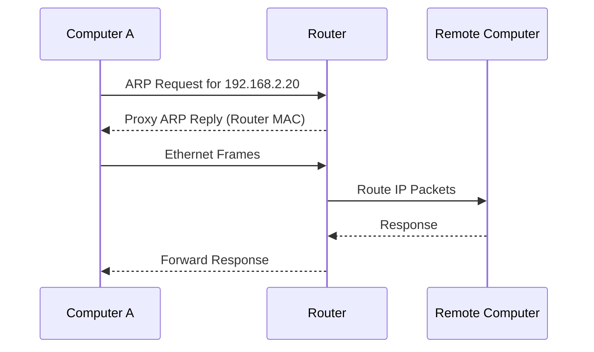


<p align="center">
<i>Figure 22: The router answers the ARP Request, receives the Ethernet frames, and routes the packets to the remote network.</i>
</p>

**Image Description:** Create or download a sequence diagram illustrating Computer A broadcasting an ARP Request, the router replying with its own MAC address, Computer A sending Ethernet frames to the router, and the router forwarding the packets to a remote computer.

---

# 🌍 Real-World Uses of Proxy ARP

Although Proxy ARP is less common in modern network designs, it still appears in certain environments.

Common uses include:

- Supporting older devices that cannot correctly use a default gateway.
- Maintaining compatibility with legacy network configurations.
- Simplifying communication during network migrations.
- Providing temporary connectivity while redesigning network infrastructure.

Many enterprise networks disable Proxy ARP unless there is a specific operational requirement, since proper routing and subnetting are generally preferred.

---

# ⚠️ Limitations of Proxy ARP

While Proxy ARP can solve certain networking problems, it also has several drawbacks.

- ❌ Increases unnecessary ARP traffic.
- ❌ Can make network troubleshooting more difficult.
- ❌ May hide poor network design or incorrect subnet configurations.
- ❌ Can introduce security concerns if improperly configured.
- ❌ Does not scale well in large enterprise environments.

Because of these limitations, modern networks typically rely on proper routing instead of Proxy ARP whenever possible.

---

# 🔍 Proxy ARP vs Normal ARP

| Feature | Normal ARP | Proxy ARP |
|---------|------------|-----------|
| Who replies? | Destination device | Router |
| MAC address returned | Destination MAC | Router's MAC |
| Used for | Local communication | Communication with remote networks in special cases |
| Requires routing? | No | Yes |
| Common today? | Yes | Mostly legacy or special environments |

---

# 🎯 Key Takeaway

Proxy ARP is a special ARP feature in which a router answers an ARP Request on behalf of a device located on another network.

Instead of returning the destination device's MAC address, the router provides **its own MAC address**, receives the Ethernet frames from the sender, and forwards the IP packets to the correct destination through normal routing.

Although Proxy ARP remains useful for certain legacy and compatibility scenarios, modern networks generally prefer well-designed routing and subnetting over relying on Proxy ARP.

# 📦 ARP Packet Format

Every network protocol follows a predefined structure when transmitting information across a network.

Just as a letter contains fields such as the sender's address, recipient's address, and message, an ARP packet also contains several fields that allow devices to understand who is asking for information and who should receive the response.

Whenever an ARP Request or ARP Reply is sent, this information is organized into an **ARP Packet**.

Understanding the ARP packet format is important for:

- Understanding how ARP actually works behind the scenes.
- Reading packet captures in Wireshark.
- Troubleshooting network communication problems.
- Detecting ARP spoofing attacks.
- Preparing for networking and cybersecurity certifications such as **CompTIA Network+**, **CCNA**, and **Security+**.

---

```text
+-----------------------------------------------------------+
|                  Address Resolution Protocol              |
+-----------------------------------------------------------+
| Hardware Type (HTYPE)                                    |
+-----------------------------------------------------------+
| Protocol Type (PTYPE)                                    |
+-----------------------------------------------------------+
| Hardware Address Length (HLEN)                           |
+-----------------------------------------------------------+
| Protocol Address Length (PLEN)                           |
+-----------------------------------------------------------+
| Operation (Opcode)                                       |
+-----------------------------------------------------------+
| Sender Hardware Address (SHA)                            |
+-----------------------------------------------------------+
| Sender Protocol Address (SPA)                            |
+-----------------------------------------------------------+
| Target Hardware Address (THA)                            |
+-----------------------------------------------------------+
| Target Protocol Address (TPA)                            |
+-----------------------------------------------------------+
```


<p align="center">
<i>Figure 23: The fields contained within an ARP packet. Together, these fields allow devices to identify the sender, specify the target, and perform IPv4-to-MAC address resolution.</i>
</p>

**Image Description:** Create or download a labeled ARP packet diagram showing each field of the ARP header, including Hardware Type, Protocol Type, Hardware Address Length, Protocol Address Length, Operation Code, Sender MAC Address, Sender IP Address, Target MAC Address, and Target IP Address.

---

# 🔍 Understanding Each Field

Let's examine each field one by one.

---

## 1️⃣ Hardware Type (HTYPE)

The **Hardware Type** field identifies the type of network technology being used.

For Ethernet networks, which are the most common today, this value is:

```text
1
```

This tells the receiving device that the packet is intended for an Ethernet network.

---

## 2️⃣ Protocol Type (PTYPE)

This field identifies which Layer 3 protocol ARP is resolving.

For IPv4, the hexadecimal value is:

```text
0x0800
```

This indicates that the ARP packet is resolving an **IPv4 address**.

If another protocol were being resolved, this value would be different.

---

## 3️⃣ Hardware Address Length (HLEN)

This field specifies the length of the hardware address.

Since Ethernet MAC addresses contain **48 bits (6 bytes)**, the value is:

```text
6
```

---

## 4️⃣ Protocol Address Length (PLEN)

This field specifies the size of the protocol address.

IPv4 addresses contain **32 bits (4 bytes)**, so the value is:

```text
4
```

---

## 5️⃣ Operation (Opcode)

The **Operation** field tells the receiving device what type of ARP message it has received.

The two most common values are:

| Opcode | Meaning |
|---------|---------|
| **1** | ARP Request |
| **2** | ARP Reply |

When Wireshark displays an ARP packet, one of the first things it checks is this field.

---

## 6️⃣ Sender Hardware Address (SHA)

This field contains the MAC address of the device sending the ARP packet.

Example:

```text
00:AA:11:22:33:44
```

Every receiving device now knows exactly which hardware interface transmitted the packet.

---

## 7️⃣ Sender Protocol Address (SPA)

This field stores the sender's IPv4 address.

Example:

```text
192.168.1.10
```

Together, the Sender Hardware Address and Sender Protocol Address create an IP-to-MAC mapping that other devices can store in their ARP Cache.

---

## 8️⃣ Target Hardware Address (THA)

This field represents the destination MAC address.

Its value depends on the type of ARP message.

### During an ARP Request

The sender does **not** know the destination MAC address yet.

Therefore, the field is filled with zeros.

```text
00:00:00:00:00:00
```

### During an ARP Reply

The responding device fills this field with the MAC address of the original requester.

---

## 9️⃣ Target Protocol Address (TPA)

This field contains the IPv4 address that is being searched for.

Example:

```text
192.168.1.20
```

The receiving devices compare this value with their own IPv4 address.

If the addresses match, they know they should respond.

Otherwise, they simply ignore the packet.

---

```mermaid
flowchart TD

A["Sender MAC Address"]

B["Sender IP Address"]

C["Target MAC Address"]

D["Target IP Address"]

E["Opcode"]

A --> F["ARP Packet"]

B --> F

C --> F

D --> F

E --> F
```


<p align="center">
<i>Figure 24: The most important fields of an ARP packet and the information each field provides during address resolution.</i>
</p>

**Image Description:** Create or download a clean infographic highlighting the five key fields used during ARP communication: Sender MAC Address, Sender IP Address, Target MAC Address, Target IP Address, and the Operation (Opcode) field.

---

> 💡 **Did You Know?**
>
> An ARP packet is surprisingly small—only **28 bytes** for the ARP message itself on a standard Ethernet network (excluding the Ethernet frame header and trailer). Despite its small size, this packet enables every IPv4 device on a LAN to discover the correct hardware address before communication begins.

---

# 🎯 Key Takeaway

The ARP packet format provides all the information required to resolve an IPv4 address into a MAC address.

Each field has a specific purpose, allowing devices to identify the sender, determine the intended recipient, and exchange address information accurately.

Understanding these fields is especially valuable when analyzing network traffic in tools like **Wireshark**, troubleshooting connectivity problems, or investigating attacks such as **ARP Spoofing**, where attackers manipulate these very fields to deceive other devices on the network.

# 🏗️ ARP in the OSI Model

Now that we understand how ARP packets are structured, an important question naturally arises:

> **Where does ARP fit within the OSI Model?**

At first glance, this may seem like a simple question, but ARP is actually one of the most unique protocols in computer networking.

Unlike many other protocols that clearly belong to a single OSI layer, **ARP operates between two layers**.

It uses information from the **Network Layer (Layer 3)** while communicating over the **Data Link Layer (Layer 2)**.

Because of this, many networking professionals describe ARP as a **bridge between Layer 2 and Layer 3**.

---

```mermaid
flowchart TB

A["Layer 7<br>Application"]

B["Layer 6<br>Presentation"]

C["Layer 5<br>Session"]

D["Layer 4<br>Transport"]

E["Layer 3<br>Network (IPv4)"]

F["ARP"]

G["Layer 2<br>Data Link (Ethernet)"]

H["Layer 1<br>Physical"]

A --> B

B --> C

C --> D

D --> E

E --> F

F --> G

G --> H
```


<p align="center">
<i>Figure 25: ARP acts as a bridge between the Network Layer and the Data Link Layer, translating IPv4 addresses into MAC addresses before Ethernet communication begins.</i>
</p>

**Image Description:** Create or download an OSI Model diagram highlighting the Network Layer (Layer 3), the Data Link Layer (Layer 2), and ARP positioned between them to illustrate its role in translating IPv4 addresses into MAC addresses.

---

# 🌐 Why Doesn't ARP Belong to Just One Layer?

To answer this question, let's examine what ARP actually does.

ARP receives an **IPv4 address**, which is a **Layer 3 (Network Layer)** address.

Its job is to discover the corresponding **MAC address**, which is a **Layer 2 (Data Link Layer)** address.

In other words, ARP translates information between two different layers.

Without ARP, the Network Layer would know **where** data should go, but the Data Link Layer would have no idea **which physical device** should receive the Ethernet frame.

---

```mermaid
flowchart LR

A["IPv4 Address<br>(Layer 3)"]

--> B["ARP Resolution"]

--> C["MAC Address<br>(Layer 2)"]

--> D["Ethernet Frame"]
```


<p align="center">
<i>Figure 26: ARP translates a logical IPv4 address into a physical MAC address, allowing Ethernet frames to be delivered correctly.</i>
</p>

**Image Description:** Create or download a simple layered diagram showing an IPv4 address entering ARP and a MAC address being produced before the Ethernet frame is created.

---

# 🔄 How ARP Works with Other Protocols

ARP does not work alone.

Instead, it supports other networking protocols by preparing the information they need.

A typical communication process looks like this:

1. An application generates data.
2. The Network Layer assigns the destination IPv4 address.
3. ARP resolves that IPv4 address into a MAC address.
4. Ethernet builds the frame.
5. The frame is transmitted across the local network.

Without ARP, this sequence would stop before the Ethernet frame could even be created.

---

```mermaid
flowchart LR

A["Application"]

--> B["IPv4"]

--> C["ARP"]

--> D["Ethernet"]

--> E["Network Cable / Wi-Fi"]

--> F["Destination Device"]
```


<p align="center">
<i>Figure 27: ARP works between IPv4 and Ethernet, allowing higher-layer protocols to communicate successfully across a local network.</i>
</p>

**Image Description:** Create or download a protocol stack diagram showing Application → IPv4 → ARP → Ethernet → Physical Network → Destination Device.

---

> 💡 **Did You Know?**
>
> ARP is **not encapsulated inside TCP or UDP** because it operates before either protocol can begin communication. ARP must first resolve the destination MAC address so that the Ethernet frame carrying the IP packet can be transmitted.

---

# ⚠️ A Common Misconception

Many beginners believe that ARP is a **Layer 3 protocol** simply because it works with IPv4 addresses.

Others believe it belongs entirely to **Layer 2** because it uses Ethernet frames.

In reality, **both ideas are partially correct**.

ARP uses **Layer 3 information (IPv4 addresses)** but is transported inside **Layer 2 Ethernet frames**.

This is why ARP is commonly described as a protocol that **bridges Layer 2 and Layer 3** rather than belonging exclusively to one layer.

---

> 📌 **Remember**
>
> - **IPv4 identifies the destination device logically.**
> - **ARP discovers the destination's MAC address.**
> - **Ethernet delivers the frame using that MAC address.**
>
> These three technologies work together every time two devices communicate on an IPv4 Ethernet network.

---

# 🧠 Knowledge Check

### 1. Which two OSI layers does ARP connect?

- A. Application and Transport
- B. Session and Presentation
- C. Network and Data Link
- D. Physical and Data Link

<details>
<summary>✅ Answer</summary>

**C. Network and Data Link**

ARP receives an IPv4 address from the Network Layer and resolves it into a MAC address used by the Data Link Layer.

</details>

---

### 2. Why is ARP often called a bridge between Layer 2 and Layer 3?

- A. Because it encrypts network traffic.
- B. Because it translates IPv4 addresses into MAC addresses.
- C. Because it routes packets across the Internet.
- D. Because it replaces Ethernet.

<details>
<summary>✅ Answer</summary>

**B.** ARP bridges the Network Layer and the Data Link Layer by translating logical IPv4 addresses into physical MAC addresses.

</details>

# ⚠️ ARP Spoofing (ARP Poisoning)

So far, we've learned that ARP allows devices to discover the MAC address associated with an IPv4 address.

However, there is one major weakness in the ARP protocol:

> **ARP was designed to trust every ARP Reply it receives.**

When ARP was created in the early days of networking, security was not a primary concern. Networks were relatively small, and most connected devices were considered trustworthy.

As a result, ARP includes **no built-in authentication mechanism**.

It does not verify:

- Whether an ARP Reply came from the legitimate device.
- Whether the MAC address in the reply is correct.
- Whether someone is impersonating another device.

This weakness allows attackers to send **fake ARP Replies**, tricking computers into storing incorrect IP-to-MAC mappings.

This attack is known as **ARP Spoofing**, or **ARP Poisoning**.

---

```mermaid
flowchart LR

A["Victim PC"]

B["Gateway"]

C["Attacker"]

A -->|"Needs Gateway MAC"| B

C -.->|"Fake ARP Reply"| A

A -->|"Stores Attacker's MAC"| C

C --> B
```


<p align="center">
<i>Figure 28: During an ARP Spoofing attack, the attacker sends forged ARP Replies, causing the victim to associate the gateway's IP address with the attacker's MAC address.</i>
</p>

**Image Description:** Create or download a network diagram showing a victim computer, a gateway (router), and an attacker. The attacker sends forged ARP Replies so the victim mistakenly associates the gateway's IP address with the attacker's MAC address.

---

# 🤔 Why Does ARP Spoofing Work?

To understand this attack, remember how the ARP Cache works.

Whenever a device receives an ARP Reply, it assumes the information is correct and updates its ARP Cache.

For example, a legitimate ARP Cache might contain:

```text
IP Address          MAC Address

192.168.1.1         AA:AA:AA:AA:AA:AA
```

This entry tells the computer:

> "The default gateway is located at MAC address **AA:AA:AA:AA:AA:AA**."

Now imagine an attacker sends a forged ARP Reply claiming:

```text
192.168.1.1 is at

66:66:66:66:66:66
```

Because ARP does not verify the authenticity of the reply, the victim updates its ARP Cache.

The new entry becomes:

```text
IP Address          MAC Address

192.168.1.1         66:66:66:66:66:66
```

The victim now believes the attacker's network interface is the default gateway.

Every packet intended for the router is instead sent to the attacker.

---

```mermaid
flowchart TD

A["Legitimate ARP Cache"]

--> B["Fake ARP Reply Received"]

--> C["ARP Cache Updated"]

--> D["Traffic Redirected to Attacker"]
```


<p align="center">
<i>Figure 29: A forged ARP Reply poisons the victim's ARP Cache, replacing the legitimate MAC address with the attacker's MAC address.</i>
</p>

**Image Description:** Create or download an illustration showing an ARP Cache before and after an ARP Spoofing attack. Highlight how the legitimate gateway MAC address is replaced by the attacker's MAC address.

---

# 🎯 What Can an Attacker Do?

Once the victim begins sending traffic to the attacker's computer, the attacker gains a powerful position within the network.

Depending on their objective, they may:

- 👀 Monitor network traffic.
- 🔑 Capture usernames and passwords sent over unencrypted protocols.
- 🍪 Steal session cookies.
- 📂 Intercept sensitive files.
- ✏️ Modify data before forwarding it.
- 🚫 Drop packets to disrupt communication.
- 🌐 Redirect users to malicious websites.

The attack often occurs silently, making it difficult for users to notice.

---

```mermaid
flowchart LR

Victim --> Attacker

Attacker --> Router

Router --> Internet

Internet --> Router

Router --> Attacker

Attacker --> Victim
```


<p align="center">
<i>Figure 30: After poisoning the ARP Cache, the attacker positions themselves between the victim and the router, creating a Man-in-the-Middle (MITM) attack.</i>
</p>

**Image Description:** Create or download a diagram illustrating a Man-in-the-Middle attack. Show all traffic flowing through the attacker before reaching the router and the Internet.

---

# 🛡️ ARP Spoofing vs ARP Poisoning

You will often encounter two different terms:

- **ARP Spoofing**
- **ARP Poisoning**

In practice, they refer to the **same attack**.

The difference is mainly in emphasis.

| Term | Meaning |
|-------|---------|
| **ARP Spoofing** | The attacker forges (spoofs) ARP messages to impersonate another device. |
| **ARP Poisoning** | The victim's ARP Cache becomes poisoned with incorrect IP-to-MAC mappings. |

Most networking and cybersecurity professionals use these terms interchangeably.

---

> 💡 **Did You Know?**
>
> ARP Spoofing only works **within the same local network or broadcast domain**. Since routers do not forward ARP packets between networks, an attacker must typically be connected to the same LAN or VLAN as the victim.

---

> 🔒 **Cybersecurity Insight**
>
> ARP Spoofing is one of the classic techniques used to launch a **Man-in-the-Middle (MITM)** attack. Although modern networks use encryption such as **HTTPS**, **SSH**, and **VPNs** to protect data in transit, attackers still attempt ARP Spoofing to intercept traffic, gather metadata, or target systems that use insecure protocols.

---

# 📌 Remember

- ARP does **not** authenticate ARP Replies.
- Any device can send a forged ARP Reply.
- Victims automatically trust and update their ARP Cache.
- Incorrect ARP Cache entries redirect traffic to the attacker.
- ARP Spoofing is the foundation of many local network attacks.

---

# 🧠 Knowledge Check

### 1. Why is ARP vulnerable to spoofing attacks?

- A. ARP packets are encrypted.
- B. ARP verifies every reply using digital signatures.
- C. ARP trusts ARP Replies without authentication.
- D. Routers modify every ARP packet.

<details>
<summary>✅ Answer</summary>

**C.** ARP was designed without authentication, so devices trust ARP Replies and update their ARP Cache without verifying the sender.

</details>

---

### 2. What is the primary goal of an ARP Spoofing attack?

- A. Assign a new IP address to the victim.
- B. Replace the victim's operating system.
- C. Trick the victim into associating an IP address with the attacker's MAC address.
- D. Encrypt all network traffic.

<details>
<summary>✅ Answer</summary>

**C.** The attacker sends forged ARP Replies so the victim stores an incorrect IP-to-MAC mapping, redirecting traffic to the attacker.

</details>

# 🛡️ Detecting and Preventing ARP Spoofing

Now that we understand how ARP Spoofing works, the next question is:

> **How can we defend against it?**

Because ARP itself has **no built-in authentication**, there is no way to completely "fix" the protocol.

Instead, network administrators use a combination of security technologies, monitoring tools, and best practices to detect suspicious ARP activity and reduce the risk of successful attacks.

Modern enterprise networks rarely rely on a single defense.

Instead, they use **multiple layers of protection**, following the cybersecurity principle of **Defense in Depth**.

---

```mermaid
flowchart TD

A["ARP Spoofing Attack"]

--> B["Detection"]

--> C["Prevention"]

B --> D["Monitor ARP Tables"]

B --> E["Network Monitoring"]

B --> F["Intrusion Detection"]

C --> G["Dynamic ARP Inspection"]

C --> H["Static ARP Entries"]

C --> I["Port Security"]

C --> J["Encrypted Protocols"]
```


<p align="center">
<i>Figure 31: Protecting against ARP Spoofing requires multiple layers of defense, including detection, prevention, and secure communication.</i>
</p>

**Image Description:** Create or download a layered cybersecurity diagram showing ARP Spoofing at the center and surrounding defenses such as Dynamic ARP Inspection, Static ARP Entries, Port Security, IDS/IPS, and encrypted protocols.

---

# 🔍 1. Monitor the ARP Cache

One of the simplest ways to detect suspicious activity is by examining the ARP Cache.

If the MAC address associated with an important device suddenly changes, it could indicate an ARP Spoofing attack.

For example, suppose your default gateway normally has the following entry:

```text
192.168.1.1

AA:AA:AA:AA:AA:AA
```

Later, you notice it has changed to:

```text
192.168.1.1

66:66:66:66:66:66
```

If no network hardware has been replaced, this unexpected change should immediately raise suspicion.

Security administrators often monitor ARP tables automatically to detect these kinds of anomalies.

---

# 📌 2. Use Static ARP Entries

For critical devices, administrators can manually create **Static ARP Entries**.

Unlike dynamic entries, static entries do not change automatically when new ARP Replies are received.

This prevents attackers from replacing important IP-to-MAC mappings through forged ARP Replies.

Static ARP entries are commonly used for:

- Core routers
- Critical servers
- Firewalls
- Industrial control systems

However, they require manual maintenance whenever hardware changes, making them impractical for large or frequently changing networks.

---

```mermaid
flowchart LR

A["Static ARP Entry"]

--> B["Ignore Fake ARP Reply"]

--> C["Correct MAC Address Remains"]

--> D["Communication Continues Securely"]
```


<p align="center">
<i>Figure 32: A static ARP entry prevents forged ARP Replies from replacing the legitimate IP-to-MAC mapping.</i>
</p>

**Image Description:** Create or download a diagram showing a fake ARP Reply being ignored because the victim has a manually configured static ARP entry.

---

# 🛡️ 3. Dynamic ARP Inspection (DAI)

One of the most effective enterprise defenses against ARP Spoofing is **Dynamic ARP Inspection (DAI)**.

DAI is a security feature available on many managed switches.

Instead of blindly forwarding every ARP packet, the switch inspects each ARP Request and ARP Reply.

It verifies whether the claimed IP-to-MAC mapping is legitimate.

If the information does not match the trusted database, the switch drops the packet before it reaches other devices.

This prevents forged ARP Replies from poisoning the ARP Cache of network hosts.

---

```mermaid
flowchart LR

A["Attacker"]

-->|"Fake ARP Reply"| SW["Switch with DAI"]

SW -->|"Packet Dropped"| X["❌"]

SW -->|"Valid ARP Only"| V["Victim"]
```


<p align="center">
<i>Figure 33: Dynamic ARP Inspection validates ARP packets and blocks forged messages before they reach other devices.</i>
</p>

**Image Description:** Create or download a managed switch diagram showing Dynamic ARP Inspection blocking a forged ARP Reply while allowing legitimate ARP traffic to pass.

---

# 🔒 4. Use Secure Protocols

Even if an attacker successfully intercepts traffic, **encryption** greatly reduces what they can learn.

Instead of using insecure protocols, modern networks prefer secure alternatives.

| Insecure Protocol | Secure Alternative |
|-------------------|--------------------|
| HTTP | HTTPS |
| Telnet | SSH |
| FTP | SFTP / FTPS |
| POP3 | POP3S |
| IMAP | IMAPS |

Encryption does **not prevent ARP Spoofing**, but it helps ensure that intercepted data cannot be easily read or modified.

This is why HTTPS and SSH are considered essential security practices.

---

> 💡 **Did You Know?**
>
> Even on a perfectly secure Wi-Fi network protected with WPA2 or WPA3, ARP Spoofing may still be possible **between devices on the same local network**. Wi-Fi encryption protects traffic over the air, but ARP still operates within the local broadcast domain.

---

# 🏢 Real-World Example

Imagine an employee working from a company office.

An attacker connects a rogue laptop to the same Ethernet switch and begins sending forged ARP Replies.

If the network has **no protections**, employees may unknowingly send sensitive company traffic through the attacker's laptop.

However, if the network uses:

- Dynamic ARP Inspection,
- DHCP Snooping,
- Port Security,
- Secure protocols such as HTTPS and SSH,

the attack becomes significantly more difficult to execute successfully.

This layered approach is common in modern enterprise environments.

---

> ⚠️ **Common Mistake**
>
> Many beginners believe that antivirus software can stop ARP Spoofing.
>
> In reality, ARP Spoofing is a **network-layer attack**, not a traditional malware infection. Protecting against it requires proper network configuration and security controls—not just endpoint antivirus software.

---

# 📌 Remember

- ARP has **no built-in authentication**.
- Static ARP entries can protect important devices but are difficult to manage at scale.
- Dynamic ARP Inspection is one of the strongest enterprise defenses.
- Encryption limits the damage caused by intercepted traffic.
- Multiple security controls working together provide the best protection.

---

# 🧠 Knowledge Check

### 1. Which technology is specifically designed to block forged ARP packets on managed switches?

- A. DHCP
- B. Dynamic ARP Inspection
- C. DNS
- D. ICMP

<details>
<summary>✅ Answer</summary>

**B. Dynamic ARP Inspection (DAI)** validates ARP packets and blocks forged IP-to-MAC mappings before they reach other devices.

</details>

---

### 2. Why is HTTPS still important if ARP Spoofing occurs?

- A. HTTPS prevents ARP packets from being sent.
- B. HTTPS changes MAC addresses automatically.
- C. HTTPS encrypts application data, making intercepted traffic much harder to read.
- D. HTTPS replaces the ARP protocol.

<details>
<summary>✅ Answer</summary>

**C.** HTTPS does not stop ARP Spoofing, but it protects the confidentiality and integrity of the intercepted data through encryption.

</details>

# 💻 ARP Tools and Commands

Understanding ARP conceptually is important.

But as a networking or cybersecurity professional, you also need to know how to **view, analyze, and manage ARP information on real systems**.

Fortunately, every major operating system provides commands that allow us to:

- View the ARP Cache.
- Add static ARP entries.
- Delete ARP entries.
- Troubleshoot network communication problems.
- Investigate suspicious ARP activity.

These commands are frequently used by:

- Network Administrators
- System Administrators
- Security Analysts
- SOC Analysts
- Penetration Testers
- Incident Responders

Learning these tools gives you the ability to move beyond theory and begin working with ARP in real environments.

---

```mermaid
flowchart LR

A["View ARP Cache"]

B["Add Static Entry"]

C["Delete Entries"]

D["Troubleshoot Issues"]

E["Detect Spoofing"]

A --> F["ARP Tools & Commands"]

B --> F

C --> F

D --> F

E --> F
```


<p align="center">
<i>Figure 34: ARP commands allow administrators to inspect, manage, troubleshoot, and secure ARP communication.</i>
</p>

**Image Description:** Create or download an infographic showing various uses of ARP commands including viewing the ARP Cache, adding static entries, deleting entries, troubleshooting connectivity, and detecting ARP Spoofing.

---

# 🪟 Viewing the ARP Cache in Windows

Windows provides the **arp** command.

The most commonly used command is:

```powershell
arp -a
```

This displays all current ARP Cache entries.

Example output:

```text
Interface: 192.168.1.10 --- 0x7

Internet Address      Physical Address      Type

192.168.1.1           aa-bb-cc-dd-ee-ff     dynamic

192.168.1.20          00-bb-55-66-77-88     dynamic

192.168.1.50          00-15-5d-4a-6f-91     static
```

This output shows:

- The IPv4 address.
- The corresponding MAC address.
- Whether the entry is **dynamic** or **static**.

---

# 🐧 Viewing the ARP Cache in Linux

Modern Linux systems commonly use:

```bash
ip neigh
```

Example:

```text
192.168.1.1 dev eth0 lladdr aa:bb:cc:dd:ee:ff REACHABLE

192.168.1.20 dev eth0 lladdr 00:bb:55:66:77:88 STALE
```

Older Linux systems may also support:

```bash
arp -n
```

Although still available on some distributions, **ip neigh** is generally preferred today.

---

# 🍎 Viewing the ARP Cache in macOS

macOS uses:

```bash
arp -a
```

Example:

```text
? (192.168.1.1) at aa:bb:cc:dd:ee:ff on en0

? (192.168.1.20) at 00:bb:55:66:77:88 on en0
```

The command displays the IPv4 addresses and their associated MAC addresses currently stored in the ARP Cache.

---

```mermaid
flowchart TD

A["Windows"]

--> B["arp -a"]

C["Linux"]

--> D["ip neigh"]

E["macOS"]

--> F["arp -a"]
```


<p align="center">
<i>Figure 35: Different operating systems provide different commands for viewing the ARP Cache.</i>
</p>

**Image Description:** Create or download an operating-system comparison diagram showing Windows, Linux, and macOS alongside their respective ARP Cache commands.

---

# ➕ Adding a Static ARP Entry

Administrators can manually create a static ARP entry.

Example on Windows:

```powershell
arp -s 192.168.1.50 00-aa-bb-cc-dd-ee
```

This permanently associates:

```text
192.168.1.50

↓

00-AA-BB-CC-DD-EE
```

Because the mapping is static, it will not be replaced by dynamic ARP Replies.

Static entries are sometimes used for:

- Critical servers.
- Firewalls.
- Routers.
- Industrial systems.
- Security-sensitive environments.

---

# ❌ Deleting ARP Entries

Sometimes administrators need to clear outdated or suspicious entries.

On Windows:

```powershell
arp -d *
```

This removes all dynamic ARP entries from the cache.

On Linux:

```bash
ip neigh flush all
```

After the cache is cleared, the operating system automatically learns new entries as communication occurs.

Clearing the ARP Cache is a common troubleshooting technique when connectivity issues occur.

---

# 🔍 ARP Commands for Troubleshooting

ARP commands are extremely useful during troubleshooting.

Suppose you can:

- Ping the default gateway.
- Reach some devices.
- But cannot communicate with a specific host.

Checking the ARP Cache may reveal:

- An incorrect MAC address.
- A stale entry.
- Duplicate IP addresses.
- Evidence of ARP Spoofing.
- Missing ARP entries.

Because ARP sits between Layer 2 and Layer 3, ARP problems can often appear as mysterious connectivity issues.

---

> 💡 **Did You Know?**
>
> One of the first troubleshooting steps many network administrators perform after a connectivity issue is clearing the ARP Cache and testing communication again. This forces the operating system to learn fresh IP-to-MAC mappings.

---

> 🛠️ **Troubleshooting Tip**
>
> If a device can communicate with some systems but not others on the same subnet, checking the ARP Cache should be one of your earliest troubleshooting steps.

---

# 🌍 Real-World Example

Imagine a help desk technician receives a report:

> "I can browse some websites, but I cannot reach the company file server."

The technician checks the ARP Cache and notices that the server's IPv4 address maps to an unexpected MAC address.

This could indicate:

- An outdated ARP entry.
- A duplicate IP address.
- An ARP Spoofing attack.
- A recently replaced network interface.

Without checking ARP, diagnosing the issue would be much more difficult.

---

# 📌 Remember

- `arp -a` is commonly used on Windows and macOS.
- `ip neigh` is commonly used on modern Linux systems.
- ARP commands help view, add, and delete ARP entries.
- Static entries resist ARP Cache poisoning.
- Clearing the ARP Cache can solve many network communication problems.

---

# 🎯 Key Takeaway

ARP commands provide direct visibility into the relationship between **IPv4 addresses and MAC addresses**.

For network administrators, these commands are essential troubleshooting tools.

For cybersecurity professionals, they are equally valuable for investigating suspicious activity, detecting ARP Spoofing, and understanding how devices communicate within a local network.

# 🔬 Viewing ARP in Wireshark

So far, we've explored how ARP works in theory.

We've learned:

- How ARP Requests are broadcast.
- How ARP Replies are returned.
- How devices build their ARP Cache.
- How attackers exploit ARP through spoofing.

But networking professionals don't rely on theory alone.

They often use **packet analyzers** to observe what is actually happening on the network.

One of the most popular packet analysis tools is **Wireshark**.

Wireshark allows us to capture live network traffic and inspect every ARP packet exchanged between devices.

This makes it an invaluable tool for:

- Learning how ARP works.
- Troubleshooting connectivity issues.
- Detecting ARP Spoofing attacks.
- Investigating suspicious network activity.
- Understanding network protocols in real time.

---

```mermaid
flowchart LR

A["Computer"]

--> B["Network Interface"]

--> C["Wireshark Capture"]

--> D["ARP Packets"]

--> E["Detailed Analysis"]
```


<p align="center">
<i>Figure 36: Wireshark captures live network traffic, allowing administrators to inspect ARP packets and understand how devices communicate.</i>
</p>

**Image Description:** Create or download a diagram showing a computer running Wireshark that captures Ethernet traffic, filters ARP packets, and displays their details for analysis.

---

# 🚀 Capturing ARP Traffic

To observe ARP communication in Wireshark:

1. Open **Wireshark**.
2. Select the network interface you want to monitor.
3. Start capturing packets.
4. Generate network traffic.

A simple way to generate ARP traffic is to:

- Ping another device on your local network.
- Clear the ARP Cache and ping again.
- Connect a new device to the network.

These actions typically trigger new ARP Requests and ARP Replies.

---

# 🔍 Filtering ARP Packets

Modern networks generate thousands of packets every minute.

Instead of scrolling through everything, Wireshark allows us to filter specific protocols.

To display only ARP packets, use the following display filter:

```text
arp
```

After applying the filter, only ARP Requests and ARP Replies remain visible.

This makes analysis much easier.

---

```mermaid
flowchart TD

A["All Network Traffic"]

--> B["Wireshark Filter"]

B --> C["arp"]

C --> D["Only ARP Packets Displayed"]
```


<p align="center">
<i>Figure 37: Applying the <code>arp</code> display filter hides unrelated traffic and shows only ARP communication.</i>
</p>

**Image Description:** Create or download a Wireshark screenshot or illustration highlighting the display filter box containing the word <code>arp</code> and showing only ARP packets in the packet list.

---

# 📦 Examining an ARP Request

A typical ARP Request captured in Wireshark might look similar to this:

```text
Who has 192.168.1.20?

Tell 192.168.1.10
```

From this single packet, we can determine:

- The sender's IPv4 address.
- The sender's MAC address.
- The target IPv4 address.
- That the sender does not yet know the target's MAC address.
- That the packet is being broadcast across the local network.

Wireshark also allows us to expand the ARP header and inspect every individual field discussed earlier in this chapter.

---

# 📨 Examining an ARP Reply

Once the destination device receives the request, it responds with an ARP Reply.

Example:

```text
192.168.1.20 is at

00:11:22:33:44:55
```

Unlike the ARP Request:

- The reply is **unicast**.
- It is sent only to the original requester.
- The sender provides its MAC address.
- The requesting device updates its ARP Cache.

By examining both packets together, we can watch the complete address resolution process in real time.

---

```mermaid
sequenceDiagram

participant A as Computer A

participant W as Wireshark

participant B as Computer B

A->>B: ARP Request (Broadcast)

W->>W: Capture Packet

B-->>A: ARP Reply (Unicast)

W->>W: Capture Packet
```


<p align="center">
<i>Figure 38: Wireshark captures both the broadcast ARP Request and the unicast ARP Reply, allowing the complete address resolution process to be analyzed.</i>
</p>

**Image Description:** Create or download a sequence diagram showing Wireshark capturing both an ARP Request and an ARP Reply between two computers.

---

# 🚨 Detecting ARP Spoofing with Wireshark

Wireshark is also an excellent tool for detecting suspicious ARP activity.

For example, warning signs include:

- Multiple devices claiming the same IPv4 address.
- Frequent unsolicited ARP Replies.
- Constant changes in MAC addresses for the same IP address.
- Unexpected Gratuitous ARP packets.
- Duplicate IP address warnings.

Although Wireshark does not automatically prevent attacks, it provides the detailed information needed to investigate them.

Security analysts often use Wireshark alongside intrusion detection systems to identify and analyze ARP Spoofing incidents.

---

> 💡 **Did You Know?**
>
> During penetration testing and incident response, Wireshark is one of the first tools analysts use to confirm whether ARP Spoofing or a Man-in-the-Middle attack is occurring. By examining live packet captures, they can quickly identify forged ARP Replies and abnormal IP-to-MAC mappings.

---

> 🔒 **Cybersecurity Insight**
>
> An unusually high number of unsolicited ARP Replies is often a strong indicator of ARP Spoofing. In a healthy network, ARP Replies are typically sent only after a corresponding ARP Request.

---

# 📌 Remember

- Wireshark captures ARP traffic in real time.
- The display filter `arp` shows only ARP packets.
- ARP Requests are broadcasts, while ARP Replies are usually unicasts.
- Wireshark displays every field within an ARP packet.
- Packet analysis is an essential skill for networking and cybersecurity professionals.

---

# 🎯 Key Takeaway

Wireshark transforms ARP from an abstract networking concept into something you can observe and analyze.

By capturing live ARP Requests and Replies, you can understand how devices resolve MAC addresses, troubleshoot communication problems, and investigate attacks such as ARP Spoofing.

Learning to analyze ARP traffic in Wireshark is a fundamental skill for anyone pursuing a career in networking, system administration, or cybersecurity.

# 🌍 Real-World Applications of ARP

Throughout this chapter, we've explored how ARP works internally, how devices use it to communicate, and how attackers can exploit it.

At this point, you might wonder:

> **"Where is ARP actually used in the real world?"**

The answer is simple:

**Every IPv4 Ethernet network uses ARP.**

Whether you're browsing the Internet from home, accessing company resources at work, or connecting to a cloud-hosted service, ARP is almost certainly working in the background.

Although users rarely notice it, ARP is one of the fundamental protocols that makes IPv4 networking possible.

---

```mermaid
flowchart TD

A["Home Networks"]

B["Office Networks"]

C["Data Centers"]

D["Universities"]

E["Cloud Infrastructure"]

F["Industrial Networks"]

A --> G["ARP"]

B --> G

C --> G

D --> G

E --> G

F --> G
```


<p align="center">
<i>Figure 39: ARP operates behind the scenes in almost every IPv4 Ethernet network, from home Wi-Fi to enterprise data centers.</i>
</p>

**Image Description:** Create or download an illustration showing multiple environments—home, office, university, data center, cloud, and industrial networks—all relying on ARP for local IPv4 communication.

---

# 🏠 1. Home Networks

Every time you connect your laptop or smartphone to your home Wi-Fi, ARP immediately begins working.

For example:

- Your laptop needs the MAC address of your home router.
- Your smartphone wants to communicate with your smart TV.
- Your gaming console connects to a local media server.

Before any IPv4 packet can be delivered over Ethernet or Wi-Fi, ARP resolves the destination's MAC address.

Most home users never realize ARP is running because the entire process happens automatically within milliseconds.

---

# 🏢 2. Enterprise Networks

Large organizations may have thousands of computers communicating across multiple departments.

Whenever two devices on the same subnet communicate, ARP is responsible for mapping IPv4 addresses to MAC addresses.

Examples include:

- Employees accessing company file servers.
- Workstations printing to network printers.
- Developers connecting to internal servers.
- IP phones communicating over the LAN.

Without ARP, these devices would know each other's IPv4 addresses but would not know where to send Ethernet frames.

---

```mermaid
flowchart LR

Employee["Employee PC"]

--> Switch["Switch"]

--> Server["File Server"]

Printer["Network Printer"]

--> Switch

Phone["IP Phone"]

--> Switch
```


<p align="center">
<i>Figure 40: Enterprise devices communicate through switches using ARP to resolve IPv4 addresses into MAC addresses.</i>
</p>

**Image Description:** Create or download an enterprise LAN diagram showing employee PCs, printers, IP phones, and servers connected through a switch while ARP resolves local communication.

---

# ☁️ 3. Data Centers and Cloud Environments

Modern data centers host thousands of virtual machines and servers.

Even in virtualized environments, ARP remains essential for IPv4 communication.

For example:

- Virtual machines communicate with one another.
- Hypervisors exchange network traffic.
- Load balancers forward client requests.
- Virtual gateways route packets between networks.

Although cloud infrastructure is highly advanced, ARP still performs the same basic task:

> **Resolving IPv4 addresses into MAC addresses on the local network.**

---

# 📡 4. Network Troubleshooting

Network administrators use ARP every day during troubleshooting.

Suppose a user reports:

> "I can't connect to the company server."

One of the first checks might be:

- Is the server reachable?
- Is the ARP Cache correct?
- Is there a duplicate IP address?
- Has someone replaced a network card?
- Is ARP Spoofing occurring?

By examining ARP information, administrators can often identify the root cause much faster.

---

# 🔒 5. Cybersecurity Operations

Security professionals also rely heavily on ARP.

Examples include:

- Detecting ARP Spoofing attacks.
- Monitoring suspicious MAC address changes.
- Investigating Man-in-the-Middle attacks.
- Performing network forensics.
- Validating device identity during incident response.

Many intrusion detection and network monitoring systems continuously analyze ARP traffic for unusual behavior.

---

> 💡 **Did You Know?**
>
> Some organizations generate alerts whenever the MAC address of a critical server or default gateway suddenly changes. Since these mappings rarely change, an unexpected update may indicate a configuration problem or a potential ARP Spoofing attack.

---

> 💼 **Real-World Example**
>
> Imagine an office where employees suddenly lose access to shared files. The server itself is running normally, but an attacker has poisoned the ARP Cache of several computers. Instead of sending traffic directly to the server, those computers unknowingly send it to the attacker's device first. By examining ARP tables and packet captures, the network administrator quickly discovers the forged IP-to-MAC mappings and restores normal communication.

---

# 📌 Remember

- ARP is used in almost every IPv4 Ethernet network.
- Home networks, businesses, universities, and cloud environments all depend on ARP.
- Network administrators use ARP for troubleshooting.
- Cybersecurity professionals use ARP to investigate and detect network attacks.
- Most users never notice ARP because it operates automatically in the background.

---

# 🎯 Key Takeaway

Although ARP is a relatively small protocol, it plays a vital role in everyday networking.

From connecting a laptop to a home router to supporting communication inside enterprise data centers, ARP enables IPv4 devices to locate one another on the local network.

For networking professionals, understanding ARP is essential for troubleshooting. For cybersecurity professionals, it is equally important for detecting attacks, investigating incidents, and protecting local network communications.

# ⚖️ Advantages and Limitations of ARP

Throughout this chapter, we've explored how ARP enables IPv4 devices to communicate on a local network.

We've also seen that despite its simplicity, ARP is one of the most important protocols in computer networking.

Like every networking protocol, however, ARP has both **strengths** and **limitations**.

Understanding both sides helps network engineers know when ARP works well, where it falls short, and why newer technologies have evolved over time.

---

```mermaid
mindmap
  root((ARP))
    Advantages
      Simple
      Fast
      Automatic
      Efficient
      Universal Support
    Limitations
      No Authentication
      Broadcast Traffic
      IPv4 Only
      Local Network Only
      Vulnerable to Spoofing
```


<p align="center">
<i>Figure 41: ARP offers a simple and efficient solution for IPv4 address resolution but also has several important limitations.</i>
</p>

**Image Description:** Create or download a balanced infographic comparing the advantages and limitations of ARP, with strengths on one side and weaknesses on the other.

---

# ✅ Advantages of ARP

## 1️⃣ Automatic Address Resolution

Perhaps the greatest advantage of ARP is that it works **automatically**.

Users never need to manually discover MAC addresses.

When a device needs to communicate, the operating system performs the ARP process in the background without any user interaction.

This automation makes networking simple and seamless.

---

## 2️⃣ Fast Communication

After the MAC address has been learned, it is stored in the **ARP Cache**.

Future communication with the same device no longer requires another ARP Request until the cache entry expires.

This reduces unnecessary broadcasts and improves network performance.

---

## 3️⃣ Simple Protocol Design

ARP is intentionally lightweight.

It performs one task:

> **Translate an IPv4 address into a MAC address.**

Because it has a single responsibility, it is easy to implement and supported by virtually every IPv4-capable operating system and network device.

---

## 4️⃣ Universal Compatibility

Whether you're using:

- Windows
- Linux
- macOS
- Cisco routers
- Enterprise switches
- Home routers
- Virtual machines

ARP works in the same fundamental way.

This universal support has made ARP a cornerstone of IPv4 networking for decades.

---

# ❌ Limitations of ARP

Despite its usefulness, ARP has several important weaknesses.

---

## 1️⃣ No Built-in Authentication

ARP trusts every ARP Reply it receives.

There is no mechanism to verify whether a response came from the legitimate device.

This design makes ARP vulnerable to:

- ARP Spoofing
- ARP Poisoning
- Man-in-the-Middle attacks

This is considered ARP's most significant security weakness.

---

## 2️⃣ Broadcast Traffic

Every new ARP Request is sent as a **broadcast**.

Every device on the local network receives and processes that broadcast, even though only one device needs to respond.

On small networks, this is not a major concern.

However, on very large networks with thousands of devices, excessive broadcasts can contribute to unnecessary network traffic.

---

## 3️⃣ Limited to the Local Network

ARP works only within a **local broadcast domain**.

Routers do not forward ARP Requests to other networks.

When communication crosses subnet boundaries, routing—not ARP—is responsible for forwarding packets.

---

## 4️⃣ IPv4 Only

ARP was designed specifically for **IPv4**.

IPv6 does **not** use ARP.

Instead, IPv6 performs address resolution using the **Neighbor Discovery Protocol (NDP)**, which is part of the Internet Control Message Protocol version 6 (ICMPv6).

As organizations continue adopting IPv6, ARP becomes less relevant in those environments.

---

## 5️⃣ Dynamic Entries Can Become Outdated

Dynamic ARP Cache entries eventually expire.

If network hardware changes, stale or incorrect entries may temporarily affect communication until the cache is refreshed.

Although operating systems handle this automatically, outdated entries can occasionally lead to troubleshooting challenges.

---

```mermaid
flowchart LR

A["Need MAC Address"]

--> B["ARP Request"]

--> C["Broadcast"]

--> D["ARP Reply"]

--> E["ARP Cache"]

--> F["Communication"]

style C fill:#ffe0b2
style E fill:#c8e6c9
```


<p align="center">
<i>Figure 42: ARP enables efficient communication through automatic address resolution, but its reliance on broadcasts and lack of authentication introduce important limitations.</i>
</p>

**Image Description:** Create or download a flow diagram illustrating ARP's communication process while highlighting broadcasts and the absence of authentication as key limitations.

---

> 💡 **Did You Know?**
>
> ARP has remained largely unchanged since it was introduced in **1982**. Despite being over four decades old, it is still used by billions of IPv4 devices worldwide because of its simplicity and reliability.

---

> ⚠️ **Common Mistake**
>
> Many beginners believe that ARP is responsible for routing packets between networks.
>
> In reality, ARP only resolves **local** IPv4 addresses into MAC addresses. Once traffic needs to leave the local subnet, the **default gateway and routing protocols** take over.

---

# 📊 Summary Comparison

| Feature | Advantage | Limitation |
|----------|-----------|------------|
| Address Resolution | Automatic and fast | Works only on the local network |
| Performance | Uses ARP Cache to reduce broadcasts | Initial requests are broadcasts |
| Security | Simple protocol design | No authentication mechanism |
| Compatibility | Supported by virtually all IPv4 devices | Cannot be used for IPv6 |
| Operation | Easy to implement and maintain | Vulnerable to ARP Spoofing |

---

# 📌 Remember

- ARP makes IPv4 networking simple through automatic address resolution.
- The ARP Cache improves efficiency by storing previously learned mappings.
- ARP broadcasts are normal but limited to the local network.
- ARP was designed without security, making it vulnerable to spoofing attacks.
- IPv6 replaces ARP with the Neighbor Discovery Protocol (NDP).

---

# 🎯 Key Takeaway

ARP has played a fundamental role in IPv4 networking for decades by providing a simple, fast, and automatic way to translate IP addresses into MAC addresses.

Its lightweight design and universal support have made it one of the most widely used networking protocols. However, its lack of authentication, reliance on broadcasts, and IPv4-only design highlight why modern networks supplement ARP with additional security mechanisms and why IPv6 introduced a different approach through the Neighbor Discovery Protocol.

The next section will conclude this chapter by reviewing everything you've learned and reinforcing the key concepts before moving on to the next protocol.

# 📚 Chapter Summary

Congratulations! 🎉

You have completed one of the most fundamental networking protocols in the entire TCP/IP suite.

Although ARP performs only a single task, it is an essential building block of IPv4 networking. Without ARP, devices on the same local network would know each other's **IP addresses** but would have no way to discover the **MAC addresses** required for Ethernet communication.

Throughout this chapter, you learned not only how ARP works internally, but also how it is analyzed, secured, and applied in real-world networking and cybersecurity environments.

---

## 🗺️ What We Learned

The following diagram summarizes the complete journey of an ARP operation.

```mermaid
flowchart LR

A["Application Needs Network Communication"]

--> B["Destination IPv4 Address Known"]

--> C["ARP Request (Broadcast)"]

--> D["Destination Device Receives Request"]

--> E["ARP Reply (Unicast)"]

--> F["ARP Cache Updated"]

--> G["Ethernet Frame Created"]

--> H["Successful Communication"]
```


<p align="center">
<i>Figure 43: The complete ARP workflow, from discovering a destination's MAC address to successfully delivering an Ethernet frame.</i>
</p>

**Image Description:** Create or download a professional infographic illustrating the complete ARP workflow: Application → IPv4 Address → ARP Request → ARP Reply → ARP Cache → Ethernet Frame → Successful Communication.

---

# ✅ Key Concepts Covered

During this chapter, you explored the following topics:

- Understanding why IPv4 addresses alone are not enough for local communication.
- Learning how MAC addresses identify devices on an Ethernet network.
- Understanding the role of Address Resolution Protocol (ARP).
- Following the complete ARP Request and ARP Reply process.
- Building and using the ARP Cache.
- Understanding Dynamic and Static ARP entries.
- Exploring Gratuitous ARP and Proxy ARP.
- Learning the structure of an ARP packet.
- Understanding where ARP fits within the OSI Model.
- Examining ARP Spoofing (ARP Poisoning) attacks.
- Learning techniques used to detect and prevent ARP Spoofing.
- Using operating system commands to inspect and manage the ARP Cache.
- Capturing and analyzing ARP traffic with Wireshark.
- Exploring real-world applications of ARP.
- Understanding the advantages and limitations of the protocol.

---

# 🎯 Skills You Can Now Perform

After completing this chapter, you should be able to:

✅ Explain why ARP is required for IPv4 communication.

✅ Describe the relationship between IP addresses and MAC addresses.

✅ Explain the difference between ARP Requests and ARP Replies.

✅ Describe how devices build and maintain an ARP Cache.

✅ Identify the fields of an ARP packet.

✅ Explain why ARP operates between Layer 2 and Layer 3.

✅ Recognize the dangers of ARP Spoofing attacks.

✅ Describe enterprise defenses such as Dynamic ARP Inspection (DAI).

✅ Use operating system commands to inspect ARP entries.

✅ Capture and analyze ARP traffic using Wireshark.

---

> 💡 **Did You Know?**
>
> Every time you browse a website, connect to a printer, stream media, or communicate with another device on your local IPv4 network, ARP silently works in the background. Millions of ARP Requests and Replies occur every second across networks worldwide, yet most users never realize they exist.

---

> 📌 **Remember**
>
> ARP has one simple responsibility:
>
> **Translate an IPv4 address into a MAC address so that Ethernet can deliver the frame on the local network.**
>
> Understanding this single concept will make many other networking protocols much easier to learn.

---

# 🚀 Continue Your Learning

Congratulations once again! 🎉

You've now mastered the **Address Resolution Protocol (ARP)**—one of the foundational protocols of IPv4 networking.

The next protocol in this module is **DHCP (Dynamic Host Configuration Protocol)**.

In the next chapter, you'll learn:

- Why manually assigning IP addresses does not scale.
- How devices automatically receive IP configuration.
- The **DORA process** (Discover, Offer, Request, Acknowledge).
- DHCP leases and lease renewal.
- DHCP reservations.
- Common DHCP attacks and security considerations.
- Troubleshooting DHCP-related issues.

By understanding DHCP, you'll discover how modern networks automatically configure thousands of devices with minimal administrative effort.

---

## 📖 Module Progress

| # | Lesson | Status |
|---|--------|:------:|
| ✅ 01 | [ARP](01-ARP.md) | **Completed** |
| ⏳ 02 | [ICMP](02-ICMP.md) | Next |
| ⏳ 03 | [TCP](03-TCP.md) | Upcoming |
| ⏳ 04 | [UDP](04-UDP.md) | Upcoming |
| ⏳ 05 | [DNS](05-DNS.md) | Upcoming |
| ⏳ 06 | [DHCP](06-DHCP.md) | Upcoming |
| ⏳ 07 | [NTP](07-NTP.md) | Upcoming |
| ⏳ 08 | [HTTP](08-HTTP.md) | Upcoming |
| ⏳ 09 | [HTTPS](09-HTPPS.md) | Upcoming |
| ⏳ 10 | [FTP](10-FTP.md) | Upcoming |
| ⏳ 11 | [TFTP](11-TFTP.md) | Upcoming |
| ⏳ 12 | [SFTP](12-SFTP.md) | Upcoming |
| ⏳ 13 | [SSH](13-SSH.md) | Upcoming |
| ⏳ 14 | [Telnet](14-Telnet.md) | Upcoming |
| ⏳ 15 | [SSH](15-SMTP.md) | Upcoming |
| ⏳ 16 | [Telnet](16-POP3.md) | Upcoming |
| ⏳ 17 | [SNMP](17-IMAP.md) | Upcoming |
| ⏳ 18 | [LDAP](18-SMB.md) | Upcoming |
| ⏳ 19 | [Kerberos](19-NFS.md) | Upcoming |
| ⏳ 20 | [SMB](20-LDAP.md) | Upcoming |
| ⏳ 21 | [NFS](21-Kerberos.md) | Upcoming |
| ⏳ 22 | [RDP](22-RDP.md) | Upcoming |
| ⏳ 23 | [SNMP](23-SNMP.md) | Upcoming |

---

# 🌟 Final Thoughts

ARP is often one of the first protocols students encounter, but it is far more than an exam topic.

It demonstrates one of the core principles of networking:

> **Logical addressing (IP) alone is not enough. Before data can travel across a local network, it must first be translated into a physical destination using a MAC address.**

Mastering ARP provides a strong foundation for understanding Ethernet, switching, routing, packet analysis, and many common cybersecurity attacks.

With this knowledge in place, you're ready to move on to **DHCP**, where you'll learn how devices automatically obtain the network configuration that ARP later uses to communicate.

---

# 🔗 Continue Your Journey

ARP solves one important problem:

> **"I know the destination's IP address, but what is its MAC address?"**

However, after a device successfully communicates with another host, another question often arises:

> **"Is that host actually reachable, and how can I test the connection?"**

This is where the **Internet Control Message Protocol (ICMP)** becomes essential.

In the next chapter, you'll learn how devices use ICMP to:

- Test network connectivity using **Ping**.
- Discover the path packets take using **Traceroute**.
- Report network and routing errors.
- Diagnose communication problems.
- Support troubleshooting in enterprise and cybersecurity environments.

➡️ **Continue to the next lesson:** **[ICMP →](02-ICMP.md)**
