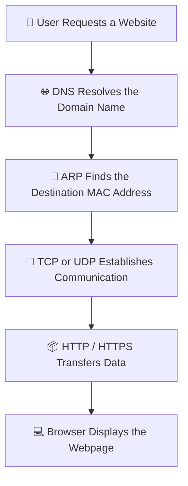
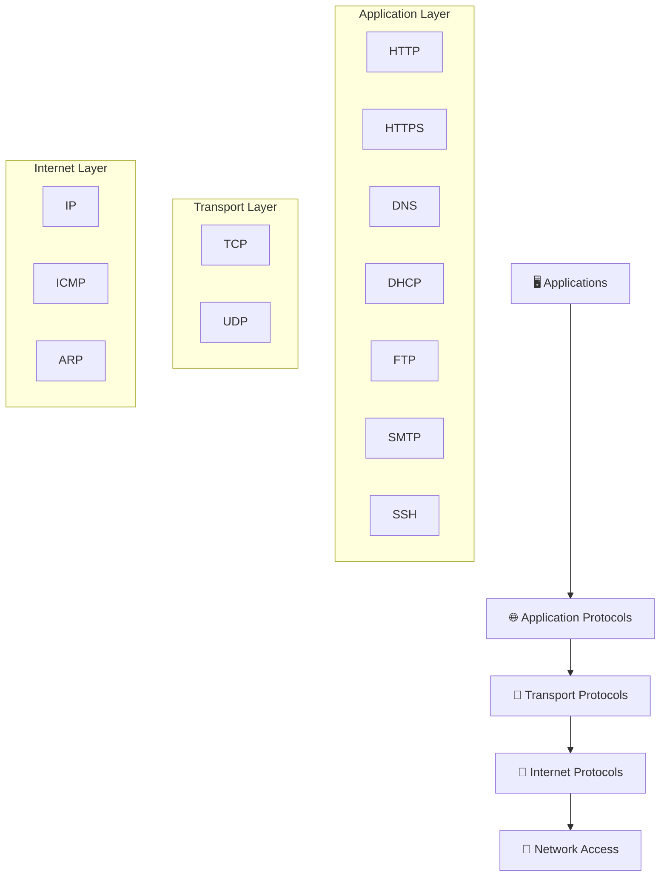
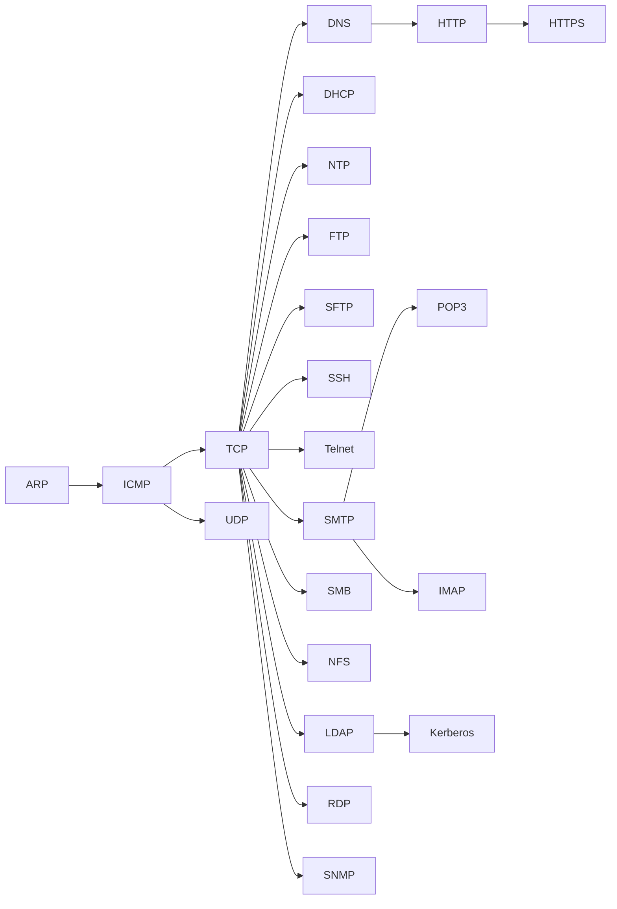
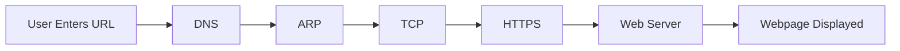
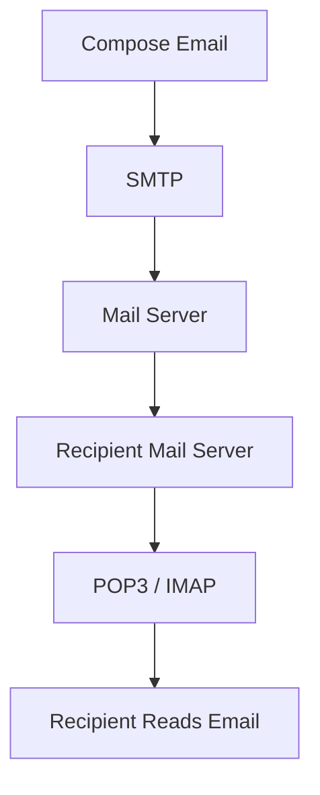
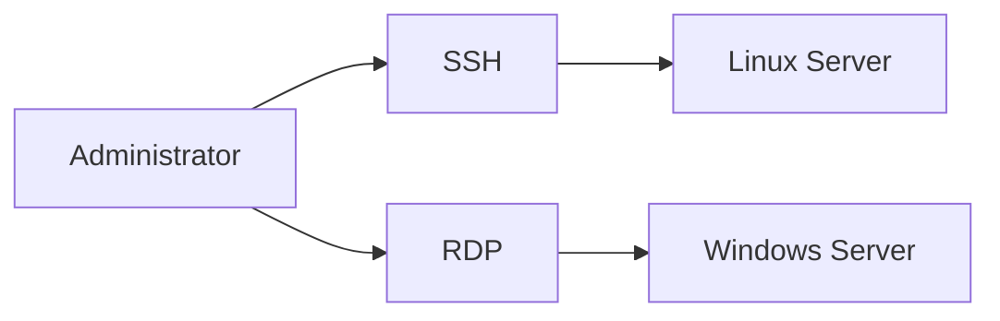
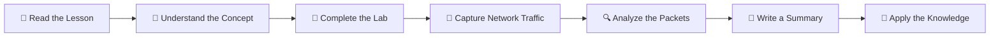
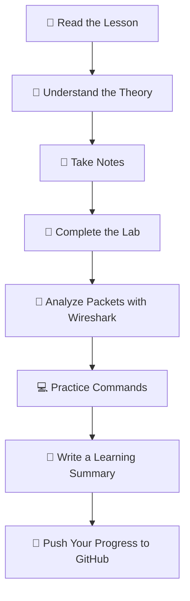

# 🌐 Network Protocols

> *Network protocols are the standardized rules that define how devices communicate, exchange information, and understand one another across modern computer networks. Every webpage you visit, every email you send, every file you download, and every online service you use relies on network protocols working together seamlessly.*

---

---

# 📖 Welcome

After learning how devices receive IP addresses, identify networks, communicate through gateways, and divide networks using subnetting and VLSM, the next logical question is:

> **How do computers actually communicate once they know each other's addresses?**

The answer lies in **network protocols**.

A protocol is much more than a technical specification—it is a **shared language** that every computer, router, switch, server, smartphone, and cloud service follows to exchange information correctly.

Imagine people from different countries attempting to communicate without agreeing on a common language or set of rules.

The conversation would quickly become confusing.

Computer networks face the exact same challenge.

Millions of devices built by different manufacturers and running different operating systems successfully communicate every second because they all follow the same networking standards.

Without protocols, the Internet simply would not exist.

This module introduces the protocols that power modern networking and explains **how data moves from one device to another**, from the moment a user types a website address until the requested information reaches their screen.

---

# 🎯 Why Learn Network Protocols?

Whether you plan to become a:

- 🌐 Network Engineer
- ☁️ Cloud Engineer
- 🔒 Cybersecurity Analyst
- 🛡️ Penetration Tester
- 🖥️ System Administrator
- 👨‍💻 Software Developer
- 🔍 Digital Forensics Investigator

you must understand how network protocols operate.

Every security assessment, penetration test, packet capture, firewall configuration, cloud deployment, and network troubleshooting task depends on understanding how these protocols communicate.

When analyzing network traffic in tools such as **Wireshark**, you'll encounter protocols like **ARP**, **TCP**, **UDP**, **DNS**, **HTTP**, **HTTPS**, **DHCP**, and many others.

Understanding them allows you to:

- Diagnose network problems.
- Identify malicious traffic.
- Analyze packet captures.
- Configure secure communication.
- Detect attacks.
- Understand how applications communicate.
- Build reliable and secure networks.

This module forms one of the most important foundations for every advanced networking and cybersecurity topic that follows.

---

# 🗺️ How Network Communication Works

Although dozens of protocols exist, they do not operate independently.

Instead, each protocol performs a specific task and cooperates with other protocols to complete the communication process.

The simplified workflow looks like this:

Every protocol shown above has a unique responsibility.

If even one protocol fails, communication may stop entirely.

Throughout this module, you'll study each protocol individually before seeing how they work together to create reliable network communication.

---

# 🧠 The Protocol Stack

Network communication is built on a layered architecture.

Each layer performs a different job, allowing networks to remain organized, scalable, and easier to troubleshoot.

Rather than relying on one enormous protocol to perform every task, networking divides responsibilities among specialized protocols.

Each protocol performs one job extremely well and works together with the others to create reliable communication across local networks and the Internet.

---

# 🎓 What You'll Learn

By the end of this module, you will be able to:

- ✅ Explain what a network protocol is.
- ✅ Describe why protocols are essential for communication.
- ✅ Understand how multiple protocols work together.
- ✅ Identify the purpose of common networking protocols.
- ✅ Recognize which protocol belongs to each networking layer.
- ✅ Analyze real network communication flows.
- ✅ Troubleshoot common protocol-related issues.
- ✅ Build a strong foundation for routing, switching, cloud networking, and cybersecurity.

This module transforms your understanding from **"devices have IP addresses"** to **"devices know how to communicate using standardized rules."**

# 📚 Module Lessons

This module is carefully structured to build your understanding step by step.

Rather than memorizing protocols individually, you'll learn **why each protocol exists**, **what problem it solves**, and **how it interacts with other protocols** during real network communication.

By the end of this module, you'll understand how a simple action—such as opening a website or sending an email—involves dozens of protocols working together behind the scenes.

---

## 🗂️ Learning Path

| # | Lesson | Description |
|---|--------|-------------|
| 01 | [ARP](01-ARP.md) | Learn how devices discover MAC addresses on a local network before sending data. |
| 02 | [ICMP](02-ICMP.md) | Understand diagnostic and error-reporting messages used by Ping and Traceroute. |
| 03 | [TCP](03-TCP.md) | Explore reliable, connection-oriented communication and the Three-Way Handshake. |
| 04 | [UDP](04-UDP.md) | Learn how fast, connectionless communication powers streaming, VoIP, and gaming. |
| 05 | [DNS](05-DNS.md) | Discover how domain names are translated into IP addresses. |
| 06 | [DHCP](06-DHCP.md) | Learn how devices automatically obtain IP configuration from a DHCP server. |
| 07 | [NTP](07-NTP.md) | Understand how computers synchronize their clocks across networks. |
| 08 | [HTTP](08-HTTP.md) | Learn how web browsers request and receive web pages. |
| 09 | [HTTPS](09-HTTPS.md) | Explore encrypted web communication using TLS and digital certificates. |
| 10 | [FTP](10-FTP.md) | Understand traditional file transfer across networks. |
| 11 | [TFTP](11-TFTP.md) | Learn about lightweight file transfers commonly used by networking equipment. |
| 12 | [SFTP](12-SFTP.md) | Discover secure file transfers over the SSH protocol. |
| 13 | [SSH](13-SSH.md) | Learn secure remote administration for servers and network devices. |
| 14 | [Telnet](14-Telnet.md) | Understand legacy remote terminal communication and why it has been replaced. |
| 15 | [SMTP](15-SMTP.md) | Learn how email messages are sent between mail servers. |
| 16 | [POP3](16-POP3.md) | Explore how email is downloaded from a mail server. |
| 17 | [IMAP](17-IMAP.md) | Learn how email synchronization works across multiple devices. |
| 18 | [SMB](18-SMB.md) | Understand Windows file and printer sharing. |
| 19 | [NFS](19-NFS.md) | Learn how Linux and UNIX systems share files across a network. |
| 20 | [LDAP](20-LDAP.md) | Explore centralized directory services used in enterprise environments. |
| 21 | [Kerberos](21-Kerberos.md) | Learn how ticket-based authentication secures enterprise networks. |
| 22 | [RDP](22-RDP.md) | Understand remote desktop communication and administration. |
| 23 | [SNMP](23-SNMP.md) | Learn how network administrators monitor and manage devices remotely. |

---

# 🧭 Learning Journey

The lessons have been arranged in a logical sequence, starting with the protocols that establish communication and progressing toward the services used by applications and enterprise environments.

As you move through each lesson, you'll gradually build a complete understanding of how modern networks communicate—from discovering neighboring devices on a local network to securely exchanging information across the Internet.

---

# 🧠 Skills You'll Build

Each lesson contributes a new skill that prepares you for more advanced networking and cybersecurity concepts.

By completing this module, you'll develop the ability to:

- 🌐 Understand how network communication actually works.
- 📡 Analyze packet flows across different protocols.
- 🔍 Identify common networking protocols in packet captures.
- 🛠️ Troubleshoot connectivity and communication problems.
- 🔒 Recognize secure and insecure communication methods.
- 📬 Understand how web browsing, email, remote access, and file sharing operate.
- ☁️ Prepare for cloud networking, network security, and penetration testing.
- 🎯 Build a strong foundation for certifications such as **CompTIA Network+**, **Cisco CCNA**, and **CompTIA Security+**.

---

# 🎯 Module Learning Outcomes

After completing every lesson in this module, you should be able to confidently answer questions such as:

- How does a computer discover another device's MAC address?
- What happens when you type a website address into a browser?
- Why do some applications use TCP while others use UDP?
- How does DNS convert domain names into IP addresses?
- How does DHCP automatically configure a new computer?
- Why is HTTPS more secure than HTTP?
- How are files transferred securely across networks?
- How do organizations authenticate users using Kerberos and LDAP?
- How do administrators remotely manage servers and monitor network devices?

If you can answer these questions without hesitation, you'll have developed a strong understanding of the protocols that power modern computer networks.

# 🌍 Real-World Applications

Network protocols are far more than theoretical concepts found in textbooks.

Every modern digital service relies on multiple protocols working together to deliver reliable, secure, and efficient communication.

Whether you're browsing the Internet, watching a movie, joining a video conference, or managing a cloud server, dozens of protocols operate behind the scenes to make that experience possible.

Understanding where these protocols are used helps transform abstract concepts into practical networking knowledge.

---

## 🌐 Web Browsing

When you visit a website such as **https://example.com**, multiple protocols work together.

Protocols involved:

- 🌍 DNS resolves the domain name into an IP address.
- 📡 ARP discovers the destination MAC address on the local network.
- 🤝 TCP establishes a reliable connection.
- 🔒 HTTPS encrypts communication between the browser and the web server.

Without all of these protocols working together, a webpage cannot be loaded successfully.

---

## 📧 Sending an Email

Sending an email is another example of protocol cooperation.

Protocols involved:

- 📤 SMTP sends the email.
- 📥 POP3 downloads messages to a device.
- 🔄 IMAP synchronizes emails across multiple devices.

This layered approach allows users to access the same mailbox from laptops, smartphones, and tablets.

---

## 📁 File Transfers

Organizations frequently transfer files between computers and servers.

Different protocols are chosen depending on security and performance requirements.

| Protocol | Typical Use |
|----------|-------------|
| **FTP** | Traditional file transfers |
| **TFTP** | Lightweight transfers for networking equipment |
| **SFTP** | Secure encrypted file transfers |

For sensitive information, organizations prefer **SFTP** because it encrypts both authentication and file data during transmission.

---

## 🖥️ Remote Administration

System administrators rarely need physical access to every server.

Instead, they remotely manage systems using specialized protocols.

- 🔐 SSH provides secure command-line access.
- 🖥️ RDP provides a graphical desktop environment for Windows systems.
- 🚫 Telnet exists for historical reasons but is considered insecure because it transmits data in plain text.

---

## 🏢 Enterprise Networks

Large organizations depend on multiple protocols simultaneously.

For example:

- DNS resolves internal server names.
- DHCP assigns IP addresses to employees.
- LDAP stores user accounts.
- Kerberos authenticates users securely.
- SMB shares files across departments.
- SNMP monitors switches, routers, and servers.
- NTP keeps every system synchronized with the correct time.

Without these protocols, managing thousands of users and devices would become extremely difficult.

---

# 🔒 Why Protocol Knowledge Matters in Cybersecurity

Cybersecurity professionals spend much of their time analyzing network traffic.

Understanding protocols allows analysts to distinguish between **normal communication** and **malicious activity**.

Examples include:

- Detecting suspicious DNS requests.
- Identifying brute-force attacks against SSH.
- Discovering unencrypted Telnet sessions.
- Monitoring HTTP and HTTPS traffic.
- Investigating abnormal ICMP activity.
- Detecting unauthorized SMB file access.
- Monitoring LDAP and Kerberos authentication attempts.

Almost every network attack leaves evidence within one or more protocols.

The better you understand these protocols, the easier it becomes to identify threats, investigate incidents, and secure modern networks.

---

# 💼 Career Relevance

Network protocols are essential knowledge for many IT careers.

| Career | Why Protocols Matter |
|---------|----------------------|
| 🌐 Network Engineer | Configure and troubleshoot communication between devices. |
| 🔒 Cybersecurity Analyst | Analyze network traffic and investigate attacks. |
| ☁️ Cloud Engineer | Design secure communication between cloud resources. |
| 🛡️ Penetration Tester | Identify protocol weaknesses and insecure services. |
| 🖥️ System Administrator | Manage servers, authentication, and network services. |
| 📊 SOC Analyst | Monitor protocol activity using SIEM and network monitoring tools. |

No matter which IT specialization you choose, a strong understanding of network protocols will remain one of your most valuable technical skills.

---

# 💡 Key Takeaway

Network protocols are the invisible rules that allow billions of devices to communicate every second.

Although each protocol has a specific responsibility, they rarely operate alone.

Instead, they work together as a coordinated system—resolving addresses, establishing connections, transferring data, authenticating users, and managing network resources.

As you progress through this module, you'll study each protocol individually and then see how they combine to create the reliable, secure, and scalable networks that power the modern world.

# 🧪 Hands-on Labs

Learning network protocols is not just about reading theory.

The best way to understand how protocols work is to observe them in action, analyze their behavior, and experiment in a safe environment.

Throughout this module, you'll complete practical exercises that reinforce the concepts covered in each lesson.

These labs are designed for beginners and require no prior experience beyond the previous networking modules.

---

# 🎯 Lab Objectives

By completing the hands-on exercises in this module, you will learn how to:

- Observe protocol communication using packet analysis tools.
- Understand how devices exchange information.
- Troubleshoot common networking problems.
- Identify protocol-specific traffic.
- Recognize normal and abnormal network behavior.
- Build confidence working with real network communication.

---

# 🧪 Practical Labs

| Lab | Description |
|------|-------------|
| 🔍 ARP Analysis | Observe ARP Requests and ARP Replies on a local network. |
| 📡 ICMP Diagnostics | Use **ping** and **traceroute** to analyze network connectivity. |
| 🤝 TCP Handshake | Capture and analyze the TCP Three-Way Handshake using Wireshark. |
| ⚡ UDP Traffic | Compare UDP communication with TCP traffic. |
| 🌐 DNS Lookup | Resolve domain names using **nslookup** and **dig**. |
| 📥 DHCP Process | Observe the complete DORA (Discover, Offer, Request, Acknowledge) process. |
| 🌍 HTTP vs HTTPS | Compare encrypted and unencrypted web traffic. |
| 🔐 SSH Connection | Connect securely to a remote Linux machine. |
| 📧 Email Protocols | Observe SMTP, POP3, and IMAP communication. |
| 📊 SNMP Monitoring | Explore how network devices are monitored remotely. |

---

# 🛠️ Recommended Lab Tools

Throughout this module, you'll become familiar with several industry-standard networking tools.

| Tool | Purpose |
|------|----------|
| 🦈 Wireshark | Capture and analyze network packets. |
| 💻 Packet Tracer | Build and simulate computer networks. |
| 🌐 Browser Developer Tools | Inspect HTTP and HTTPS communication. |
| 🖥️ Command Prompt / PowerShell | Run networking commands such as `ping`, `tracert`, `ipconfig`, and `nslookup`. |
| 🐧 Linux Terminal | Practice networking commands in a Linux environment. |

These are the same tools used by network engineers, system administrators, and cybersecurity professionals around the world.

---

# 📚 Learning Strategy

To get the most from this module, follow the learning process below for every lesson.

This approach ensures that you don't simply memorize protocols—you understand how they behave in real-world networks.

---

# 💡 Best Practices

As you progress through the labs, keep these recommendations in mind:

- ✅ Perform every exercise yourself rather than only reading the results.
- ✅ Capture packets whenever possible to visualize protocol communication.
- ✅ Compare multiple protocols to understand their differences.
- ✅ Practice troubleshooting by intentionally creating simple networking problems.
- ✅ Review packet captures after each lab to reinforce your understanding.
- ✅ Keep notes of new commands, observations, and troubleshooting techniques.

Small, consistent practice sessions will build far stronger networking skills than passive reading alone.

---

# 🎯 Module Goal

By the end of this module, you won't just recognize protocol names—you'll understand **how they communicate, why they exist, how they interact with one another, and how to analyze them in real network environments.**

That practical understanding is what separates someone who has memorized networking concepts from someone who can confidently troubleshoot, secure, and design modern computer networks.

# 🚀 Continue Your Learning

Congratulations! 🎉

You're now ready to begin one of the most exciting modules in the Networking roadmap.

By studying network protocols, you'll move beyond simply knowing **what an IP address is** to understanding **how real communication happens across modern networks**.

Every protocol you learn will become another piece of the networking puzzle, helping you understand how computers, servers, routers, cloud platforms, and Internet services communicate securely and efficiently.

---

# 🧩 How This Module Fits into Networking

The Networking roadmap is designed so that each module builds upon the previous one.

You've already completed the fundamentals of networking.

```mermaid
flowchart LR

A["📖 Introduction"] --> B["🧩 Network Models"]

B --> C["🖧 Network Devices"]

C --> D["🔌 Network Media"]

D --> E["🌍 IP Addressing"]

E --> F["📡 Network Protocols"]

F --> G["🚪 Ports & Services"]

G --> H["🔀 Routing & Switching"]

H --> I["🛠️ Network Services"]

I --> J["🛡️ Network Security"]

J --> K["📊 Network Monitoring"]

K --> L["🔍 Network Scanning"]

L --> M["📶 Wireless Networking"]

M --> N["☁️ Cloud Networking"]

N --> O["🧪 Hands-on Labs"]
```

Each completed module provides the knowledge required for the next.

The concepts you learned in **IP Addressing** will now be applied throughout every lesson in this module.

---

# 🧠 Before You Begin

As you study each protocol, don't focus on memorizing port numbers or definitions alone.

Instead, ask yourself questions like:

- Why was this protocol created?
- What problem does it solve?
- Which networking layer does it operate on?
- Which protocols work alongside it?
- Is it secure by default?
- How would I recognize it in a packet capture?
- How could an attacker abuse it?
- How can it be secured?

Thinking this way develops the mindset of a network engineer and cybersecurity professional rather than someone who simply memorizes facts.

---

# 📚 Recommended Study Routine

For every lesson in this module, follow the same workflow.

Following a consistent study routine will help you retain knowledge far more effectively than simply reading through the lessons.

---

# 🎯 Your Goal

By the time you complete this module, you should be able to confidently explain:

- How computers discover one another on a network.
- How reliable and unreliable communication differs.
- How websites, emails, and file transfers work.
- How secure communication is established.
- How enterprise authentication operates.
- How administrators remotely manage systems.
- How network devices are monitored.
- How multiple protocols work together during a single communication session.

Most importantly, you'll begin viewing the Internet not as a collection of websites and applications, but as a carefully coordinated system of protocols working together.

---

# 🚀 Ready to Begin?

Your journey starts with one of the most fundamental networking protocols:

> **Lesson 01 — [ARP (Address Resolution Protocol)](01-ARP.md)**

In the next lesson, you'll discover how computers locate one another on a local network by translating **IP addresses into MAC addresses**—the very first step in successful network communication.

Good luck, and happy learning! 🌐