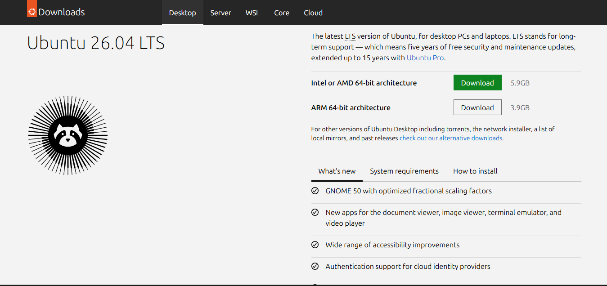
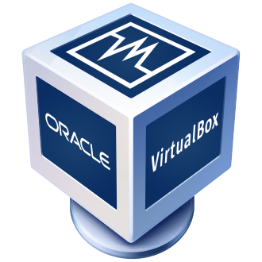
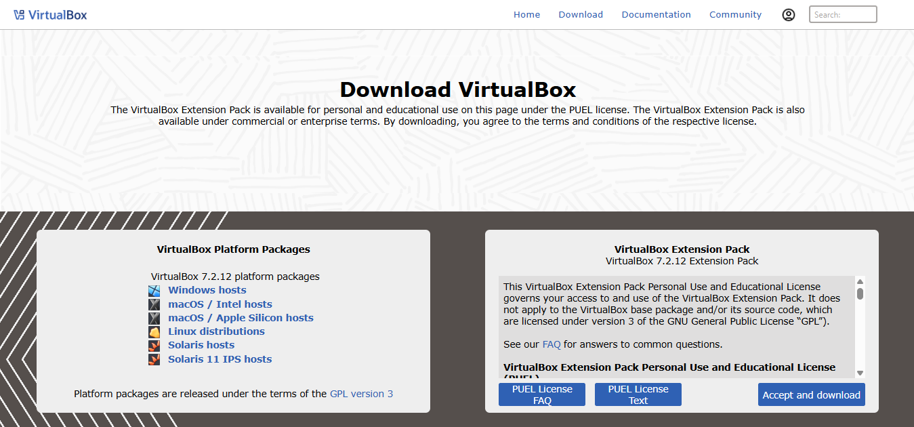
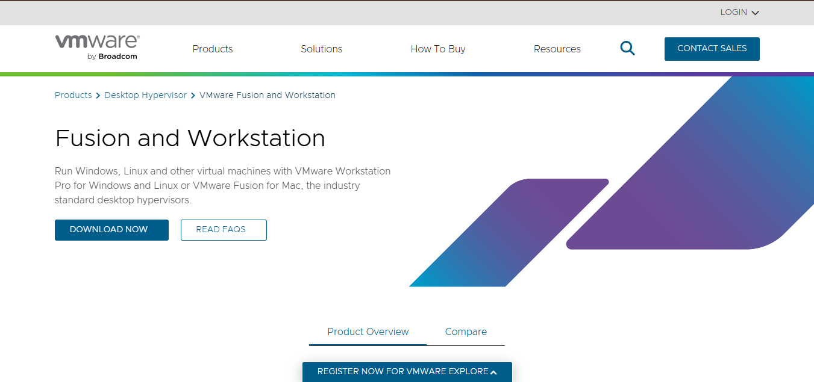

# 💽 Linux Installation & Environment Setup

> Before you can practice a single cybersecurity skill on Linux, you need a Linux environment that actually works. This chapter walks you — screen by screen, decision by decision — through choosing, installing, and verifying a Linux environment built for learning security.

<p align="center">

</p>

---

## 🎯 Learning Objectives

By the end of this chapter, you will be able to:

- Understand the different **ways to install Linux** and choose the right one for your goals.
- Explain the **BIOS/UEFI boot process**, Secure Boot, and TPM at a beginner level.
- Install and configure **VirtualBox** or **VMware Workstation**.
- Create a **Virtual Machine** with correctly chosen settings.
- Install **Ubuntu** step by step, understanding what every installer screen does.
- Understand basic **disk partitioning** (EFI, root, swap, home).
- Install and use **WSL** (Windows Subsystem for Linux) as an alternative.
- Update Linux and install the **essential tools** every cybersecurity learner needs.
- **Verify** that your installation is healthy and troubleshoot common problems.

---

## 📑 Table of Contents

- [What is Linux Installation?](#-what-is-linux-installation)
- [Before You Begin](#-before-you-begin)
- [Different Ways to Install Linux](#-different-ways-to-install-linux)
- [Choosing the Right Linux Distribution](#-choosing-the-right-linux-distribution)
- [Downloading Ubuntu](#-downloading-ubuntu)
- [Installing VirtualBox](#-installing-virtualbox)
- [Installing VMware Workstation](#-installing-vmware-workstation)
- [Creating a Virtual Machine](#-creating-a-virtual-machine)
- [Installing Ubuntu Step by Step](#-installing-ubuntu-step-by-step)
- [Understanding Disk Partitioning](#-understanding-disk-partitioning)
- [First Boot](#-first-boot)
- [Installing WSL](#-installing-wsl)
- [Updating Linux](#-updating-linux)
- [Installing Essential Software](#-installing-essential-software)
- [Verifying Installation](#-verifying-installation)
- [Common Installation Problems](#-common-installation-problems)
- [Best Practices](#-best-practices)
- [Security Tips](#-security-tips)
- [Cybersecurity Relevance](#-cybersecurity-relevance)
- [Image Reference Guide](#-image-reference-guide)
- [Practical Exercises](#-practical-exercises)
- [Interview Questions](#-interview-questions)
- [Summary](#-summary)
- [Next Chapter](#-next-chapter)

---

## 💿 What is Linux Installation?

**Installing an operating system** means copying its core files (kernel, system libraries, default applications) onto a storage device, configuring the **bootloader** so your computer knows how to start it, and setting up the initial system state (users, network, disk layout) so it can run independently afterward.

Unlike installing a normal app, installing an OS is special because the OS is what makes every other program possible. This is why the installer asks about **partitions**, **boot settings**, and **user accounts** — it's laying the entire foundation your future programs and security tools will stand on.

> 💡 **Key Term:** A **bootloader** is a small program (like GRUB) that runs immediately after your computer's firmware and is responsible for loading the operating system's kernel into memory.

---

## 🧾 Before You Begin

### Minimum Hardware Requirements (Ubuntu Desktop, current LTS)
| Resource | Minimum | Recommended (for VM use) |
|---|---|---|
| **RAM** | 4 GB | 8 GB+ (allocate 4 GB to the VM) |
| **CPU** | Dual-core, 2 GHz | Quad-core with virtualization support |
| **Storage** | 25 GB free | 60–80 GB free (for snapshots & tools) |
| **Display** | 1024×768 | 1920×1080 |

### Virtualization Support
Your CPU must support **hardware virtualization** (Intel VT-x or AMD-V) to run a Virtual Machine efficiently. This is usually enabled in the BIOS/UEFI settings, sometimes disabled by default on laptops.

> ⚠️ **Note:** If you plan to run a VM and it fails to boot with an error mentioning "VT-x is disabled," you'll need to enter your BIOS/UEFI and enable virtualization manually — covered later in [Common Installation Problems](#-common-installation-problems).

### BIOS vs UEFI
- **BIOS (Basic Input/Output System)** — Older firmware standard; boots using a Master Boot Record (MBR), text-based setup screens, and a 2 TB disk size limit.
- **UEFI (Unified Extensible Firmware Interface)** — Modern replacement; supports GPT partitioning, disks larger than 2 TB, faster boot times, and graphical setup menus.

```
Power Button
     │
     ▼
 Firmware (BIOS or UEFI)
     │
     ▼
 Bootloader (GRUB)
     │
     ▼
 Operating System Kernel
```

### Secure Boot
**Secure Boot** is a UEFI security feature that only allows digitally signed operating system loaders to run, blocking unauthorized or malicious bootloaders. Most modern Linux distributions (including Ubuntu) are signed and work fine with Secure Boot enabled, but some third-party drivers may require it to be disabled.

### TPM (Trusted Platform Module) — Brief Overview
A **TPM** is a small hardware chip that securely stores encryption keys and can verify that a system booted without tampering. It matters more for Windows 11 requirements than for standard Linux installs, but it's increasingly relevant for **full-disk encryption** and **secure boot attestation**.

---

## 🛣️ Different Ways to Install Linux

| Method | Advantages | Disadvantages | Best Used When |
|---|---|---|---|
| **Virtual Machine (VM)** | Safe, reversible, snapshots, doesn't touch your main OS | Slightly slower performance, uses shared host resources | You're learning and want a safety net — **recommended for beginners** |
| **Dual Boot** | Native performance, full hardware access | Risk of disk/partition mistakes, must choose OS at every boot | You need full performance for gaming/heavy workloads alongside Linux |
| **Full Installation** | Best possible performance, real hardware experience | No safety net if something breaks; erases existing data on that disk | You're confident and Linux will be your primary/only OS |
| **WSL (Windows Subsystem for Linux)** | Lightweight, deeply integrated with Windows, fast setup | Not a full Linux kernel experience (WSL1) or limited GUI/hardware access | Quick command-line practice without leaving Windows |
| **Live USB** | No installation needed, fully portable, leaves no trace on host | Nothing is saved after reboot (unless configured with persistence) | Testing a distro or doing quick forensic/security tasks |

> ✅ **Recommendation for cybersecurity beginners:** Start with a **Virtual Machine** running Ubuntu. It's safe, reversible, and mirrors how security professionals build isolated lab environments — a habit you'll rely on for the rest of your career.

---

## 🐧 Choosing the Right Linux Distribution

| Distribution | Best For | Notes |
|---|---|---|
| **Ubuntu** | Beginners, general learning | Huge community, excellent documentation, long-term support releases |
| **Debian** | Stability-focused users | The base Ubuntu is built on; slower release cycle, very stable |
| **Linux Mint** | Users wanting a familiar desktop feel | Beginner-friendly, based on Ubuntu |
| **Fedora** | Developers wanting newer software | Cutting-edge packages, shorter support cycle |
| **Kali Linux** | Experienced penetration testers | Preloaded with offensive security tools |
| **Parrot OS** | Security researchers | Similar to Kali, with a privacy/forensics focus |

> ⚠️ **Common Mistake:** Beginners often want to install **Kali Linux** first because it "looks like a hacker's OS." Kali is a specialized **toolbox distribution**, not a general-purpose learning environment — it strips away much of the beginner-friendly polish and assumes you already understand Linux fundamentals. Learn core Linux skills on **Ubuntu** first, then move to Kali once you understand permissions, networking, and the command line.

---

## ⬇️ Downloading Ubuntu

- **LTS (Long-Term Support)** releases are supported with security updates for **5 years**, making them the safest choice for learning and long-term use. Non-LTS releases are updated more often but supported for only 9 months.
- An **ISO file** is a single archive file containing an entire disk's contents — in this case, the full Ubuntu installer and operating system, ready to be written to a USB drive or mounted in a VM.
- **Always download Ubuntu only from the official site:** [https://ubuntu.com/download/desktop](https://ubuntu.com/download/desktop)
- Downloading from unofficial mirrors or third-party sites risks getting a **tampered ISO** containing malware — a real and historically documented attack vector.

<p align="center">

</p>

### SHA256 Checksum Verification (Brief Introduction)
A **checksum** is a short fingerprint calculated from a file's contents. After downloading, you can calculate the ISO's SHA256 hash and compare it against the official value published on Ubuntu's site to confirm the file wasn't corrupted or tampered with:

```bash
sha256sum ubuntu-24.04-desktop-amd64.iso
```

If the output doesn't match the official checksum listed on ubuntu.com, **do not use the file** — re-download it.

---

## 📦 Installing VirtualBox

<p align="center">

</p>

**VirtualBox** is a free, open-source **hypervisor** — software that lets you run one or more virtual computers ("guests") inside your real computer ("host").

**Why virtualization is useful:** It lets you experiment, break things, and even get "infected" with test malware inside an isolated environment, without ever risking your real operating system.

<p align="center">

</p>

### Installation Steps
1. Download VirtualBox from the official site: [https://www.virtualbox.org/wiki/Downloads](https://www.virtualbox.org/wiki/Downloads)
2. Choose the installer for your host OS (Windows/macOS/Linux).
3. Run the installer and accept the default components (USB support, networking features).
4. Restart your computer if prompted.
5. Install the **VirtualBox Extension Pack** for USB 3.0 and additional features (optional but recommended).

### Common Installation Issues
- **Installation blocked by antivirus** — Temporarily allow the installer through your antivirus; VirtualBox is a legitimate, widely trusted tool.
- **Network driver conflicts** — Occasionally requires a restart to finish installing virtual network adapters.
- **Virtualization not enabled in BIOS** — VirtualBox will warn you if VT-x/AMD-V is disabled (see [Common Installation Problems](#-common-installation-problems)).

---

## 🖥️ Installing VMware Workstation

<p align="center">

</p>

**VMware Workstation** (Player edition is free for personal use) is another popular hypervisor, often preferred in enterprise and professional environments.

### Advantages Over VirtualBox
| Aspect | VirtualBox | VMware Workstation |
|---|---|---|
| **Cost** | Free & open-source | Free (Player) / Paid (Pro) |
| **Performance** | Good | Often slightly better, especially for 3D graphics |
| **Snapshots** | Supported | Supported, generally more robust |
| **Enterprise use** | Less common | Widely used in corporate environments |

<p align="center">

</p>


### Installation Steps
1. Download from the official site: [https://www.vmware.com/products/workstation-player.html](https://www.vmware.com/products/workstation-player.html)
2. Run the installer and accept the license agreement.
3. Choose typical installation settings unless you have a specific reason to customize.
4. Restart if prompted, then launch VMware.

> 📌 **Which should you choose?** Either is fine for learning. VirtualBox is more common in tutorials and free courses; VMware is more common in corporate IT/security jobs. Many professionals eventually learn both.

---

## 🖧 Creating a Virtual Machine

When creating your first VM, you'll be asked to configure the following settings:

| Setting | What It Means | Recommended Value for Beginners |
|---|---|---|
| **VM Name** | A label to identify your VM | e.g., `Ubuntu-Security-Lab` |
| **Guest OS** | The operating system you're installing | Ubuntu (64-bit) |
| **RAM** | Memory allocated to the VM | 4 GB (4096 MB) minimum |
| **CPU** | Number of virtual processor cores | 2 cores |
| **Storage** | Virtual disk size | 40–60 GB, dynamically allocated |
| **Network Adapter** | How the VM connects to a network | **NAT** (simplest, internet access without exposing the VM) |
| **Display** | Graphics memory/resolution | Default is fine; enable 3D acceleration if available |
| **Shared Clipboard** | Copy/paste between host and VM | Enable "Bidirectional" |
| **Drag & Drop** | File transfer between host and VM | Enable "Bidirectional" (optional) |

```
        ┌───────────────────────────────┐
        │          Host OS              │
        │   (Windows / macOS / Linux)   │
        │  ┌─────────────────────────┐  │
        │  │ Hypervisor (VirtualBox) │  │
        │  │  ┌───────────────────┐  │  │
        │  │  │ Guest OS (Ubuntu) │  │  │
        │  │  │  Virtual CPU/RAM  │  │  │
        │  │  │  Virtual Disk     │  │  │
        │  │  └───────────────────┘  │  │
        │  └─────────────────────────┘  │
        └───────────────────────────────┘
```

> 💡 **Tip:** Dynamically allocated storage only uses as much real disk space as needed, growing over time — a safe default for beginners.

---

## 🧭 Installing Ubuntu Step by Step

Once your VM boots from the Ubuntu ISO, you'll walk through these installer screens in order:

1. **Language** — Select your preferred language for the installer and the installed system.
2. **Keyboard Layout** — Choose your physical keyboard layout (e.g., US, UK). Use "Detect Keyboard Layout" if unsure.
3. **Updates and Other Software** — Choose "Normal Installation" (includes web browser, utilities, office tools) vs. "Minimal Installation" (browser and basic utilities only). Beginners should choose **Normal**.
4. **Third-Party Drivers** — Optionally install proprietary drivers (graphics, Wi-Fi) and codecs for media playback. Recommended: **enable this** for a smoother experience.
5. **Installation Type** — Choose "Erase disk and install Ubuntu" for a VM (safe, since it's a virtual disk) or "Something else" for manual partitioning (advanced users only).
6. **Disk Partitioning** — Review or customize how the disk is divided (explained in detail in the next section).
7. **Time Zone** — Select your location so the system clock is set correctly.
8. **User Account** — Create your name, computer name, and username.
9. **Password** — Choose a strong password; you can also enable automatic login (not recommended for security practice).
10. **Installation Progress** — The installer copies files and configures the system; this typically takes 10–20 minutes.
11. **Restart** — Remove the installation media (or in a VM, the installer will prompt you to press Enter) and reboot into your new Ubuntu system.

---

## 🗂️ Understanding Disk Partitioning

A **partition** is a logically separated section of a disk, treated by the OS as if it were a separate drive. Ubuntu typically creates these partitions automatically during a guided install:

| Partition | Purpose |
|---|---|
| **EFI System Partition** | Small partition (~512 MB) that stores the bootloader files UEFI firmware needs to start the OS |
| **Root (`/`)** | The main partition holding the operating system, installed programs, and system configuration |
| **Swap** | Disk space used as "overflow memory" when RAM is full, or for hibernation |
| **Home (`/home`)** | Stores personal files, downloads, and per-user settings — kept separate so it can survive an OS reinstall |

```
 ┌────────────────────────────────────────────── ─┐
 │                   Physical Disk                │
 ├───────────┬───────────────────┬───────┬────────┤
 │   EFI     │      Root (/)     │ Swap  │  Home  │
 │  ~512 MB  │      20–40 GB     │ 2–4GB │  rest  │
 └───────────┴───────────────────┴───────┴────────┘
```

> 💡 **Key Term:** **Swap** doesn't need to equal your RAM size on modern systems with 8 GB+ RAM; 2–4 GB is usually sufficient unless you plan to use hibernation.

---

## 🌅 First Boot

After Ubuntu restarts for the first time, you'll land on the **login screen**, then the **desktop (GNOME by default)**. Expect to see:

- **Desktop** — Your main workspace, mostly empty by default in modern Ubuntu.
- **Dock** — The vertical bar (usually on the left) holding pinned and running applications.
- **Activities** — A view (top-left corner or the "Super"/Windows key) showing all open windows and a search bar for apps.
- **Terminal** — Found in the app menu, or opened instantly with `Ctrl + Alt + T` — this becomes your primary tool from here on.
- **Applications** — Access the full app grid from the dock's "Show Applications" icon (grid of dots).

> ✅ Take a few minutes to click around before opening a terminal. Comfort with the desktop reduces the intimidation factor of the command line that follows.

---

## 🪟 Installing WSL

**WSL (Windows Subsystem for Linux)** lets you run a real Linux environment directly inside Windows, without a separate VM or dual boot.

| | WSL1 | WSL2 |
|---|---|---|
| **Kernel** | Translation layer (no real Linux kernel) | Real, lightweight Linux kernel running in a managed VM |
| **Performance** | Faster file access on Windows drives | Faster overall system call performance; better for most workloads |
| **Compatibility** | Some Linux features unsupported | Near-full Linux kernel compatibility (best for Docker, security tools) |

### Installation Steps (Windows 10/11)
```powershell
wsl --install
```
This single command enables the required Windows features, downloads the Linux kernel, and installs Ubuntu by default. Restart when prompted, then set your Linux username and password on first launch.

### Advantages
- Extremely fast to set up (minutes, not an hour-long install).
- No separate VM software or disk image required.
- Great for practicing commands, Git, and scripting without switching computers.

### Limitations
- Limited graphical application support compared to a full VM or dual boot (improving with WSLg).
- Not ideal for advanced networking labs (e.g., custom virtual networks) that security courses often require.
- Some kernel-level or hardware-dependent tools won't behave identically to a full Linux install.

> 📌 **When to use WSL:** Great for quick daily practice, scripting, and Git usage. For dedicated cybersecurity labs (network scanning, isolated malware analysis, multiple VMs on a virtual network), a full Virtual Machine remains the better choice.

---

## 🔄 Updating Linux

Right after installation, update your system before installing anything else:

```bash
sudo apt update
sudo apt upgrade
```

- `sudo apt update` — Refreshes the local list of available packages and their latest versions from your configured repositories (it does **not** install anything yet).
- `sudo apt upgrade` — Actually installs the newer versions of any packages that have updates available, based on the refreshed list.

> ⚠️ **Common Mistake:** Running only `apt upgrade` without first running `apt update` can install outdated packages, because your local package list wasn't refreshed first. Always run them in that order.

---

## 🧰 Installing Essential Software

| Tool | Why You Need It |
|---|---|
| **VS Code** | A powerful, free code/text editor used for scripting, config files, and note-taking |
| **Git** | Version control system for tracking changes and collaborating on code — essential for any technical portfolio |
| **curl** | Command-line tool for making network requests — used constantly in security testing and scripting |
| **wget** | Downloads files directly from the command line, useful for fetching tools and scripts |
| **build-essential** | A package bundle with compilers (`gcc`, `make`) needed to build software from source |
| **Python 3** | The most widely used scripting language in cybersecurity automation and tooling |
| **OpenSSH** | Enables secure remote access to your machine (`ssh`) — critical for managing servers and remote labs |

```bash
sudo apt install code git curl wget build-essential python3 openssh-server -y
```

---

## ✅ Verifying Installation

Confirm your system installed correctly and check its specifications:

```bash
lsb_release -a        # Linux distribution name and version
uname -r               # Kernel version
free -h                # Memory (RAM) usage, human-readable
nproc                  # Number of CPU cores available
df -h                  # Disk space usage, human-readable
```

> 🧪 **Try it yourself:** Run all five commands and write down your system's specs in your own notes — you'll reference this information often when troubleshooting later.

---

## 🛠️ Common Installation Problems

| Problem | Likely Cause | Solution |
|---|---|---|
| **Black screen after boot** | Graphics driver incompatibility | Add `nomodeset` boot parameter, or enable 3D acceleration in VM settings |
| **VM won't boot** | ISO not attached correctly, or corrupted download | Re-check VM storage settings; re-download and verify checksum |
| **Virtualization disabled** | VT-x/AMD-V turned off in BIOS/UEFI | Restart, enter BIOS/UEFI setup, enable virtualization support |
| **No internet in VM** | Network adapter misconfigured | Switch adapter mode to **NAT** or **Bridged**, restart networking |
| **Guest Additions missing** | Not installed after OS setup | Install Guest Additions (VirtualBox) or VMware Tools for better display/clipboard support |
| **Screen resolution problems** | Guest Additions/Tools not installed | Install Guest Additions, then adjust display settings |
| **Shared clipboard not working** | Feature not enabled, or Guest Additions missing | Enable "Bidirectional" clipboard in VM settings after installing Guest Additions |

---

## 🏆 Best Practices

- Always download ISOs from **official sources only**.
- Take a **VM snapshot** immediately after a clean install, before installing extra tools — an easy rollback point.
- Allocate resources conservatively at first; you can increase RAM/CPU later.
- Keep your **host** OS and hypervisor software updated.
- Document your setup steps as you go — this repository is your future reference.

---

## 🔐 Security Tips

- **Use strong, unique passwords** for your Linux user account — this is your first line of defense.
- **Keep the system updated** regularly (`sudo apt update && sudo apt upgrade`) to patch known vulnerabilities.
- **Install software only from official repositories** or verified sources — avoid third-party `.deb` files from unknown sites.
- **Avoid running random scripts from the internet** with `sudo`, especially ones piped directly into a shell (e.g., `curl | bash`) without reading them first.
- **Take regular backups or snapshots**, especially before testing unfamiliar security tools.

---

## 🛡️ Cybersecurity Relevance

- **Penetration testers** need isolated, disposable Linux environments to safely test exploits without risking their host machine or corporate network.
- **SOC analysts** frequently investigate Linux servers and need to comfortably navigate, install tools, and read logs on Linux systems during incident response.
- **Cloud engineers** deploy and manage Linux-based virtual machines on AWS, Azure, and GCP as a daily task.
- **System administrators** are responsible for installing, updating, and hardening Linux servers that host critical business services.

A correctly configured, safely isolated Linux environment is the **foundation of every hands-on skill** taught later in this repository — network scanning, log analysis, privilege escalation, and more.

---

---

## 🧪 Practical Exercises

1. Download the Ubuntu LTS ISO and verify its SHA256 checksum.
2. Install VirtualBox (or VMware) and create a new VM with the settings recommended in this chapter.
3. Complete a full Ubuntu installation inside your VM.
4. Take a snapshot of your VM immediately after installation.
5. Run all five verification commands from [Verifying Installation](#-verifying-installation) and save the output in a text file.
6. Install the essential software list using a single `apt install` command.
7. Intentionally disable your VM's network adapter, then diagnose and fix the "no internet" issue yourself.

---

## ❓ Interview Questions

1. **What is the difference between a Virtual Machine and Dual Boot?**
   A VM runs an OS inside your existing OS using a hypervisor, sharing hardware; dual boot installs two OSes side-by-side, choosing one at each startup with full native performance.

2. **Why are LTS releases recommended for beginners?**
   They receive security updates for a much longer period (typically 5 years), providing more stability for ongoing learning.

3. **What is the purpose of a swap partition?**
   It acts as overflow space when RAM is full, and can support hibernation.

4. **What does `sudo apt update` actually do?**
   It refreshes the local package index so the system knows which package versions are currently available — it does not install or upgrade anything by itself.

5. **Why is verifying a checksum important when downloading an ISO?**
   It confirms the downloaded file is complete and untampered, protecting against corrupted downloads or malicious modified images.

6. **What is the difference between WSL1 and WSL2?**
   WSL1 uses a translation layer to mimic Linux syscalls on the Windows kernel; WSL2 runs an actual lightweight Linux kernel inside a managed virtual machine, offering broader compatibility.

---

## 📝 Summary

- Installing Linux means placing its files on a disk, configuring the bootloader, and setting up initial system state.
- **Virtual Machines** are the safest and most recommended installation method for cybersecurity beginners.
- **Ubuntu LTS** is the best first distribution; save **Kali Linux** for after you're comfortable with core Linux skills.
- Always download ISOs from **official sources** and verify their **checksums**.
- Understand your disk layout: **EFI, root, swap, and home** partitions each serve a distinct purpose.
- After installation, always **update the system** and install **essential tools** before doing anything else.
- **Verification commands** confirm your environment is healthy and ready for future chapters.

---

## ➡️ Next Chapter

With Linux successfully installed and verified, it's time to actually explore what's inside it. The next chapter, **Linux File System**, will take you through the Linux directory structure, the purpose of key system folders like `/etc`, `/var`, and `/usr`, how to navigate between them confidently, and how Linux organizes every file and device into a single unified tree.
