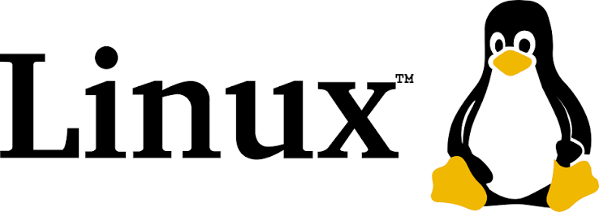
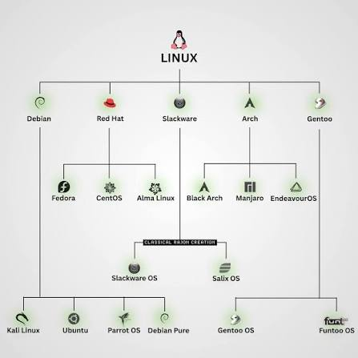
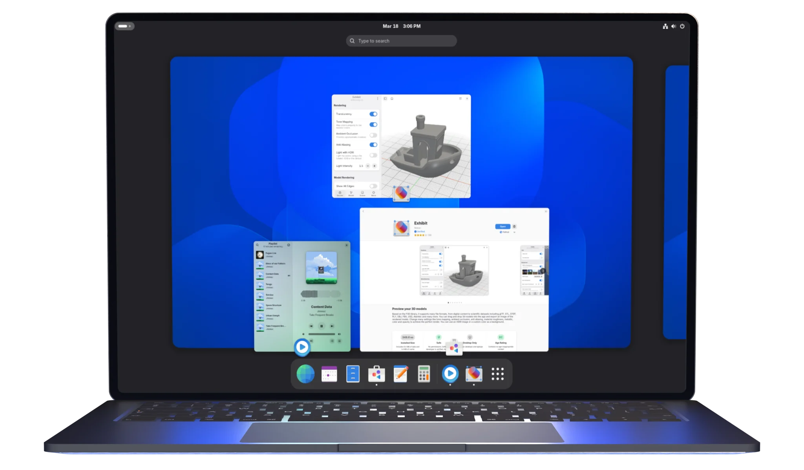
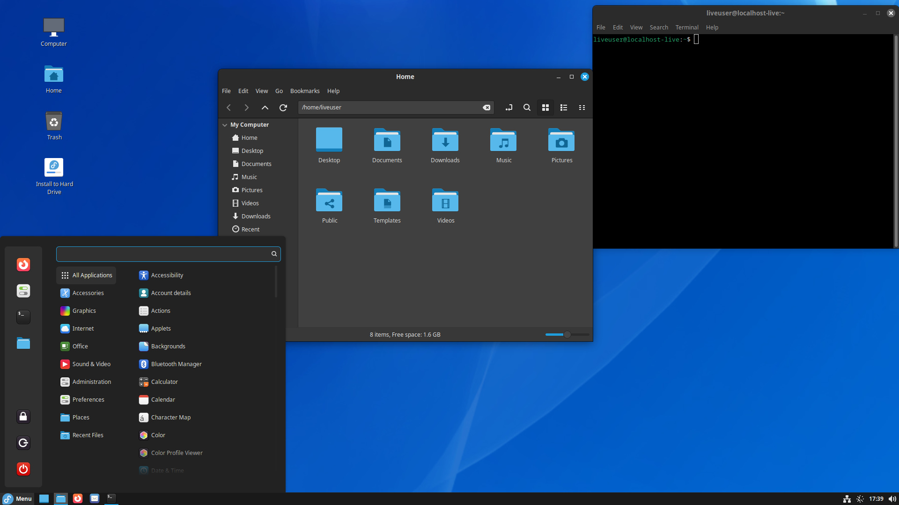
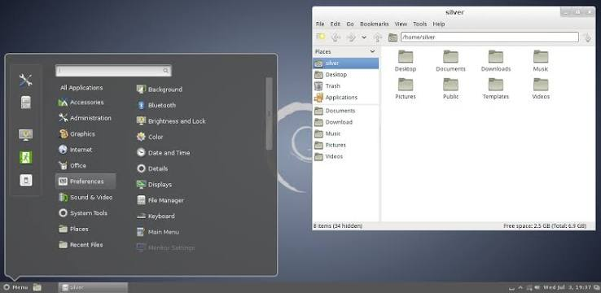
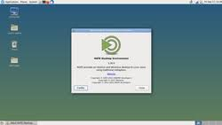
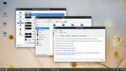

# 🐧 Linux Distributions

> There is no single "Linux operating system" you install — there are hundreds of them, all built from the same core, each shaped for a different purpose. This chapter explains why that's the case, how the major families relate to each other, and how to pick the right one for whatever you're trying to do.

---

## 🎯 Learning Objectives

By the end of this chapter, you will be able to:

- Explain what a **Linux distribution** actually is.
- Understand the relationship between the **Linux kernel** and a distribution.
- Identify the major **distribution families** and how they're related.
- Compare popular distributions across desktop, server, and security use cases.
- Choose the right distribution for **your specific goal**, not just the most popular one.
- Understand why dedicated **cybersecurity distributions** exist, and when to use them.

---

## 📑 Table of Contents

- [Introduction](#-introduction)
- [What Makes a Linux Distribution?](#-what-makes-a-linux-distribution)
- [Why Are There So Many Linux Distributions?](#-why-are-there-so-many-linux-distributions)
- [Linux Distribution Families](#-linux-distribution-families)
- [Popular Linux Distributions](#-popular-linux-distributions)
- [Desktop Environments](#-desktop-environments)
- [Package Managers](#-package-managers)
- [LTS vs Rolling Release](#-lts-vs-rolling-release)
- [Choosing the Right Distribution](#-choosing-the-right-distribution)
- [Linux Distributions for Cybersecurity](#-linux-distributions-for-cybersecurity)
- [Real-World Usage](#-real-world-usage)
- [Common Beginner Misconceptions](#-common-beginner-misconceptions)
- [Visual Learning](#-visual-learning)
- [Practical Exercises](#-practical-exercises)
- [Interview Questions](#-interview-questions)
- [Quick Revision](#-quick-revision)
- [Key Takeaways](#-key-takeaways)
- [Further Reading](#-further-reading)
- [Next Chapter](#-next-chapter)

---

## 📖 Introduction

<p align="center">

</p>

A **Linux distribution** (often shortened to "distro") is a complete, ready-to-use operating system built around the **Linux kernel**, bundled with a package manager, system utilities, and often a graphical desktop environment. When people casually say "I'm using Linux," they're really using one specific distribution — Ubuntu, Fedora, Kali, or one of hundreds of others.

**Why does Linux have so many distributions?** Because the Linux kernel itself is free and open source, anyone — a company, a community, or an individual — can take it, combine it with their own choice of tools and software, and release it as their own distribution. This is fundamentally different from Windows or macOS, which are each controlled and released by a single company.

**A simple analogy:**

```
Linux Kernel        =  The Engine
Linux Distribution  =  The Complete Car
```

The **engine** (kernel) handles the core work — managing hardware, memory, and processes — no matter which car it's installed in. But different manufacturers build very different **complete cars** around that engine: a rugged pickup truck (a server-focused distro), a fuel-efficient sedan (a beginner desktop distro), or a stripped-down race car (a minimal security-testing distro). Same engine category, wildly different final product.

> 💡 **Key Term:** The **Linux kernel** is the core program managing a computer's hardware and resources; a **distribution** is the full, usable operating system built around it.

---

## 🧩 What Makes a Linux Distribution?

Every distribution combines the same basic set of building blocks, just chosen and configured differently:

- **Linux Kernel** — The core managing hardware, processes, and memory.
- **Bootloader** — Software (commonly GRUB) that loads the kernel when the computer starts.
- **Package Manager** — A tool for installing, updating, and removing software safely (e.g., APT, DNF, Pacman).
- **Desktop Environment** — The graphical interface a user interacts with (e.g., GNOME, KDE) — some distributions ship without one for server use.
- **GNU Utilities** — Core command-line tools (like `ls`, `grep`, `bash`) from the GNU Project that make the system usable.
- **System Libraries** — Shared code (like `glibc`) that applications depend on to run.
- **Applications** — Pre-installed or easily installable software, from web browsers to security tools.
- **Documentation** — Official guides, man pages, and community wikis specific to that distribution.

```
        Applications
              │
     Desktop Environment
              │
        GNU Utilities
              │
        Linux Kernel
              │
           Hardware
```

Two distributions can use the **exact same kernel version** and still feel completely different, because everything above the kernel — the package manager, defaults, and included software — is where the real differences live.


---

## 🌍 Why Are There So Many Linux Distributions?

Distributions multiply because different groups of people optimize for different priorities:

- **Different user needs** — A beginner wants ease of use; a server admin wants stability; a researcher wants the newest software.
- **Different philosophies** — Some communities prioritize completely free, open-source software only (like Debian); others happily include proprietary drivers for convenience (like Ubuntu).
- **Enterprise support** — Companies need paid, guaranteed support contracts, which drives distributions like Red Hat Enterprise Linux (RHEL).
- **Stability** — Some users want software that almost never changes unexpectedly (Debian Stable); others want the newest features immediately.
- **Security** — Specialized distributions bundle security and penetration testing tools by default (Kali Linux, Parrot OS).
- **Performance** — Minimalist distributions strip away anything unnecessary to maximize speed on specific hardware.
- **Ease of use** — Beginner-oriented distributions hide complexity behind sensible defaults and graphical installers.
- **Customization** — Some users want to build their system piece by piece, choosing every component themselves (Arch Linux).

---

## 🌳 Linux Distribution Families

Most distributions aren't built from scratch — they're based on an existing distribution, forming clear "family trees."

<p align="center">

</p>

```
Debian
│
├── Ubuntu
│   ├── Linux Mint
│   ├── Pop!_OS
│   └── Kubuntu
│
└── Kali Linux

Red Hat
│
├── Fedora
├── Rocky Linux
└── AlmaLinux

Arch
│
├── Manjaro
└── EndeavourOS

SUSE
│
└── openSUSE
```

- **Debian Family** — Known for stability and a strict commitment to free software; Ubuntu (and everything based on Ubuntu, including Kali Linux) traces back to Debian.
- **Red Hat Family** — Enterprise-focused, commonly seen in corporate data centers; Fedora acts as its fast-moving, community testing ground.
- **Arch Family** — Built around a "do it yourself" philosophy and a rolling release model, favored by advanced users.
- **SUSE Family** — Popular in enterprise environments, especially in Europe, with openSUSE as its community counterpart.

> 📌 **Why this matters:** If you learn Ubuntu, you already understand roughly 80% of what you need for Debian, Linux Mint, or Kali — they share the same package manager and directory conventions, because they're all part of the same family.

---

## 📊 Popular Linux Distributions

| Distribution | Based On | Target Users | Package Manager | Default Desktop | Advantages | Limitations | Best Use Case |
|---|---|---|---|---|---|---|---|
| **Ubuntu** | Debian | Beginners, general users | APT | GNOME | Huge community, excellent docs, LTS support | Includes some proprietary components by default | General learning, desktop, and cloud use |
| **Debian** | Independent | Stability-focused users, servers | APT | None by default (server) | Extremely stable, fully open-source | Slower release cycle, older software versions | Long-running servers |
| **Linux Mint** | Ubuntu | Beginners wanting a familiar desktop feel | APT | Cinnamon | Very polished, Windows-like layout | Smaller community than Ubuntu | Desktop replacement for new Linux users |
| **Fedora** | Independent (RHEL upstream) | Developers, enthusiasts | DNF | GNOME | Cutting-edge software, strong security defaults | Shorter support cycle | Developers wanting newer packages |
| **Arch Linux** | Independent | Advanced/experienced users | Pacman | None (user-built) | Total customization, rolling release | Steep learning curve, manual setup | Users wanting full control |
| **openSUSE** | Independent | Enterprise & power users | Zypper | KDE Plasma | Strong tooling (YaST), enterprise-grade | Smaller community outside Europe | Enterprise desktops/servers |
| **Rocky Linux** | RHEL | Enterprise server admins | DNF | None by default | Free, binary-compatible with RHEL | Newer project, smaller community | Production servers needing RHEL compatibility |
| **AlmaLinux** | RHEL | Enterprise server admins | DNF | None by default | Free, community-governed RHEL alternative | Newer project | Production servers needing RHEL compatibility |
| **Kali Linux** | Debian | Experienced penetration testers | APT | XFCE | Hundreds of preloaded security tools | Not beginner-friendly, not a general-use OS | Authorized penetration testing |
| **Parrot Security OS** | Debian | Security researchers | APT | MATE | Security tools + privacy/forensics focus | Smaller community than Kali | Security testing, forensics, privacy-focused work |
| **BlackArch** | Arch | Advanced penetration testers | Pacman | None by default | One of the largest security tool collections | Requires strong Linux experience already | Experienced testers wanting maximum tool variety |

---

## 🖥️ Desktop Environments

A **desktop environment (DE)** is the graphical layer users interact with — the taskbar, icons, windows, and menus — and it's actually **separate** from the underlying distribution. Most distributions let you install a different desktop environment if you prefer.

- **GNOME** — Clean, modern, minimalist; the default for Ubuntu and Fedora.
<p align="center">

</p>

- **KDE Plasma** — Highly customizable, visually rich; default for openSUSE and Kubuntu.
<p align="center">

</p>

- **XFCE** — Lightweight and fast, popular on older hardware and Kali Linux.
<p align="center">

</p>

- **Cinnamon** — Traditional, Windows-like layout; default for Linux Mint.
<p align="center">

</p>

- **MATE** — A continuation of the classic GNOME 2 style, lightweight and simple.
<p align="center">

</p>

- **LXQt** — Extremely lightweight, designed for minimal resource usage.
<p align="center">

</p>

> 💡 **Key Term:** A **desktop environment** only changes how the system *looks and feels* to use — the underlying distribution, kernel, and package manager remain the same regardless of which DE you choose.

---

## 📦 Package Managers

A **package manager** installs, updates, and removes software while automatically handling dependencies (other software your program needs to run) — preventing the broken installs common on other operating systems.

| Package Manager | Used By | Install Command Example |
|---|---|---|
| **APT** | Debian, Ubuntu, Kali, Mint | `sudo apt install nmap` |
| **DNF** | Fedora, Rocky Linux, AlmaLinux | `sudo dnf install nmap` |
| **Pacman** | Arch, Manjaro, BlackArch | `sudo pacman -S nmap` |
| **Zypper** | openSUSE | `sudo zypper install nmap` |

**Why package managers matter:** Without one, installing software would mean manually downloading files, tracking down every dependency yourself, and hoping nothing conflicts. Package managers solve this automatically, and — just as importantly for security — they typically install software only from **verified, trusted repositories**, reducing the risk of installing tampered or malicious packages.

---

## 🔁 LTS vs Rolling Release

| | LTS (Long-Term Support) | Rolling Release |
|---|---|---|
| **Update model** | Major updates released periodically; security patches for years | Continuous small updates; always on the latest software |
| **Stability** | Very stable, thoroughly tested before release | Can occasionally break due to very new, less-tested updates |
| **Example distros** | Ubuntu LTS, Debian Stable, RHEL | Arch Linux, Manjaro |
| **Best for** | Servers, beginners, production systems | Advanced users wanting the newest features immediately |

**LTS (Long-Term Support)** releases are supported with security updates for an extended period (often 5 years for Ubuntu), making them ideal when stability matters more than having the absolute newest software.

**Rolling release** distributions never have a single "big" version — the system is continuously updated in small increments, so you're always running the latest packages, at the cost of occasional instability from less-tested changes.

> ✅ **Example:** A company running a production web server almost always chooses an **LTS** or enterprise distribution (Ubuntu LTS, RHEL) — predictability matters far more than having this week's newest kernel feature.

---

## 🎯 Choosing the Right Distribution

| Use Case | Recommended Distribution | Why |
|---|---|---|
| **Complete Beginners** | Ubuntu or Linux Mint | Polished installers, huge community support, beginner-friendly defaults |
| **Students** | Ubuntu | Widely documented, matches most tutorials and courses |
| **Programmers** | Ubuntu or Fedora | Strong developer tooling and up-to-date language runtimes |
| **System Administrators** | Debian or RHEL/Rocky Linux | Stability and long-term predictability in production |
| **Cybersecurity Students** | Ubuntu first, then Kali Linux later | Learn core Linux skills before moving to a specialized toolkit |
| **Penetration Testers** | Kali Linux or Parrot OS | Preloaded, maintained security tool collections |
| **Cloud Engineers** | Ubuntu or Amazon Linux/RHEL-based images | Matches what most cloud providers offer and support |
| **Servers** | Debian, Ubuntu LTS, or RHEL/Rocky Linux | Long support windows and proven stability |
| **Older Hardware** | Linux Mint XFCE, Lubuntu, or MX Linux | Lightweight desktop environments need fewer resources |
| **Gaming** | Pop!_OS or Ubuntu | Strong out-of-the-box GPU driver support |
| **Enterprise** | RHEL, SUSE Linux Enterprise | Paid support contracts, compliance, and vendor accountability |

---

## 🛡️ Linux Distributions for Cybersecurity

| Distribution | Purpose | Who Should Use It | When to Use It |
|---|---|---|---|
| **Ubuntu** | General-purpose learning foundation | Complete beginners | While learning core Linux and security fundamentals |
| **Kali Linux** | Penetration testing toolkit | Experienced testers with written authorization | Authorized security assessments and labs |
| **Parrot Security OS** | Security testing + privacy/forensics | Testers and privacy-focused researchers | Similar use cases to Kali, plus forensic work |
| **BlackArch** | Extensive security tool repository | Advanced Arch users | Specialized testing needing rare/niche tools |
| **REMnux** | Malware analysis toolkit | Malware analysts | Reverse engineering and analyzing malicious software safely |
| **CAINE** | Digital forensics | Forensic investigators | Evidence collection and forensic analysis of compromised systems |
| **BackBox** | Penetration testing & security assessments | Security testers | An alternative toolkit distribution to Kali/Parrot |

> ⚠️ **Why beginners should not start with Kali Linux:** Kali strips away much of the beginner-friendly polish found in general-purpose distributions and assumes you already understand Linux fundamentals — permissions, networking, package management. Jumping straight to Kali without that foundation means constantly fighting the operating system itself instead of learning security concepts. Build your fundamentals on Ubuntu first.

---

## 🌐 Real-World Usage

Linux distributions power far more of the world's technology than most beginners realize:

- **Google** runs a customized Debian-based distribution internally for its workstations and much of its infrastructure.
- **Amazon** maintains its own distribution, **Amazon Linux**, optimized for AWS cloud instances.
- **Microsoft Azure** and **AWS** both offer Ubuntu, Debian, RHEL, and SUSE images as standard cloud virtual machine options.
- **NASA** and research institutions rely on Linux for mission-critical computing systems and data analysis.
- **Supercomputers** — Effectively all of the world's fastest supercomputers run Linux-based operating systems.
- **Embedded Systems** — Routers, smart TVs, and IoT devices frequently run stripped-down Linux distributions.
- **Android**, the world's most-used mobile operating system, is built on the Linux kernel.
- **Web Servers** — The majority of the internet's websites are served from Linux-based servers.
- **Cloud Infrastructure & Enterprise Data Centers** — Linux distributions form the backbone of virtually every major cloud provider's compute offerings.

---

## ⚠️ Common Beginner Misconceptions

> ⚠️ **Linux is not just Ubuntu.** Ubuntu is one popular distribution among hundreds — Debian, Fedora, Arch, and many others each have their own communities and philosophies.

> ⚠️ **Kali Linux is not the best beginner distribution.** It's a specialized security toolkit, not a general-purpose learning environment — start with Ubuntu instead.

> ⚠️ **More tools do not make a better hacker.** Understanding networking, systems, and methodology matters far more than how many tools a distribution ships with.

> ⚠️ **Every Linux distribution uses the same kernel family, but they differ in software, package management, defaults, and goals.** Sharing a kernel lineage doesn't mean two distributions behave, feel, or perform the same way.

---


---

## 🧪 Practical Exercises

1. Identify your current Linux distribution:
   ```bash
   cat /etc/os-release
   ```
2. Check your kernel version:
   ```bash
   uname -r
   ```
3. Determine your package manager by checking which one is installed and functional (`apt`, `dnf`, or `pacman`).
4. Explore your desktop environment's settings menu and identify which DE you're using.
5. Compare Ubuntu and Debian by reading both projects' official "About" pages and listing two differences you notice.

---

## ❓ Interview Questions

1. **What is a Linux distribution?**
   A complete operating system built around the Linux kernel, bundled with a package manager, utilities, and often a desktop environment.

2. **What is the Linux kernel?**
   The core software that manages a computer's hardware, memory, and processes — shared across all Linux distributions.

3. **Difference between Ubuntu and Debian?**
   Ubuntu is based on Debian but adds a more beginner-friendly installer, more frequent releases, and optional proprietary drivers; Debian prioritizes stability and strict open-source principles.

4. **What is an LTS release?**
   A Long-Term Support version that receives security updates for an extended period, prioritizing stability over having the newest features.

5. **What is a rolling release?**
   A distribution model where the system receives continuous small updates instead of distinct version releases, always staying current.

6. **Why are there multiple Linux distributions?**
   Because the open-source Linux kernel can be freely combined with different tools and philosophies, different groups build distributions optimized for different needs — stability, security, customization, or ease of use.

7. **Which Linux distribution would you recommend for cybersecurity beginners, and why?**
   Ubuntu — it builds essential Linux fundamentals (permissions, networking, package management) in a beginner-friendly environment, preparing learners before moving to specialized tools like Kali Linux.

---

## 📝 Quick Revision

| Concept | One-Line Summary |
|---|---|
| **Linux kernel** | The shared engine at the core of every distribution |
| **Distribution** | A complete OS built around the kernel, with its own tools and defaults |
| **Debian family** | Stability-focused; parent of Ubuntu and Kali Linux |
| **Red Hat family** | Enterprise-focused; parent of Fedora, Rocky Linux, AlmaLinux |
| **Arch family** | Customization-focused; rolling release model |
| **LTS** | Long-term, stable releases — best for servers and beginners |
| **Rolling release** | Continuous updates — best for advanced users wanting the newest software |
| **Kali/Parrot/BlackArch** | Specialized security toolkits — not beginner starting points |

---

## 🔑 Key Takeaways

- A **Linux distribution** is the full operating system built around the shared **Linux kernel** — Linux itself is not a single OS.
- Distributions exist in **families** (Debian, Red Hat, Arch, SUSE), and understanding one often transfers directly to its relatives.
- Choosing a distribution should be based on **your specific goal** — beginner learning, servers, or security testing — not just popularity.
- **LTS releases** favor stability; **rolling releases** favor having the newest software immediately.
- Specialized security distributions like **Kali Linux** are toolkits for experienced users, not ideal first distributions for beginners.

---

## 📚 Further Reading

- **Official Ubuntu documentation:** [help.ubuntu.com](https://help.ubuntu.com/)
- **Debian documentation:** [debian.org/doc](https://www.debian.org/doc/)
- **Fedora documentation:** [docs.fedoraproject.org](https://docs.fedoraproject.org/)
- **Arch Wiki:** [wiki.archlinux.org](https://wiki.archlinux.org/)
- **Linux Foundation:** [linuxfoundation.org](https://www.linuxfoundation.org/)
- **Kali Linux official documentation:** [kali.org/docs](https://www.kali.org/docs/)

---

