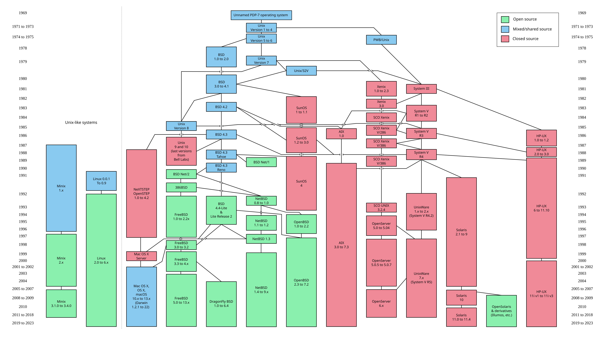
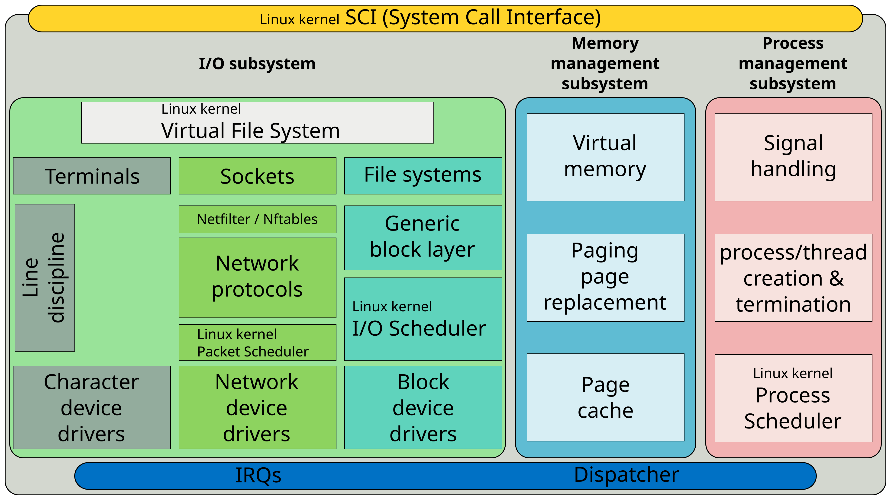
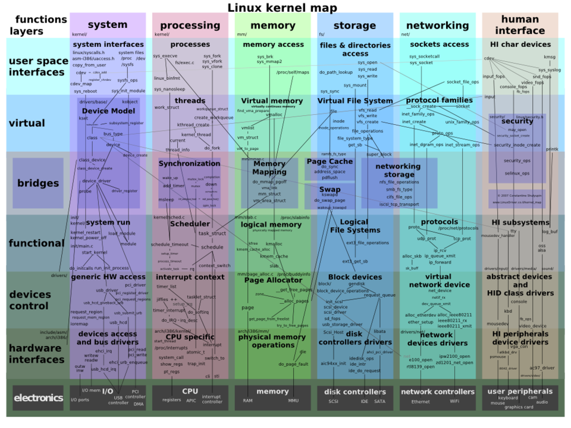
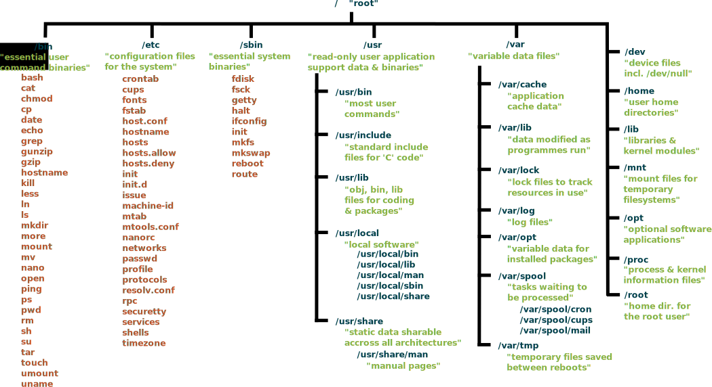
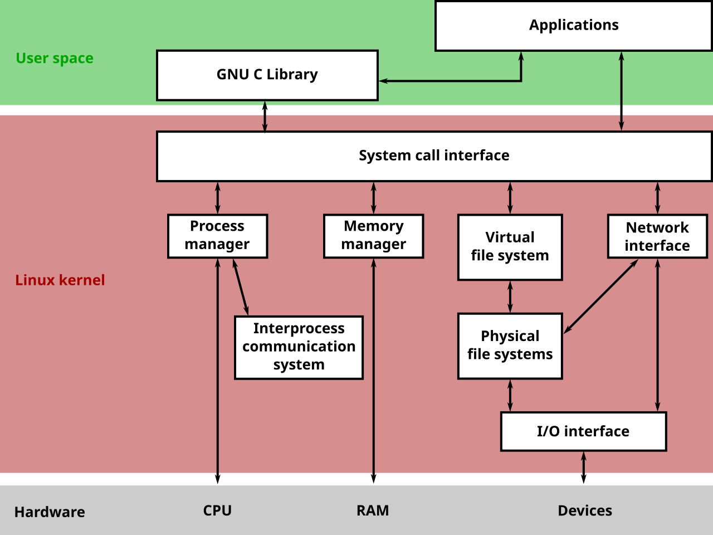

# 🐧 Getting Started with Linux

> A beginner-friendly, exam-ready, and portfolio-ready deep dive into Linux — the operating system that quietly runs most of the internet, the cloud, and the cybersecurity tools you're about to master.

<p align="center">

</p>

---

## 🎯 Learning Objectives

By the end of this chapter, you will be able to:

- Explain **what Linux is**, where it came from, and why it dominates servers, clouds, and security tooling.
- Describe the **architecture** of a Linux system, from hardware to the shell.
- Navigate the **filesystem hierarchy** and understand what each core directory does.
- Use essential **command-line operations** confidently (navigation, file management, permissions, processes).
- Understand **users, groups, and permissions** — the foundation of Linux access control.
- Connect Linux knowledge directly to **cybersecurity, cloud, networking, DevOps, and penetration testing** work.
- Answer common **beginner-level interview questions** about Linux.
- Have a solid base for **CompTIA A+/Security+, CCNA, and Microsoft Azure (AZ-900/SC-900/AZ-104/SC-200/AZ-500/SC-100)** exam topics that assume Linux familiarity.

---


## 📖 Introduction

**Linux** is a free, open-source **operating system kernel** — the core program that manages a computer's hardware (CPU, memory, storage, devices) and lets other software run on top of it. When people say "Linux," they usually mean a full operating system built around that kernel, bundled with tools from the **GNU Project**, a shell, and thousands of available applications. This bundle is more precisely called a **Linux distribution** (or "distro").

**Why does it exist?** In 1991, a Finnish student named **Linus Torvalds** wanted a free, Unix-like operating system he could run and modify on his own PC. Existing Unix systems were either expensive or restricted. Linux was born as a hobby project and released under a license that let anyone use, study, modify, and redistribute it.

**Why does it matter?** Because that openness — combined with stability, security, and flexibility — made Linux the operating system of choice for **servers, cloud infrastructure, smartphones (Android), embedded devices, supercomputers, and cybersecurity tools**. If you plan to work in IT or security, you *will* touch Linux, often on day one.

> 💡 **Key Term:** An **operating system (OS)** is the software layer that sits between your hardware and your applications, managing resources like memory, CPU time, and files so programs don't have to manage them directly.

---

## 🌍 Why Learn This?

| Field | Why Linux Knowledge Matters |
|---|---|
| **Cybersecurity** | Most security tools (Nmap, Wireshark, Metasploit, Burp Suite) run natively on Linux. Distros like **Kali Linux** and **Parrot OS** are built specifically for offensive and defensive security work. |
| **Cloud** | The majority of virtual machines on **AWS, Azure, and Google Cloud** run Linux. Azure certifications (AZ-104, AZ-500) expect you to manage Linux VMs alongside Windows ones. |
| **Networking** | Routers, firewalls, and network appliances (including many Cisco and enterprise systems) run Linux-based or Unix-like operating systems under the hood. |
| **DevOps** | Tools like **Docker, Kubernetes, Ansible, Jenkins, and Git** were built for and run best on Linux. CI/CD pipelines are almost universally Linux-based. |
| **Penetration Testing** | Nearly every professional penetration tester works from a Linux terminal daily — it's the default environment for reconnaissance, exploitation, and reporting tools. |
| **System Administration** | Linux servers power web hosting, databases, and enterprise backends. Sysadmins must manage users, services, logs, and security on Linux daily. |

---

## 🕰️ History

- **1969** — **Unix** is created at Bell Labs, introducing ideas like a hierarchical filesystem and "everything is a file."
- **1983** — **Richard Stallman** launches the **GNU Project** to build a free Unix-like OS, but it lacks a kernel.
- **1991** — **Linus Torvalds** releases the **Linux kernel**, which combines with GNU tools to form a complete free OS: **GNU/Linux**.
- **1990s–2000s** — Distributions like **Slackware, Debian, Red Hat, and SUSE** emerge, each packaging Linux differently.
- **2004** — **Ubuntu** launches, making Linux far more beginner-friendly.
- **2008–present** — Linux becomes the backbone of **Android**, **cloud computing**, and modern **DevOps**, cementing its dominance in servers and security.

<p align="center">

<br><sub>Simplified family tree of Unix and Unix-like systems, including Linux and BSD.</sub>
</p>

---

## 🧠 Core Concepts

> ⚠️ Don't skim this section — everything later in your cybersecurity journey builds on these ideas.

- **Kernel** — The core software that talks directly to hardware and manages CPU scheduling, memory, and devices.
- **Shell** — A program that reads the commands you type and asks the kernel to carry them out. Common shells: **bash**, **zsh**, **sh**.
- **Terminal** — The application window where you type commands into the shell.
- **Distribution (Distro)** — The kernel plus a curated set of tools, package manager, and desktop environment (e.g., Ubuntu, Debian, Fedora, Kali).
- **Filesystem** — Linux organizes *everything* — files, directories, and even hardware devices — into a single tree starting at `/` (root).
- **Users & Permissions** — Every file has an owner and permission rules controlling who can read, write, or execute it.
- **Processes** — Every running program is a process with a unique **Process ID (PID)**.
- **Package Manager** — A tool (like `apt`, `yum`, or `dnf`) used to install, update, and remove software safely.
- **Root/Superuser** — The all-powerful administrative account, equivalent to "Administrator" on Windows.

---

## 🏗️ Architecture / Workflow

Linux is organized in **layers**, where each layer only talks to the one directly next to it. This separation is a core security and stability principle.

```
        User Applications  (bash, Firefox, Nmap, Python...)
                │
                ▼
             Shell        (interprets your commands)
                │
                ▼
        System Libraries  (shared code, e.g. glibc)
                │
                ▼
             Kernel        (process, memory, device management)
                │
                ▼
            Hardware       (CPU, RAM, disk, network card)
```

<p align="center">

<br><sub>Simplified structure of the Linux kernel showing its major subsystems.</sub>
</p>

The kernel itself has internal subsystems, each responsible for a slice of the system:

```
                     ┌────────────────────────┐
                     │      Linux Kernel      │
                     ├────────────┬───────────┤
                     │  Process   │  Memory   │
                     │ Scheduler  │ Management│
                     ├────────────┼───────────┤
                     │ Filesystem │  Network  │
                     │  Drivers   │   Stack   │
                     ├────────────┴───────────┤
                     │   Device Drivers (I/O) │
                     └────────────────────────┘
```

<p align="center">

<br><sub>A broader map of Linux kernel subsystems and how they interconnect.</sub>
</p>

---

## 🧩 Components

| Component | Role |
|---|---|
| **Kernel** | Manages hardware, memory, and processes |
| **Shell** | Interprets and executes user commands |
| **Filesystem Hierarchy** | Standardized directory tree (`/etc`, `/home`, `/var`, etc.) |
| **Package Manager** | Installs and manages software (`apt`, `dnf`, `pacman`) |
| **Init System** | The first process (`systemd` on most modern distros) that starts all other services |
| **Daemons/Services** | Background processes (e.g., `sshd` for SSH access) |
| **Utilities** | Core command-line tools (`ls`, `grep`, `find`, `chmod`) |

<p align="center">

<br><sub>Standard Unix/Linux filesystem hierarchy overview.</sub>
</p>

---

## 🔀 Types / Variations

Linux itself is just a kernel — **distributions** package it differently for different purposes:

| Distribution Family | Examples | Common Use Case |
|---|---|---|
| **Debian-based** | Ubuntu, Debian, Kali Linux, Parrot OS | Desktops, servers, **penetration testing** |
| **Red Hat-based** | RHEL, CentOS Stream, Fedora, Rocky Linux | Enterprise servers, corporate environments |
| **Arch-based** | Arch Linux, Manjaro | Advanced users wanting full customization |
| **SUSE-based** | openSUSE, SLES | Enterprise servers (common in Europe) |
| **Independent/Security-focused** | Kali Linux, Parrot Security OS, Tails | Ethical hacking, forensics, privacy |


---

## ⚙️ How It Works

1. **Power on** — The BIOS/UEFI firmware runs a Power-On Self-Test, then hands control to the **bootloader** (e.g., GRUB).
2. **Bootloader loads the kernel** — GRUB loads the Linux kernel into memory and starts it.
3. **Kernel initializes hardware** — The kernel detects devices, mounts the root filesystem, and starts the first process.
4. **Init system takes over** — `systemd` (PID 1) starts all background services (networking, logging, SSH, etc.) in the correct order.
5. **Login prompt appears** — Once services are ready, you get a login screen (graphical or terminal).
6. **Shell session begins** — After login, a shell (like `bash`) starts and waits for your commands.
7. **Command execution loop** — You type a command → the shell parses it → the kernel executes the requested action → output is returned to your terminal.

```
Power On → Bootloader → Kernel Init → systemd → Services Start → Login → Shell
```

---

## ✨ Features

- **Multi-user** — Many people can use the same system simultaneously without interfering with each other.
- **Multi-tasking** — Runs many processes at once, each isolated and scheduled fairly by the kernel.
- **Open Source** — Source code is publicly available, auditable, and modifiable.
- **Strong permission model** — Fine-grained control over who can read, write, or execute each file.
- **Highly scriptable** — Nearly every task can be automated with shell scripts.
- **Portable** — Runs on servers, desktops, phones (Android), routers, and even spacecraft systems.
- **Stability** — Linux servers routinely run for months or years without needing a reboot.

---

## ✅ Advantages

| Advantage | Explanation |
|---|---|
| **Free & Open Source** | No licensing cost; source code can be reviewed for security flaws. |
| **Security** | Strong permission model and a smaller attack surface for common malware families. |
| **Stability** | Rarely crashes; ideal for servers that must run continuously. |
| **Flexibility** | Highly configurable — from minimal embedded builds to full desktop environments. |
| **Community Support** | Massive global community, forums, and documentation. |
| **Automation-friendly** | Native scripting support makes repetitive admin tasks easy to automate. |

---

## ⚠️ Limitations

- **Steeper learning curve** for beginners used to graphical-only operating systems.
- **Software compatibility** — Some commercial software (certain games, specific enterprise apps) still targets Windows/macOS only.
- **Fragmentation** — Hundreds of distributions can mean inconsistent documentation and setup steps.
- **Hardware driver gaps** — Some very new or niche hardware may lack immediate Linux driver support.
- **No single default GUI** — Multiple desktop environments (GNOME, KDE, XFCE) can confuse newcomers.

---

## 🌐 Real-World Examples

- **Google, Amazon, and Meta** run their data centers predominantly on Linux servers.
- **Android**, the world's most-used mobile OS, is built on the Linux kernel.
- **Kali Linux** is the standard toolkit distribution used in professional penetration testing engagements.
- **AWS EC2 and Azure Virtual Machines** offer Linux images as a primary deployment option for cloud workloads.
- **Supercomputers** — As of recent rankings, effectively all of the world's top 500 supercomputers run Linux.
- **Network devices** — Many enterprise firewalls and routers run customized Linux or Unix-like firmware.

---

## 💻 Practical Demonstration

Below are foundational commands every beginner should practice. Try them in a real or virtual Linux environment (Ubuntu is a great starting point).

**Navigating the filesystem:**
```bash
pwd                # Print current working directory
ls -la              # List all files, including hidden ones, with details
cd /var/log         # Change into the log directory
```

**Working with files and directories:**
```bash
mkdir project       # Create a new directory
touch notes.txt      # Create an empty file
cp notes.txt backup.txt   # Copy a file
mv backup.txt archive/    # Move a file
rm archive/backup.txt     # Delete a file
```

**Checking and changing permissions:**
```bash
ls -l script.sh          # View permissions (e.g., -rwxr-xr-x)
chmod +x script.sh       # Make a file executable
chown user:group file.txt  # Change file ownership
```

**Viewing and managing processes:**
```bash
ps aux              # List all running processes
top                 # Live view of system resource usage
kill 1234           # Terminate the process with PID 1234
```

**Searching for text and files:**
```bash
grep "error" /var/log/syslog   # Search for a keyword inside a file
find / -name "*.conf"          # Search the whole system for config files
```

> 🧪 **Try it yourself:** Install VirtualBox or use WSL, spin up an Ubuntu virtual machine, and run each command above. Muscle memory matters more than memorization.

---

## 🖼️ Visual Learning


<p align="center">

<br><sub>An oversimplified — but beginner-friendly — view of the kernel's structure.</sub>
</p>

> 📌 **Tip:** As you progress, add your own screenshots of your terminal, `htop` output, and file permission examples here to make this repository personally useful for revision.

---

## 🏆 Best Practices

- **Never operate as root for daily tasks** — use `sudo` only when necessary.
- **Keep your system updated** (`apt update && apt upgrade`) to patch security vulnerabilities.
- **Use SSH keys instead of passwords** for remote server access.
- **Read command output before running anything with `sudo`** — mistakes as root can break a system.
- **Comment your shell scripts** so future-you (or teammates) understand the logic.
- **Back up before major changes**, especially to configuration files in `/etc`.
- **Learn to read man pages** (`man command`) instead of only relying on search engines.

---

## ❌ Common Mistakes

> ⚠️ **Common Mistake**
> Beginners often assume Linux "is just a black terminal screen" and skip learning the filesystem hierarchy. This backfires quickly, because nearly every Linux task — installing software, reading logs, configuring services — depends on knowing *where* things live (`/etc`, `/var`, `/home`, etc.).

> ⚠️ **Common Mistake**
> Running everything with `sudo` "just in case." This defeats the purpose of Linux's permission system and increases the risk of accidental system damage or security exposure.

> ⚠️ **Common Mistake**
> Confusing a **distribution** with the **kernel**. Ubuntu, Fedora, and Kali are different distributions, but they can all run on top of very similar versions of the same Linux kernel.

---

## 🛡️ Cybersecurity Relevance

Linux knowledge is **non-negotiable** for security professionals because:

- **Tooling** — Nmap, Wireshark, Metasploit, John the Ripper, and Burp Suite all run best (or exclusively) on Linux.
- **Log analysis** — Linux servers generate logs in `/var/log` that are essential for **incident response** and **threat hunting**.
- **Privilege escalation** — Understanding Linux permissions, `sudo`, and SUID/SGID bits is essential for both attacking and defending systems.
- **Server hardening** — Security engineers must configure firewalls (`iptables`/`nftables`), SSH, and services securely on Linux hosts.
- **Certifications** — Security+ and CEH exams both test basic Linux command-line and permission concepts directly.
- **Cloud security** — Since most cloud workloads run Linux, cloud security roles require comfort with Linux administration.

---

## ❓ Interview Questions

1. **What is the difference between Linux and a Linux distribution?**
   Linux refers to the kernel; a distribution bundles the kernel with GNU tools, a package manager, and often a desktop environment.

2. **What command would you use to view running processes?**
   `ps aux` or `top`/`htop` for a live view.

3. **How do you change file permissions in Linux?**
   Using `chmod`, e.g., `chmod 755 file.sh`, or symbolically with `chmod +x file.sh`.

4. **What is the root user?**
   The superuser account with unrestricted administrative privileges over the entire system.

5. **Where are system logs typically stored?**
   In the `/var/log` directory.

6. **What is the difference between a hard link and a symbolic link?**
   A hard link points directly to the same file data (inode), while a symbolic link is a pointer/shortcut to another file's path.

7. **What does `sudo` do?**
   It lets a permitted user temporarily run a command with elevated (root) privileges.

---

## 📝 Quick Revision

- Linux = **kernel**; distributions = **kernel + tools + package manager**.
- Everything in Linux is represented as a **file**, including devices.
- The system boots: **firmware → bootloader → kernel → init (systemd) → services → login → shell**.
- Permissions follow the **owner / group / others** model, each with **read, write, execute**.
- `sudo` grants temporary elevated privileges; the **root** account has full control.
- Core directories: `/etc` (configs), `/var` (variable data/logs), `/home` (user files), `/bin` and `/usr/bin` (executables).

---

## 🔑 Key Takeaways

- Linux is the **kernel**; a distro is the full usable operating system built around it.
- Its **open-source nature**, **stability**, and **strong permission model** make it the backbone of servers, clouds, and security tools.
- Mastering the **command line**, **filesystem hierarchy**, and **permissions** is the single highest-leverage skill for a cybersecurity beginner.
- Nearly every certification path (Security+, CCNA, Azure) and every practical security tool assumes basic Linux comfort.

---

## 📚 Further Reading

- **Official Kernel Documentation:** [kernel.org](https://www.kernel.org/doc/)
- **The Linux Documentation Project:** [tldp.org](https://tldp.org/)
- **Ubuntu Official Documentation:** [help.ubuntu.com](https://help.ubuntu.com/)
- **Book:** *The Linux Command Line* by William Shotts (free PDF available from the author's site)
- **Book:** *How Linux Works* by Brian Ward
- **Filesystem Hierarchy Standard:** [refspecs.linuxfoundation.org](https://refspecs.linuxfoundation.org/FHS_3.0/fhs-3.0.html)

---


---

# 🚀 Why Linux for Cybersecurity?

Now that you understand what Linux is, its history, architecture, and core concepts, the next step is understanding why Linux is so important in the cybersecurity field.

This section explains how Linux is used by security professionals, penetration testers, system administrators, and cloud engineers.

➡️ **[Continue to Why Linux for Cybersecurity](Why-Linux-for-Cybersecurity.md)**

---

---

# 🐧 Linux Distributions

Linux is available in many different distributions, each designed for different purposes.

In the next section, you will learn about popular Linux distributions such as Ubuntu, Debian, Kali Linux, Fedora, and their common use cases in cybersecurity and IT.

➡️ **[Continue to Linux Distributions](Linux-Distributions.md)**

---
# 🚀 Next Step: Installation Process

Now that you understand what Linux is, why it's important, and how it works, it's time to install it and set up your learning environment.

In the next guide, you'll learn how to install **Ubuntu Linux** using **VirtualBox** or **VMware**, create a virtual machine, and prepare a safe environment for practicing Linux commands and cybersecurity labs.

➡️ **Continue to:** **[Installation Process](Installation.md)**

---
---

# 📂 Linux File System Overview

After installing Linux, the next important skill is understanding how Linux organizes files and directories.

This section explains the Linux filesystem hierarchy, important directories like `/etc`, `/home`, `/var`, `/usr`, and how the operating system stores and manages data.

➡️ **[Continue to File System Overview](File-System-Overview.md)**

---


