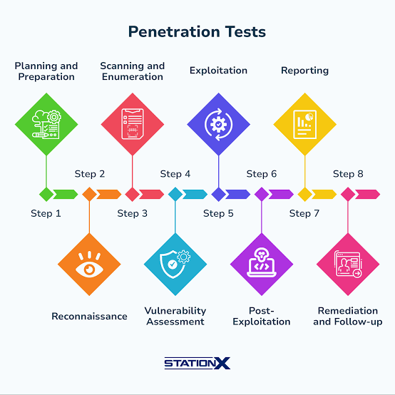
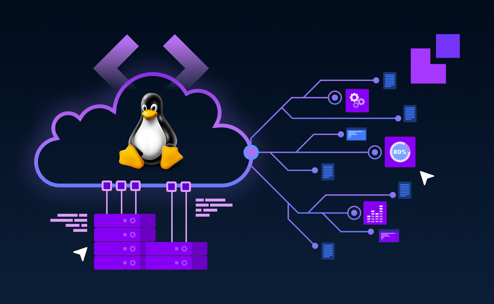

# 🛡️ Why Linux is Important in Cybersecurity

If you ask any experienced penetration tester, SOC analyst, or cloud security engineer which operating system they touch the most, the answer is almost always the same: **Linux**. Not because it's trendy, but because Linux quietly runs the servers, cloud platforms, and network devices that security professionals are hired to protect — and the same tools attackers use to break in.

Understanding Linux isn't an optional extra skill in cybersecurity. It's closer to a **second language** — one you need to read logs, run tools, investigate breaches, and defend systems that are, statistically, very likely to be running Linux underneath.

This chapter explains **why** that relationship exists, not just **that** it exists.

<p align="center">
  
</p>

---

## 🏢 Linux and the Cybersecurity Industry

**Linux dominates servers and cloud infrastructure.** The vast majority of web servers, cloud virtual machines, and container platforms run on Linux rather than Windows. Major cloud providers — **AWS, Microsoft Azure, and Google Cloud** — all offer Linux as a primary, often default, operating system for compute instances. Even Microsoft's own Azure documentation acknowledges that a large share of workloads running on Azure are Linux-based.

**Security professionals interact with Linux constantly** because that's simply where the infrastructure lives. A SOC analyst investigating a compromised web server, a cloud security engineer auditing an AWS environment, or a penetration tester scanning a corporate network will almost certainly encounter Linux systems — often more frequently than Windows ones.

**Why Windows knowledge alone isn't enough:** Windows skills remain valuable (Active Directory environments are everywhere in corporate networks), but a security professional who only understands Windows has a major blind spot. Real-world example: a company's public-facing website runs on a Linux server, its Kubernetes cluster orchestrating containers runs on Linux nodes, and its firewall appliance runs a Linux-based OS — a security engineer who can't navigate any of these can't properly assess or defend that environment.

> 💡 **Key Term:** **Infrastructure** refers to the underlying servers, networks, and platforms that applications and services run on top of.

---

## 👥 Linux Usage Across Cybersecurity Roles

| Cybersecurity Role | How Linux is Used |
|---|---|
| **Penetration Tester** | Uses Linux-based distributions (like Kali Linux) as their primary toolkit for scanning, exploitation, and reporting during authorized security assessments. |
| **SOC Analyst** | Investigates alerts from Linux servers, reads system and authentication logs, and uses Linux-based SIEM and monitoring tools daily. |
| **Security Engineer** | Hardens and configures Linux servers, manages firewalls (`iptables`/`nftables`), and builds secure infrastructure from the ground up. |
| **Digital Forensics Analyst** | Examines compromised Linux systems, extracts forensic artifacts from Linux filesystems, and uses Linux-based forensic toolkits. |
| **Malware Analyst** | Studies malware behavior — including Linux-targeting malware — often inside isolated Linux virtual machines for safe analysis. |
| **Cloud Security Engineer** | Secures Linux-based cloud virtual machines, containers, and Kubernetes clusters across AWS, Azure, and GCP. |
| **DevSecOps Engineer** | Integrates security into Linux-based CI/CD pipelines, automates vulnerability scanning, and secures containerized deployments. |

Each of these roles overlaps at one point: **the command line**. Whether you're scanning a network, reading a log file, or writing an automation script, you're doing it from a Linux terminal.

---

## 🗡️ Linux as an Attacker's Platform

Linux isn't just popular with defenders — it's the preferred environment for **offensive security work** too, and understanding why helps you understand how attacks actually happen.

- **Powerful command-line tools** — Linux exposes granular control over networking, processes, and files that GUI-only systems often hide away.
- **Automation & scripting** — Nearly every Linux action can be scripted, letting security testers chain together reconnaissance, scanning, and exploitation steps efficiently.
- **Network analysis tools** — Utilities for packet capture, traffic inspection, and protocol analysis are native to (or best supported on) Linux.
- **Security testing frameworks** — Many industry-standard frameworks are built specifically to run on Linux.

**Distributions built for this purpose include:**
- **Kali Linux** — The most widely used penetration testing distribution, preloaded with hundreds of security tools.
- **Parrot Security OS** — Similar toolset to Kali, with an added focus on privacy and forensics.
- **BlackArch** — An Arch Linux-based distribution with one of the largest collections of security tools available.

> ⚠️ **Critical Note:** These distributions and their tools are built for **authorized security testing only** — used against systems you own or have explicit written permission to test. Using them against systems without permission is illegal in most jurisdictions and can carry serious criminal penalties, regardless of intent.

---

## 🛡️ Linux as a Defender's Platform

Defenders rely on Linux just as heavily as attackers, but for different tasks:

- **Log analysis** — Investigating `/var/log` files to understand what happened during a suspicious event or breach.
- **Monitoring** — Running continuous system and network monitoring tools to catch abnormal behavior in real time.
- **Incident response** — Isolating compromised Linux systems, collecting evidence, and restoring services safely.
- **Threat hunting** — Proactively searching Linux systems and logs for signs of compromise before an alert ever fires.
- **Security automation** — Writing scripts that automatically check configurations, rotate credentials, or respond to alerts.
- **Server hardening** — Disabling unnecessary services, configuring firewalls, and applying the principle of least privilege on Linux servers.

---

## 🧠 Important Linux Skills for Cybersecurity

### Command Line
The terminal is where nearly all serious security work on Linux happens. Core skill areas include:
- **Navigation** — Moving through the filesystem (`cd`, `pwd`, `ls`).
- **File management** — Creating, moving, copying, and deleting files (`mkdir`, `mv`, `cp`, `rm`).
- **Searching** — Finding files or text quickly (`find`, `grep`).
- **Process management** — Viewing and controlling running programs (`ps`, `kill`).

### File Permissions
Linux organizes access control around **users**, **groups**, and **ownership**. Every file has an owner and a group, and permissions determine who can **read**, **write**, or **execute** it.

- `chmod` — Changes what actions (read/write/execute) are allowed on a file.
- `chown` — Changes who owns a file or which group it belongs to.

**Why this matters for security:** Misconfigured permissions are one of the most common real-world vulnerabilities. A world-writable configuration file or a script with excessive permissions can let a low-privilege attacker escalate to full system control — understanding permissions is fundamental to both attacking and defending Linux systems.

### Networking Commands
| Command | Purpose |
|---|---|
| `ip` | View and configure network interfaces and routing |
| `ping` | Test basic connectivity to another host |
| `netstat` / `ss` | List active network connections and listening ports |
| `curl` | Send HTTP/HTTPS requests directly from the terminal |
| `traceroute` | Trace the network path packets take to a destination |
| `dig` | Query DNS records for a domain |

These commands let security professionals confirm connectivity, identify open ports, inspect suspicious traffic, and diagnose network-based attacks.

### Processes and Services
Understanding what's actually running on a system is essential for spotting malicious activity.
- `ps` — Lists currently running processes.
- `top` — Shows a live, continuously updating view of resource usage per process.
- `systemctl` — Manages background services (starting, stopping, checking status of daemons like `sshd`).

An unexpected process consuming high CPU, or an unfamiliar service running on startup, is often the first clue of a compromise.

### Logs and Monitoring
- Linux logs system activity extensively, mostly stored under **`/var/log`**.
- **Authentication logs** (e.g., `/var/log/auth.log` on Debian-based systems) record every login attempt, successful or failed — critical for detecting brute-force attacks or unauthorized access.
- Security investigations almost always begin by reading logs to reconstruct a timeline of what happened.

### Bash Scripting
**Automation matters** because manually repeating security tasks doesn't scale. A single Bash script can:
- Automate repetitive administrative tasks.
- Run a security scan against multiple hosts automatically.
- Parse and summarize large log files for suspicious patterns.
- Apply the same hardening configuration across many servers consistently.

> 💡 **Key Term:** **Bash** is the default command-line shell on most Linux distributions, and also a scripting language used to automate sequences of commands.

---

## 🧰 Linux Security Tools

| Tool | Purpose |
|---|---|
| **Nmap** | Scans networks to discover live hosts, open ports, and running services |
| **Wireshark** | Captures and analyzes network traffic packet-by-packet |
| **Burp Suite** | Tests web applications for vulnerabilities like injection flaws and broken authentication |
| **Metasploit** | A framework for developing and executing exploit code against target systems in authorized tests |
| **John the Ripper** | Audits password strength by attempting to crack password hashes |
| **Hashcat** | A high-performance password recovery and hash-cracking tool, often GPU-accelerated |

All of these tools run natively on Linux, and most security professionals use them directly from the command line as part of a broader testing or investigation workflow.

---

## 🎯 Linux in Penetration Testing

Penetration testing follows a structured methodology, and Linux is the environment where nearly every phase happens:

<p align="center">
  
</p>


```
Planning and Preparation
       ↓
Reconnaissance
       ↓
Scanning
       ↓
Enumeration
       ↓
Vulnerability Assessment
       ↓
Post-Exploitation
       ↓
Reporting
       ↓
Remediation & Follow-up
```

- **Planning & Preparation** — Defining the scope, rules of engagement, and legal boundaries of the test before any technical actions begin.
- **Reconnaissance** — Gathering public information about a target using Linux-based OSINT tools.
- **Scanning** — Using tools like Nmap (run from Linux) to identify live hosts and open ports.
- **Enumeration** — Extracting detailed information about services, users, and shares, often via Linux command-line utilities.
- **Vulnerability Assessment** — Analyzing the collected data to identify potential flaws and security gaps that could be exploited.
- **Exploitation** — Executing exploit code, frequently through Linux-native frameworks like Metasploit, to gain an initial foothold.
- **Post-Exploitation** — Maintaining access, expanding control, and performing privilege escalation using Linux permission and process knowledge.
- **Reporting** — Documenting findings, vulnerabilities, and risks, using Linux-based note-taking and scripting tools to organize evidence.
- **Remediation & Follow-up** — Providing steps to patch discovered flaws and conducting re-testing to ensure the system is completely secured.


---

## ☁️ Linux in Cloud Security

- The overwhelming majority of cloud compute instances worldwide run **Linux**, not Windows.
- **AWS, Azure, and Google Cloud** all offer Linux images as a default, cost-effective option, and much of their own internal infrastructure runs on Linux as well.
- Cloud security engineers must understand Linux server configuration, permissions, and logging to properly secure virtual machines, containers, and Kubernetes clusters deployed in these environments.

<p align="center">
  
</p>

---

## ⭐ Linux Security Advantages

- **Open source** — The source code is publicly available, allowing anyone to audit it for hidden vulnerabilities or malicious code.
- **Transparency** — Configuration is typically stored in plain-text files, making systems easier to inspect, version-control, and audit.
- **Powerful permissions** — A granular user/group/ownership model provides fine control over who can access what.
- **Strong networking capabilities** — Built-in, highly configurable networking and firewall tools (`iptables`, `nftables`) without needing third-party software.
- **Automation** — Native scripting support makes consistent, repeatable security configurations easy to enforce.
- **Community support** — A massive global community continuously identifies, reports, and patches vulnerabilities.

---

## ⚠️ Common Beginner Misconceptions

> ⚠️ **Linux is not only for hackers.** It's a general-purpose operating system running everything from web servers to smartphones (Android) — security use is just one of its many applications.

> ⚠️ **Installing Kali Linux does not automatically make someone a penetration tester.** Kali is simply a toolbox; real skill comes from understanding networking, systems, and security methodology — not from the distribution you use.

> ⚠️ **Running security tools without permission is illegal.** Scanning, exploiting, or testing any system without explicit, documented authorization is a criminal offense in most countries, regardless of the tester's intentions.

---

---

## 🗺️ Practical Learning Path

```
Linux Basics
      ↓
Command Line
      ↓
Permissions
      ↓
Networking
      ↓
Bash Scripting
      ↓
Security Tools
      ↓
Security Labs
```

Follow this order as you progress through the rest of this repository — each stage builds directly on the skills learned in the one before it.

---

## ❓ Interview Questions

1. **Why is Linux important in cybersecurity?**
   Because most servers, cloud infrastructure, and security tools run on Linux, making it essential for both attacking and defending real-world systems.

2. **Why do penetration testers use Linux?**
   Linux offers powerful command-line control, scripting/automation capabilities, and native support for the major security testing frameworks and tools.

3. **What is the difference between Linux and Kali Linux?**
   Linux is the underlying kernel/operating system family; Kali Linux is a specific distribution built on Debian and preloaded with penetration testing tools for security work.

4. **Explain Linux file permissions.**
   Every file has an owner, a group, and permission settings (read, write, execute) that control who can access or modify it, managed with commands like `chmod` and `chown`.

5. **What Linux commands are useful for security analysis?**
   Commands like `grep`, `ps`, `netstat`/`ss`, `find`, and reviewing logs in `/var/log` are commonly used to investigate systems and detect suspicious activity.

---

## 🔑 Key Takeaways

- Linux runs the majority of the world's servers, cloud infrastructure, and security tooling — making it unavoidable in cybersecurity work.
- Both **attackers and defenders** rely heavily on Linux, just for different purposes.
- Core skills — **command line, permissions, networking, and scripting** — form the foundation for every advanced security topic that follows.
- Popular security tools like **Nmap, Wireshark, Metasploit, and Burp Suite** all run natively on Linux.
- Using security tools **without proper authorization is illegal**, regardless of the operating system or intent.

---

